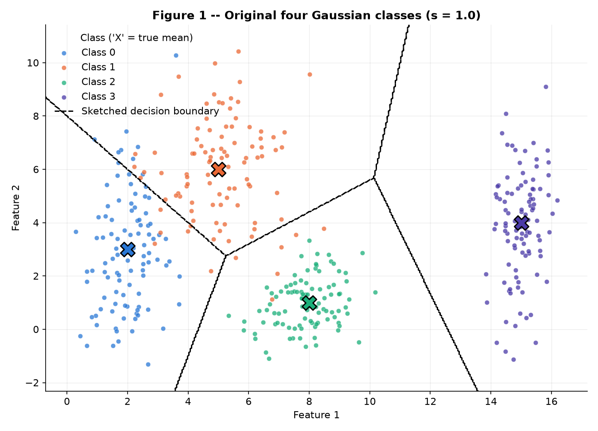
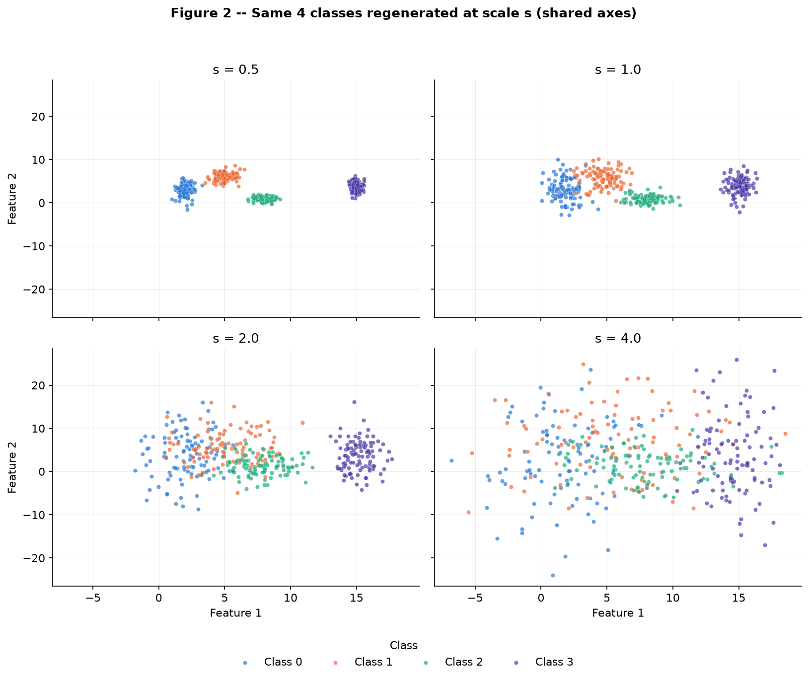
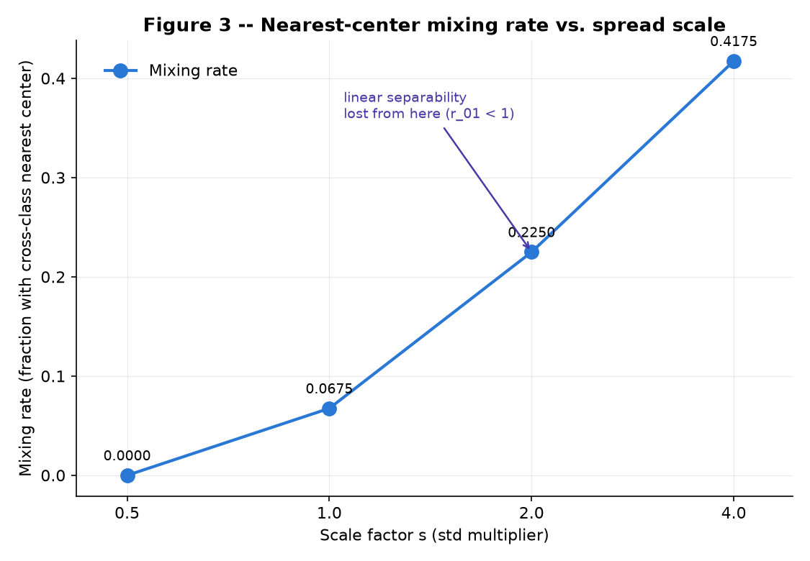
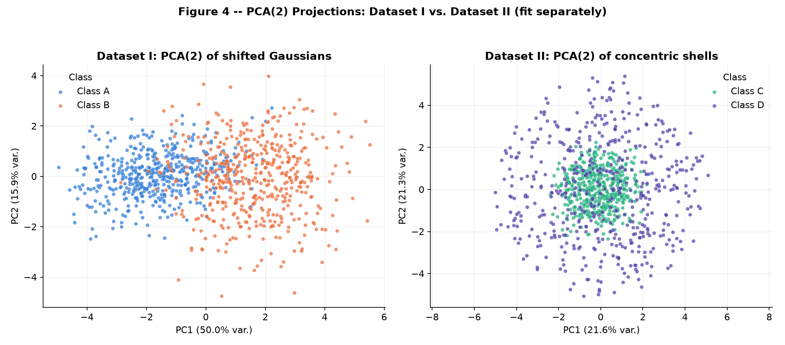
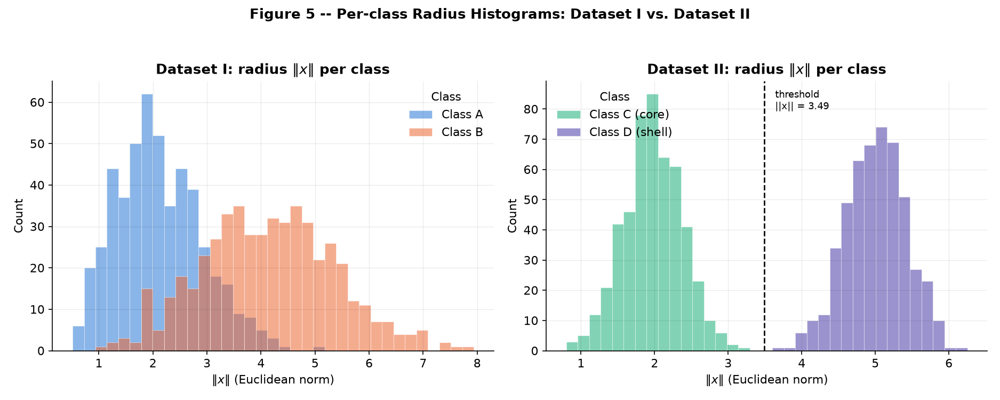
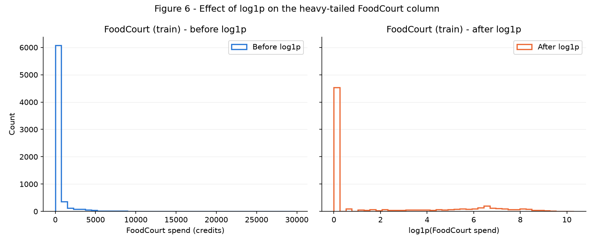

This report traces one idea across three different data settings: how the spread of a class's own
points, relative to the distance between classes, decides whether a straight line can ever separate
them. Exercise 1 makes that trade-off explicit in 2D, watching four Gaussian clouds fold into each
other as their spread grows around fixed centers. Exercise 2 pushes the same question into 5D and
breaks it on purpose, contrasting a dataset where a mean shift carries the signal with one where the
signal is a radius no hyperplane can ever see. Exercise 3 closes the loop on a real tabular dataset,
where the practical version of "spread" — heavy-tailed, skewed features — has to be tamed by
preprocessing before any network can learn from it without leakage.

## Exercise 1

### A

Four synthetic classes are drawn as 2D Gaussians, 100 points each (400 total), from the single
seeded generator `rng = np.random.default_rng(42)`, consumed in class order 0 through 3 with one
`rng.normal(mean, std, size=(100, 2))` call per class — no other draw happens before this. The
exact parameters are Class 0: mean `[2, 3]`, std `[0.8, 2.5]`; Class 1: mean `[5, 6]`, std
`[1.2, 1.9]`; Class 2: mean `[8, 1]`, std `[0.9, 0.9]`; Class 3: mean `[15, 4]`, std `[0.5, 2.0]`.
**Figure 1** plots all 400 points colored by class, with each class's true generative mean marked
by a bold black-edged 'X'. Class 0 and Class 1 already sit close enough that their clouds visibly
touch at a thin border, Class 2 forms the tightest, most symmetric cloud of the four (its std is
the only isotropic one, `[0.9, 0.9]`), and Class 3 sits in complete isolation far along the first
axis (`x ≈ 15`).



### B

**1.** The same 4 classes are regenerated four separate times, once per scale factor
`s ∈ {0.5, 1.0, 2.0, 4.0}`, multiplying every class's standard deviation by `s` while every mean
stays fixed — four independent 400-point datasets, not one dataset with mixed scales. These draws
continue the same `rng` stream in increasing order of `s`, with no re-seeding. **Figure 2** shows
the four datasets in a 2×2 grid sharing identical x/y axis limits across all four panels, so the
growth in spread is directly comparable. At `s = 0.5` the four clusters are small and essentially
disjoint; by `s = 2.0` Classes 0, 1, and 2 have visibly merged into one elongated cloud while
Class 3 stays a separate island; by `s = 4.0` all four classes interpenetrate across most of the
plotted region.



**2.** For `s = 1.0`, the separation ratio `r_ij = ||μ_i − μ_j|| / (σ̄_i + σ̄_j)` (with
`σ̄_k = mean(σ_k)` over the 2 axes) is computed analytically for all 6 class pairs, directly from
the class parameters — it never touches the random generator:

| Pair | ‖μ_i − μ_j‖ | σ̄_i + σ̄_j | r_ij |
|---|---|---|---|
| (0, 1) | 4.2426 | 3.20 | **1.3258** |
| (0, 2) | 6.3246 | 2.55 | 2.4802 |
| (0, 3) | 13.0384 | 2.90 | 4.4960 |
| (1, 2) | 5.8310 | 2.45 | 2.3800 |
| (1, 3) | 10.1980 | 2.80 | 3.6422 |
| (2, 3) | 7.6158 | 2.15 | 3.5422 |

The smallest ratio is **r₀₁ = 1.3258, between Class 0 and Class 1** — their mean distance is only
about 1.33× the sum of their average per-axis spreads, the tightest margin of any pair. Because
every mean is held fixed while only spread is scaled, `r_ij` scales exactly as `1/s`: at `s = 2.0`,
without generating anything new, the smallest ratio becomes **r₀₁ = 1.3258 / 2 = 0.6629** — pure
arithmetic on the `s = 1.0` value above.

**3.** For each scale, the mixing rate is the fraction of the 400 points whose nearest of the 4
true class **centers** (Euclidean distance from the point to each class **mean**, not to another
data point) is not the center of their own class — a purely geometric, fully vectorized
point-to-center `argmin`, nothing trained. The results: `s = 0.5` → **0.00%** (0/400 points),
`s = 1.0` → **6.75%** (27/400), `s = 2.0` → **22.50%** (90/400), `s = 4.0` → **41.75%** (167/400).

**4. Figure 3** plots this mixing rate against `s`. At `s = 0.5` the rate is exactly 0.00%: every
point already sits closer to its own class's center than to any other, so the four clouds are, for
all practical purposes, already separable by straight lines (Figure 1's nearest-center Voronoi
cells assign every point to its true class at this scale). At **`s = 1.0`** the rate is still
modest (6.75%) but no longer negligible, driven almost entirely by the Class 0/Class 1 border
where `r₀₁` is smallest. Separation is decisively lost **from `s = 2.0` onward**: the mixing rate
more than triples to 22.50% (**3.33×** the `s = 1.0` value) at exactly the scale where the
smallest ratio computed above crosses below 1 — `r₀₁ = 0.6629` at `s = 2.0` means the distance
between the two closest means is now *smaller* than their combined average spread, so no straight
line can keep the bulk of either cloud on its own side any more. By `s = 4.0` the rate reaches
41.75%, approaching the point where a nearest-center rule is barely better than guessing among the
classes it still confuses.



### C

**1.** At `s = 1.0` (Figure 1), Classes 2 and 3 sit in their own clearly separated regions of the
plane, but Class 0 and Class 1 overlap at a shared border — consistent with `r₀₁ = 1.3258` being
far smaller than every other pairwise ratio. A **single** straight line cannot separate all four
classes: with four regions arranged around the plane (0 upper-left, 1 upper-middle, 2 lower-middle,
3 far right) no one line puts each class entirely on its own side, since at least two of the four
classes will always fall on the same side of any single cut. A **set** of straight lines can,
almost — the piecewise-linear (Voronoi) partition built from the 4 fixed means, one straight
boundary segment per adjacent pair of classes, keeps the large majority of points on the correct
side at `s = 1.0` (nearest-center mixing rate only 6.75%), failing mostly in the region where
Class 0 and Class 1 physically interleave.

**2.** That piecewise-linear partition is sketched directly on **Figure 1** above as dashed black
lines: the perpendicular-bisector boundaries a nearest-centroid rule draws between each pair of
adjacent class means — the straight-line boundary a trained network would most plausibly settle
close to, since it is the simplest decision rule consistent with the geometry of four Gaussian
blobs. This is the same nearest-center rule used to compute the mixing rate in B.3, just evaluated
on a dense grid instead of only the 400 sampled points.

**3.** Because the scaling convention keeps every mean fixed and only inflates each class's
covariance by `s`, **the sketched boundary lines themselves never move** — Figure 1's dashed lines
are the same lines that partition every panel of Figure 2. What changes is how much of each
Gaussian's probability mass ends up on the wrong side of a boundary that is no longer moving to
compensate for it. Since the overlap region between two Gaussians grows faster than the spread
itself, the region where the network necessarily makes mistakes — the sliver near each boundary
line where a class's own tail now crosses into a neighboring cell — expands sharply: doubling `s`
from 1.0 to 2.0 sends the mixing rate from 6.75% to 22.50% (**3.33×**), and by `s = 4.0` that error
region has swallowed 41.75% of all points. The fixed sketch on Figure 1 is therefore best read as
the boundary a network learns once, while Figures 2 and 3 show how much of the data that fixed
boundary keeps getting wrong as the classes are made to overlap it more.

```python
--8<-- "docs/exercises/data/code/ex1_point_clouds.py"
```

## Exercise 2

### A

Dataset I is two correlated multivariate Gaussian blobs in 5D, 500 samples each, drawn with
`rng.multivariate_normal(mean, cov, size=500)` from the single seeded generator
`rng = np.random.default_rng(42)`, class A before class B, continuing the exact stream left by
Exercise 1. Class A has mean `[0, 0, 0, 0, 0]` and covariance with a strong positive correlation
between features 1–2 (`0.8`) and moderate positive correlations chaining features 2–3, 3–4, and
4–5 (`0.3`, `0.5`, `0.2`); class B is shifted to mean `[1.5, 1.5, 1.5, 1.5, 1.5]`, has 1.5× the
variance on every axis, and flips the sign of the leading correlation (`-0.7` between features
1–2) while keeping the same downstream chain (`0.4`, `0.6`, `0.3`). The empirical centroids
recovered from the 500-sample draws land at `[0.026, 0.085, 0.037, 0.019, 0.035]` for A and
`[1.489, 1.499, 1.450, 1.458, 1.524]` for B — both within sampling noise of their true generative
means, confirming the draw is behaving as specified.

### B

Dataset II is two concentric spherical shells in 5D, 500 samples per class, built from pure
direction/radius geometry rather than any mean shift. For each point, a direction is drawn
uniformly on the unit 5-sphere by sampling `v ~ N(0, I_5)` (`rng.standard_normal(5)`) and
normalizing, `u = v / ‖v‖`; the point is then `x = ρ·u` for a class-specific radius `ρ`. Class C
(the core) uses `ρ ~ N(2.0, 0.4)`; class D (the shell) uses `ρ ~ N(5.0, 0.4)`. The same `rng`
stream continues after Dataset I with a fixed draw order — for each class, all direction vectors
before that class's radii, core (C) before shell (D) — so the whole script is byte-reproducible
from the single seed. By construction, class membership here carries *no* directional information
at all: only the scalar radius `ρ` differs between C and D, and direction is drawn identically
(uniformly) for both.

### C

**Figure 4** projects each dataset to 2D with its own independently-fit `PCA(n_components=2,
svd_solver="full")` — the two datasets are never mixed into a shared PCA, and the exact `"full"`
solver keeps PCA itself non-random so all randomness in the pipeline stays confined to data
generation. For **Dataset I**, PC1 alone explains **50.04%** of the variance and PC2 a further
**15.93%**, for a combined **65.97%** — the two classes separate cleanly along PC1 in the left
panel, consistent with the strong correlations baked into each covariance matrix concentrating
variance into a small number of directions, one of which the A→B mean shift lines up with. For
**Dataset II**, PC1 and PC2 explain **21.59%** and **21.32%** respectively — almost exactly the
20% each would carry if variance were spread uniformly over all 5 axes — for a combined
**42.91%**; the right panel shows classes C and D collapsed into two heavily overlapping,
roughly circular clouds with no dominant linear direction to separate them. **The 2D projection
preserves classification-relevant structure far better for Dataset I than for Dataset II** — the
higher explained-variance share (65.97% vs. 42.91%) is not a coincidence but a direct symptom of
Dataset I's signal (a mean shift) being linear, and therefore visible to PCA, while Dataset II's
signal (radius) is not.



In the original 5D space, the Euclidean distance between empirical class centroids is
**‖μ_A − μ_B‖ = 3.2282** for Dataset I and only **‖μ_C − μ_D‖ = 0.2662** for Dataset II — the
shell centroids coincide almost exactly, as expected since directions average out around the
origin for both classes regardless of radius. **Figure 5** shows the per-class distribution of
`‖x‖` (Euclidean norm from the origin), one panel per dataset, both classes overlaid on the same
axis. For Dataset I the mean radius is **2.1085** for class A and **4.1284** for class B — visibly
separated but with real overlap, a side effect of the mean shift rather than the primary signal.
For Dataset II the mean radius is **1.9718** (std 0.3956) for class C and **5.0047** (std 0.4094)
for class D — a gap of **3.0328**, over ten times the 5D centroid distance, and the two histograms
in the right panel of Figure 5 are essentially non-overlapping.



### D

**1.** In Dataset II the class centroids coincide (distance 0.2662) while the radius histograms
are almost perfectly separated (means 1.9718 vs. 5.0047, gap 3.0328). A hyperplane `wᵀx = b`
is a *location*-based test: it separates classes by projecting points onto a direction `w` and
comparing to a threshold, which only works when the classes' means differ along some direction.
Here they do not — both classes are centered at the same point and differ only in how far their
points wander from it. No choice of `w` and `b` can turn "same center, different spread" into two
half-spaces, because for (almost) every point of class C near a candidate hyperplane there is a
same-radius point of class C on the opposite side (and likewise for D) — direction carries zero
class information by construction. The coincident centers plus separated radii is precisely the
signature of a problem that is trivially separable in *magnitude* but carries no linearly
exploitable signal in *location*.

**2.** No amount of additional data changes this, because the non-separability is geometric, not
statistical. Every point of both classes is drawn as `ρ·u` with `u` uniform on the unit sphere and
independent of class; for any fixed candidate hyperplane, rotating a training point around the
sphere while holding its radius fixed keeps it in the same class but sweeps it through both sides
of that hyperplane with the same (class-conditional) probability. So every hyperplane misclassifies
close to half of each class by symmetry, independent of sample size — collecting more data only
estimates that ~50% error rate more precisely, it does not reduce it. The decision boundary that
actually separates C and D is a pair of concentric spheres, a shape no single hyperplane (in the
original coordinates, or after any linear/PCA rotation of them) can represent.

**3.** No — a 2D linear projection showing mixed classes only proves the classes are inseparable
*by a linear boundary confined to that particular 2D subspace*; it says nothing about separability
in the full 5D space, or under a non-linear transform of it. PCA is itself a linear map (a
rotation followed by truncation to the top variance directions), so it can only ever reveal
structure that a hyperplane could already exploit; a projection along it looking mixed is
consistent with either genuine inseparability or with a perfectly good non-linear boundary that
PCA's linear lens simply cannot represent. Dataset II is exactly this second case: Figure 4's right
panel looks mixed, and the raw coordinates carry no separable linear signal (Part D.1–D.2), yet the
classes are separated almost perfectly by the simple non-linear feature `f(x) = ‖x‖² = Σᵢ xᵢ²`. Using
the empirical class radii from Part C (mean 1.9718 for C, mean 5.0047 for D), the natural threshold
sits at their midpoint, `‖x‖ ≈ (1.9718 + 5.0047) / 2 = 3.4883`, i.e. **f(x) = ‖x‖², classify as
Class C (core) if f(x) < T ≈ 12.17, else Class D (shell)** — equivalently `‖x‖ < 3.4883`.
Applying this exact rule to all 1000 points of Dataset II classifies **100.00%** of them correctly,
confirming that the "inseparability" visible in the PCA plot is an artifact of PCA's linearity, not
a property of the data itself.

```python
--8<-- "docs/exercises/data/code/ex2_nonlinearity_5d.py"
```

## Exercise 3

### A

The Kaggle "Spaceship Titanic" `train.csv` has 8,693 passenger rows and 14 columns. The target,
`Transported`, is a boolean flag recording whether that passenger was transported to an alternate
dimension during the collision event — the binary classification label the rest of the pipeline is
preparing features for. The class balance is close to even: 4,378 passengers (50.36%) have
`Transported = True` and 4,315 (49.64%) have `Transported = False`.

The features split into two groups. Numerical: `Age` and the five spending columns `RoomService`,
`FoodCourt`, `ShoppingMall`, `Spa`, `VRDeck`. Categorical: `HomePlanet`, `CryoSleep`, `Destination`,
`VIP` (plus `Cabin`, a packed deck/num/side string, and `Name`, free text — both out of scope and
dropped in Part C rather than encoded).

Every feature column carries missing values, each in a narrow 2.06%–2.50% band — no column is
dominated by missingness:

| Column | Missing count | Missing % |
|---|---|---|
| CryoSleep | 217 | 2.50% |
| ShoppingMall | 208 | 2.39% |
| VIP | 203 | 2.34% |
| HomePlanet | 201 | 2.31% |
| Name | 200 | 2.30% |
| Cabin | 199 | 2.29% |
| VRDeck | 188 | 2.16% |
| FoodCourt | 183 | 2.11% |
| Spa | 183 | 2.11% |
| Destination | 182 | 2.09% |
| RoomService | 181 | 2.08% |
| Age | 179 | 2.06% |

Mean / median / max for each spending column (full dataset):

| Column | Mean | Median | Max |
|---|---|---|---|
| RoomService | 224.69 | 0.00 | 14327.00 |
| FoodCourt | 458.08 | 0.00 | 29813.00 |
| ShoppingMall | 173.73 | 0.00 | 23492.00 |
| Spa | 311.14 | 0.00 | 22408.00 |
| VRDeck | 304.85 | 0.00 | 24133.00 |

Every spending column has a median of exactly 0.00 while its mean sits well above zero (224.69 to
458.08) — most passengers spend nothing in a given service, and a minority spend heavily (up to
tens of thousands of credits), pulling the mean far above the median. That gap is the numeric
signature of heavy right skew, which is exactly what motivates the `log1p` transform in Part C.

### B

The raw table is split 80/20 into train (6,954 rows) and test (1,739 rows), stratified on
`Transported` with a fixed seed, before any imputer, encoder, or scaler is touched. The resulting
positive-class share is 0.5036 on train and 0.5037 on test, confirming the stratification held the
original balance on both sides of the split.

The split must happen before imputation and scaling because every one of those steps *learns* a
statistic — a median, a mode, a min/max — from whatever data it is fit on. Fitting on the full
table first would let the test rows' own values leak into the exact numbers used to transform the
training data, silently inflating any performance measured afterward. Splitting first and fitting
every transformer on the training rows only keeps the test split a genuine stand-in for data the
model has never seen, so held-out performance stays an honest estimate.

### C

**Missing data.** Numerical columns (`Age` and the five spending columns) are imputed with the
**train median**, robust to the heavy skew documented in Part A where a mean would be pulled far
from the typical (mostly-zero) value. Categorical columns (`HomePlanet`, `CryoSleep`,
`Destination`, `VIP`) are imputed with the **train mode**, the natural default for a small set of
discrete labels. Both imputers (`SimpleImputer`) are fit on the training split only and applied
(`.transform`) to test — after imputation, zero NaNs remain in either split.

**Categorical encoding.** `HomePlanet`, `CryoSleep`, `Destination`, and `VIP` are one-hot encoded
with `OneHotEncoder(handle_unknown="ignore")`, fit on train only, producing 10 binary columns. A
category value that exists in test but was never seen in the training split is handled explicitly:
`handle_unknown="ignore"` makes the encoder emit an all-zero row for that passenger's block of
columns instead of raising an error, so the pipeline never crashes on an unseen category and never
needs to peek at test to know its categories in advance.

**Feature engineering.** `TotalSpend` is computed as the row-wise sum of the five (already-imputed)
spending columns, after imputation so no NaN silently poisons the sum. `Cabin`, `Name`, and
`PassengerId` are dropped as identifiers/free text with no reusable predictive signal.

**Heavy tails.** `log1p` is applied to the five spending columns plus `TotalSpend`. This is a
stat-free, order-independent transform (no fitted parameter, so no leakage risk either way), but it
must come after imputation and before scaling. It compresses the long right tail documented in Part
A into a shape close to symmetric, which matters for a tanh network specifically because tanh
saturates (gradient ≈ 0) for large-magnitude inputs — feeding it a raw column where a few outliers
sit orders of magnitude past the bulk of the data would push those points deep into the flat part of
the curve and waste most of the [-1, 1] output range on the dense near-zero mass. See the
before/after histogram in Part D.

**Scaling.** Numerical columns (`Age`, the five log-transformed spending columns, and
`TotalSpend`) are scaled with `MinMaxScaler(feature_range=(-1, 1))`, fit on train only —
Normalization to [-1, 1] rather than standardization, chosen because tanh's own output range is
exactly [-1, 1], so mapping inputs onto that same bounded interval keeps activations centered and
away from saturation, which a standardized (unbounded, mean-0/std-1) column cannot guarantee for
outlier rows. The resulting range is exactly `[-1.00, 1.00]` on train (bounded by construction,
since the scaler was fit on it) and `[-1.00, 1.14]` on test (two columns, `ShoppingMall` and
`VRDeck`, each contain at least one test passenger more extreme than anything seen in training —
expected, leakage-free behavior, not a bug, since the scaler correctly only ever learned train's
min/max).

### D

Figure 6 shows the `FoodCourt` column on the train split before and after `log1p`:



The raw distribution (left, blue) is dominated by a spike near zero with a long, sparse tail out to
nearly 30,000 credits — the mean-above-median gap from Part A made visible. After `log1p` (right,
orange) the mass spreads across a much narrower, roughly 0–10 range instead of collapsing almost
entirely into one bin.

Final checks: after preprocessing, zero NaN values remain in either split (train: 0, test: 0). The
final training feature matrix has shape `(6954, 17)` — 7 scaled numerical columns (`Age`, the five
log-transformed spending columns, `TotalSpend`) plus 10 one-hot categorical columns — with the test
matrix at the matching `(1739, 17)`. The training value range sits at exactly `[-1.00, 1.00]`,
compatible with a tanh hidden layer's own output range; test's range, `[-1.00, 1.14]`, is
explained above as an expected leakage-free artifact rather than a defect.

The single decision most likely to affect training is the `log1p` transform on the spending
columns. Every other choice here (median/mode imputation, one-hot encoding, the exact scaling
interval) shifts numbers around without changing the shape of the distribution a hidden unit has to
learn from. `log1p` is the one step that changes that shape: without it, the spending columns'
extreme skew would put almost all training examples in a razor-thin sliver of the scaled range while
a handful of outliers sat at the far edges, which is exactly the kind of input a tanh unit saturates
on — most examples would produce near-identical activations and gradients would vanish for the
outlier rows. Compressing the tail first is what lets the [-1, 1] scaling in the next step actually
spread examples out usefully.

```python
--8<-- "docs/exercises/data/code/ex3_spaceship_titanic.py"
```

## Results summary

| # | Item | Your value |
|---|---|---|
| 1 | Mixing rate at s=0.5 | 0.0000 (0/400) |
| 2 | Mixing rate at s=1.0 | 0.0675 (27/400) |
| 3 | Mixing rate at s=2.0 | 0.2250 (90/400) |
| 4 | Mixing rate at s=4.0 | 0.4175 (167/400) |
| 5 | Smallest r_ij at s=1.0, and which pair | 1.3258, Class 0 vs Class 1 |
| 6 | Distance between centers - Dataset I | 3.2282 |
| 7 | Distance between centers - Dataset II | 0.2662 |
| 8 | Explained variance PC1+PC2 - Dataset I | 0.6597 (0.5004 + 0.1593) |
| 9 | Explained variance PC1+PC2 - Dataset II | 0.4291 (0.2159 + 0.2132) |
| 10 | Share of the positive class in Transported | 0.5036 (train) / 0.5037 (test) |
| 11 | Mean and median of FoodCourt on the training set, before transforming | 442.59 / 0.00 |
| 12 | Final shape of the training feature matrix | (6954, 17) |
| 13 | Minimum and maximum of the training and test sets after scaling | Train: [-1.00, 1.00] / Test: [-1.00, 1.14] |
