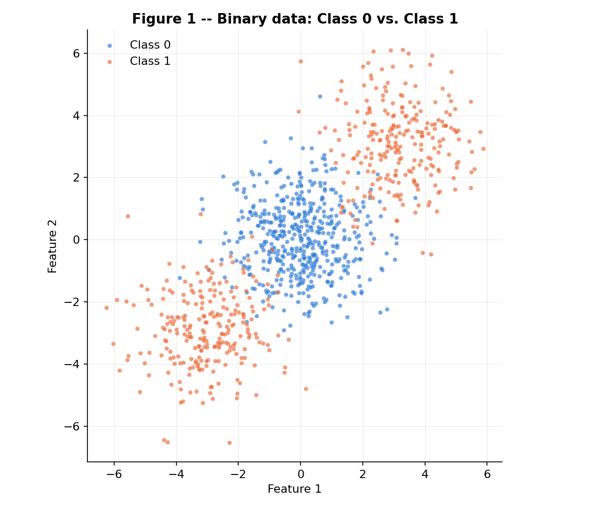
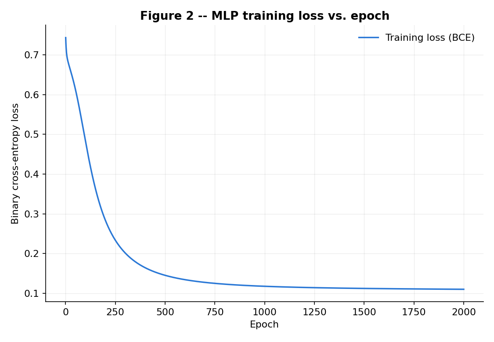
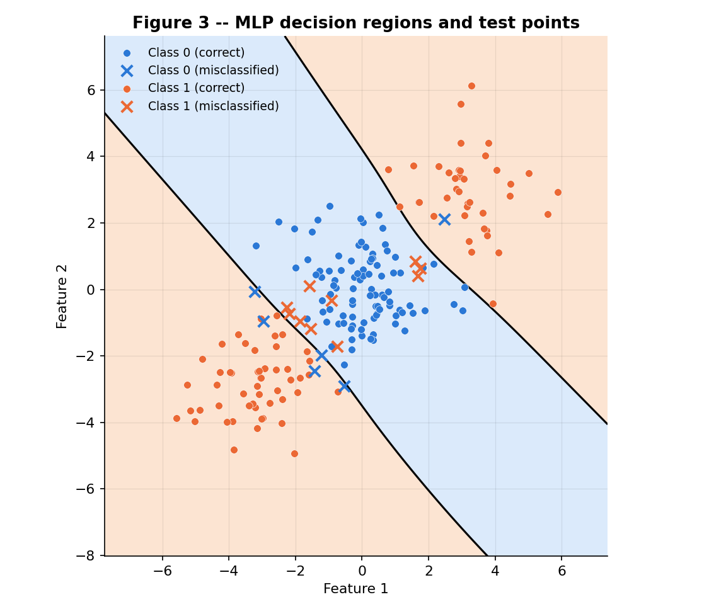
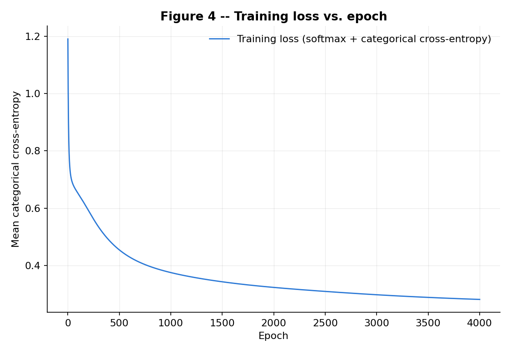
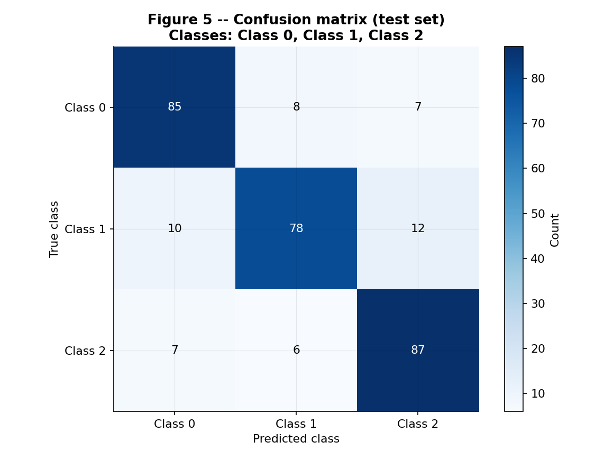
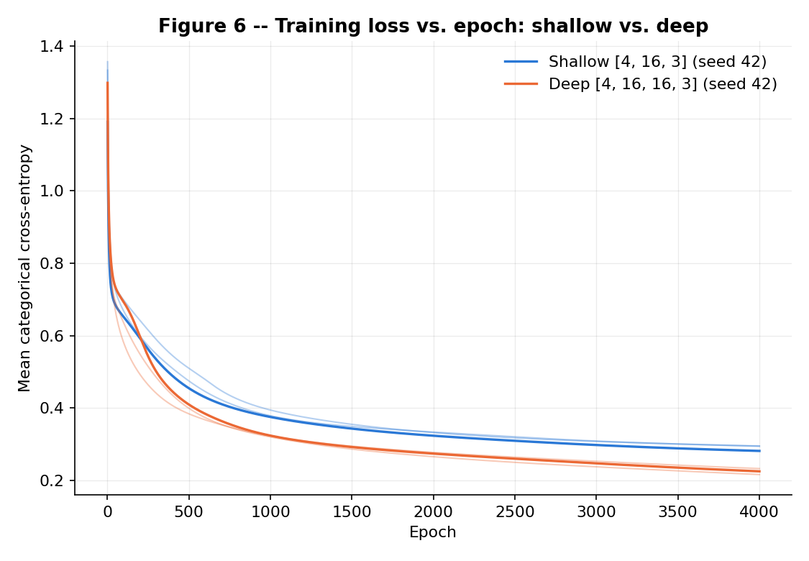

Four exercises, one question: what does a hidden layer buy you?

Exercise 1 pushes one sample through a 2-2-1 tanh network by hand and moves every parameter
one gradient step. Exercise 2 builds the same machinery in numpy, as a class that takes its
layer sizes as an argument, and points it at a dataset no straight line can split. Exercise 3
reuses that code untouched on three classes, which needs only a softmax output and a different
loss. Exercise 4 adds a second hidden layer and asks, over three seeds, whether depth earned
its parameters.

Everything the network does is hand-written: activations, losses, every gradient, the update.
scikit-learn appears only where the statement allows it, to generate and split the datasets, for
the logistic-regression baselines, and for the confusion matrix. One generator,
`rng = np.random.default_rng(42)`, seeds each script.

## Exercise 1

A 2-2-1 network: two inputs, one hidden layer of two \(\tanh\) units, one \(\tanh\) output unit, squared error on a single sample. Convention: \(\mathbf{z}^{(1)} = \mathbf{W}^{(1)}\mathbf{x} + \mathbf{b}^{(1)}\) and \(u^{(2)} = \mathbf{W}^{(2)}\mathbf{h}^{(1)} + b^{(2)}\), so row \(i\) of \(\mathbf{W}^{(1)}\) holds the weights feeding hidden unit \(i\) (\(\mathbf{W}^{(2)}\) is a row vector since there is one output unit).

### A

Hidden pre-activations, \(z^{(1)}_i = \sum_j W^{(1)}_{ij} x_j + b^{(1)}_i\):

\[ z^{(1)}_1 = (0.3)(0.5) + (-0.1)(-0.2) + 0.1 = 0.15 + 0.02 + 0.1 = 0.2700 \]

\[ z^{(1)}_2 = (0.2)(0.5) + (0.4)(-0.2) + (-0.2) = 0.1 - 0.08 - 0.2 = -0.1800 \]

Hidden activations, \(h^{(1)}_i = \tanh(z^{(1)}_i)\):

\[ h^{(1)}_1 = \tanh(0.2700) = 0.2636 \]

\[ h^{(1)}_2 = \tanh(-0.1800) = -0.1781 \]

Output pre-activation, \(u^{(2)} = W^{(2)}_1 h^{(1)}_1 + W^{(2)}_2 h^{(1)}_2 + b^{(2)}\):

\[ u^{(2)} = (0.5)(0.2636) + (-0.3)(-0.1781) + 0.2 = 0.1318 + 0.0534 + 0.2 = 0.3852 \]

Output and loss:

\[ \hat{y} = \tanh(u^{(2)}) = \tanh(0.3852) = 0.3672 \]

\[ L = (y - \hat{y})^2 = (1.0000 - 0.3672)^2 = 0.4004 \]

### B

Each gradient below is derived from the one before it by the chain rule, starting at the loss and working back to the inputs.

\[ \frac{\partial L}{\partial \hat{y}} = -2(y - \hat{y}) = -2(1.0000 - 0.3672) = -1.2655 \]

\(\hat{y} = \tanh(u^{(2)})\), and \(\frac{d}{du}\tanh(u) = 1 - \tanh^2(u) = 1 - \hat{y}^2\), so by the chain rule:

\[ \frac{\partial L}{\partial u^{(2)}} = \frac{\partial L}{\partial \hat{y}} \cdot (1 - \hat{y}^2) = -1.2655 \times (1 - 0.3672^2) = -1.2655 \times 0.8652 = -1.0948 \]

Output layer. \(u^{(2)} = W^{(2)}_1 h^{(1)}_1 + W^{(2)}_2 h^{(1)}_2 + b^{(2)}\), so \(\partial u^{(2)} / \partial W^{(2)}_j = h^{(1)}_j\) and \(\partial u^{(2)} / \partial b^{(2)} = 1\):

\[ \frac{\partial L}{\partial W^{(2)}_1} = \frac{\partial L}{\partial u^{(2)}} \cdot h^{(1)}_1 = -1.0948 \times 0.2636 = -0.2886 \]

\[ \frac{\partial L}{\partial W^{(2)}_2} = \frac{\partial L}{\partial u^{(2)}} \cdot h^{(1)}_2 = -1.0948 \times (-0.1781) = 0.1950 \]

\[ \frac{\partial L}{\partial b^{(2)}} = \frac{\partial L}{\partial u^{(2)}} \cdot 1 = -1.0948 \]

Propagate back through the same sum, \(\partial u^{(2)} / \partial h^{(1)}_j = W^{(2)}_j\):

\[ \frac{\partial L}{\partial h^{(1)}_1} = \frac{\partial L}{\partial u^{(2)}} \cdot W^{(2)}_1 = -1.0948 \times 0.5 = -0.5474 \]

\[ \frac{\partial L}{\partial h^{(1)}_2} = \frac{\partial L}{\partial u^{(2)}} \cdot W^{(2)}_2 = -1.0948 \times (-0.3) = 0.3284 \]

\(h^{(1)}_i = \tanh(z^{(1)}_i)\), so \(\partial h^{(1)}_i / \partial z^{(1)}_i = 1 - (h^{(1)}_i)^2\):

\[ \frac{\partial L}{\partial z^{(1)}_1} = \frac{\partial L}{\partial h^{(1)}_1} \cdot (1 - (h^{(1)}_1)^2) = -0.5474 \times (1 - 0.2636^2) = -0.5474 \times 0.9305 = -0.5094 \]

\[ \frac{\partial L}{\partial z^{(1)}_2} = \frac{\partial L}{\partial h^{(1)}_2} \cdot (1 - (h^{(1)}_2)^2) = 0.3284 \times (1 - 0.1781^2) = 0.3284 \times 0.9683 = 0.3180 \]

Hidden layer. \(z^{(1)}_i = \sum_j W^{(1)}_{ij} x_j + b^{(1)}_i\), so \(\partial z^{(1)}_i / \partial W^{(1)}_{ij} = x_j\): the gradient is the outer product \(\mathbf{\delta}^{(1)} \mathbf{x}^\top\), with \(\mathbf{\delta}^{(1)} = \partial L / \partial \mathbf{z}^{(1)}\) — row \(i\) of \(\partial L/\partial \mathbf{W}^{(1)}\) scales \(\mathbf{x}\) by \(\delta^{(1)}_i\), matching the row convention of \(\mathbf{W}^{(1)}\) itself:

\[ \frac{\partial L}{\partial W^{(1)}_{11}} = \frac{\partial L}{\partial z^{(1)}_1} \cdot x_1 = -0.5094 \times 0.5 = -0.2547 \]

\[ \frac{\partial L}{\partial W^{(1)}_{12}} = \frac{\partial L}{\partial z^{(1)}_1} \cdot x_2 = -0.5094 \times (-0.2) = 0.1019 \]

\[ \frac{\partial L}{\partial W^{(1)}_{21}} = \frac{\partial L}{\partial z^{(1)}_2} \cdot x_1 = 0.3180 \times 0.5 = 0.1590 \]

\[ \frac{\partial L}{\partial W^{(1)}_{22}} = \frac{\partial L}{\partial z^{(1)}_2} \cdot x_2 = 0.3180 \times (-0.2) = -0.0636 \]

And \(\partial z^{(1)}_i / \partial b^{(1)}_i = 1\):

\[ \frac{\partial L}{\partial b^{(1)}_1} = \frac{\partial L}{\partial z^{(1)}_1} = -0.5094, \qquad \frac{\partial L}{\partial b^{(1)}_2} = \frac{\partial L}{\partial z^{(1)}_2} = 0.3180 \]

### C

Gradient descent, \(\eta = 0.3\), applied to every parameter (the statement says eight; \(\mathbf{W}^{(1)}\) alone has four, so there are nine scalars):

\[ W^{(2)}_1 \leftarrow 0.5 - 0.3(-0.2886) = 0.5866, \qquad W^{(2)}_2 \leftarrow -0.3 - 0.3(0.1950) = -0.3585 \]

\[ b^{(2)} \leftarrow 0.2 - 0.3(-1.0948) = 0.5284 \]

\[ W^{(1)}_{11} \leftarrow 0.3 - 0.3(-0.2547) = 0.3764, \qquad W^{(1)}_{12} \leftarrow -0.1 - 0.3(0.1019) = -0.1306 \]

\[ W^{(1)}_{21} \leftarrow 0.2 - 0.3(0.1590) = 0.1523, \qquad W^{(1)}_{22} \leftarrow 0.4 - 0.3(-0.0636) = 0.4191 \]

\[ b^{(1)}_1 \leftarrow 0.1 - 0.3(-0.5094) = 0.2528, \qquad b^{(1)}_2 \leftarrow -0.2 - 0.3(0.3180) = -0.2954 \]

The updated parameters: \(\mathbf{W}^{(2)} = [0.5866, -0.3585]\), \(b^{(2)} = 0.5284\), \(\mathbf{W}^{(1)} = \begin{bmatrix} 0.3764 & -0.1306 \\ 0.1523 & 0.4191 \end{bmatrix}\), \(\mathbf{b}^{(1)} = [0.2528, -0.2954]\).

A second forward pass with these updated parameters gives \(u^{(2)} = 0.8896\), \(\hat{y} = 0.7112\), and:

\[ L_{\text{new}} = (1.0000 - 0.7112)^2 = 0.0834 \]

The loss goes down, from \(0.4004\) to \(0.0834\). A gradient descent step moves every parameter in the direction opposite its gradient; for a small enough \(\eta\) this always reduces a smooth loss to first order, and \(\eta = 0.3\) is small enough here — the measured drop confirms it.

```python
--8<-- "docs/exercises/mlp/code/ex1_backprop_by_hand.py"
```

## Exercise 2

*Binary classification a straight line cannot do.*

### A

Class 0 is one Gaussian blob centered at `[0, 0]`, 500 points. Class 1 is two Gaussian blobs, 250
points each, centered at `[3, 3]` and `[-3, -3]`, on opposite sides of Class 0. All three blobs come
from a single `make_blobs(n_samples=[500, 250, 250], centers=[[0,0],[3,3],[-3,-3]], cluster_std=1.2,
random_state=42)` call; `y = (c > 0).astype(int)` folds the two Class 1 blobs into one label, giving
an exact **500/500** class split over **1000** points total. The split is
`train_test_split(X, y, test_size=0.2, random_state=42, stratify=y)`: **800 train / 200 test**,
stratified so each half keeps the 50/50 balance. **Figure 1** plots all 1000 points, one color per
class — Class 0 forms a single round cloud at the center, Class 1 forms two round clouds in the
upper-right and lower-left corners.



### B

`LogisticRegression()` fit on the training split scores **47.50%** test accuracy — below the 50%
a constant majority guess would already get on this balanced split. Part D explains why.

### C

The MLP is a from-scratch `MLP` class (`mlp.py`) that takes `layer_sizes` as a constructor argument,
so the same code trains any depth or width — Exercises 3 and 4 reuse it untouched. It implements,
by hand, the forward pass (`tanh` on every hidden layer, sigmoid or softmax on the output), the loss
(mean binary cross-entropy here), the backward pass (every gradient derived, no autodiff), and the
plain gradient-descent update. No scikit-learn, PyTorch, or TensorFlow model touches the network
itself.

Architecture **`[2, 16, 1]`** (2 inputs, one hidden layer of 16 tanh units, one sigmoid output),
**65** parameters total. Trained full-batch with `lr = 0.1` for **2000** epochs. Final training loss
(mean BCE) is **0.1103**. Test accuracy is **92.00%** (16/200 test points misclassified) — inside
the 90–93% range a correct implementation is expected to land in, and far above the 47.50% linear
baseline. **Figure 2** plots training loss against epoch: it drops fast for the first ~300 epochs
and flattens out near 0.11 well before the 2000-epoch budget ends. **Figure 3** shows the network's
decision regions, evaluated on a 350×350 grid, together with the 200 test points colored by true
class and marked filled (correct) or ✕ (misclassified).

| model | test accuracy |
|---|---|
| Logistic regression (baseline) | 47.50% |
| MLP `[2, 16, 1]` | 92.00% |





### D

**Figure 3** shows the region the network assigns to Class 1: two disconnected corners, one around
`(3, 3)` and one around `(-3, -3)`, separated by a diagonal band around the origin that the network
assigns to Class 0. That band runs perpendicular to the line joining the two Class 1 centers, and
both Class 1 corners sit outside it, on opposite ends.

No straight line can produce that shape. A line splits the plane into exactly two half-planes.
Placing the boundary to wall the `(3, 3)` lobe off from Class 0 puts that boundary between the lobe
and the origin — but the `(-3, -3)` lobe sits on the exact opposite side of the origin, so the same
boundary drops it back into whichever half-plane already holds Class 0. A line can isolate one lobe
or the other. It cannot isolate both.

That geometry also explains why the linear baseline lands below 50%, not merely near it. The class
split is exactly 500/500, and the three blob centers are symmetric about the origin: reflecting
every point through `(0, 0)` swaps the `(3, 3)` and `(-3, -3)` lobes and leaves the Class 0 cloud
unchanged, so the class layout is symmetric under that reflection. A single line breaks this
symmetry — whatever boundary logistic regression settles on, its mirror image would fit exactly as
well, and no direction favors one lobe without equally penalizing the other. The fitted line
converges to that symmetric compromise: it catches only slivers of each Class 1 lobe while cutting
into the Class 0 cloud sitting between them, which is worse than the 50% a constant majority guess
already gets on this evenly split dataset. The MLP's two-lobe region in Figure 3 is exactly the
shape a single hyperplane cannot express, and it is what buys the jump from 47.50% to 92.00%.

```python
--8<-- "docs/exercises/mlp/code/ex2_binary.py"
```

## Exercise 3

Same network as Exercise 2, extended to three classes: `[4, 16, 3]`, tanh on the hidden
layer, softmax on the output, categorical cross-entropy loss. The forward pass, backward
pass and update step are `mlp.py`'s, unchanged — see Part B.

### A

`make_classification` draws 1500 samples with 4 informative features, 3 classes, 2 clusters
per class, `class_sep=1.0`, `random_state=42` — the class counts land at 499 / 499 / 502.
`train_test_split(..., test_size=0.2, random_state=42, stratify=y)` gives 1200 training
points and 300 test points. Targets are one-hot encoded for the network with
`np.eye(3)[y_train]`, plain numpy, no sklearn encoder.

### B

Extending Exercise 2 to three classes only touches the output layer: 3 units instead of 1,
softmax instead of sigmoid, categorical cross-entropy instead of binary cross-entropy. The
derivation below shows why the backward pass itself needs no change.

For one sample, let \(u_1, \dots, u_K\) be the output pre-activations and define the softmax
probabilities:

\[ p_k = \frac{e^{u_k}}{\sum_j e^{u_j}} \]

The loss, with one-hot target \(y\) (\(y_k \in \{0,1\}\), \(\sum_k y_k = 1\)):

\[ L = -\sum_k y_k \log p_k \]

First the softmax Jacobian. Differentiating \(p_k\) with respect to \(u_i\), the quotient rule
gives two cases: when \(i = k\), \(\partial p_k/\partial u_k = p_k(1-p_k)\); when \(i \neq k\),
\(\partial p_k/\partial u_i = -p_k p_i\). Both cases are one expression with the Kronecker
delta \(\delta_{ik}\) (1 if \(i=k\), else 0):

\[ \frac{\partial p_k}{\partial u_i} = p_k(\delta_{ik} - p_i) \]

Now chain through the loss. Since \(L = -\sum_k y_k \log p_k\), \(\partial L/\partial p_k =
-y_k/p_k\). Every \(p_k\) depends on \(u_i\), so the chain rule sums over \(k\):

\[ \frac{\partial L}{\partial u_i} = \sum_k \frac{\partial L}{\partial p_k}\frac{\partial p_k}{\partial u_i}
= \sum_k \left(-\frac{y_k}{p_k}\right) p_k(\delta_{ik}-p_i) = -\sum_k y_k(\delta_{ik}-p_i) \]

Expand the sum. \(\sum_k y_k \delta_{ik} = y_i\), since only the \(k=i\) term survives. And
\(\sum_k y_k p_i = p_i \sum_k y_k = p_i\), using \(\sum_k y_k = 1\) because \(y\) is one-hot.
So:

\[ \frac{\partial L}{\partial u_i} = -(y_i - p_i) = p_i - y_i \]

In vector form, per sample, \(\partial L/\partial u = p - y\). This is the "famously simple"
result the statement points at: the softmax Jacobian and the log in the loss cancel almost
entirely, leaving just the difference between the predicted and the true distribution.

With mean reduction over \(N\) samples, as `mlp.py`'s `loss` uses, the batch gradient is:

\[ \frac{\partial L}{\partial U} = \frac{P - Y}{N} \]

This is the exact same expression sigmoid + binary cross-entropy gives (`mlp.py`'s docstring
derives that case). Because the output-layer gradient has one form for both output types,
`backward` needs no branch on `output` — the same chain of matmuls and tanh derivatives
handles either loss. That is why `mlp.py`'s `forward`, `backward` and `update` are reused
untouched between Exercise 2 and Exercise 3, earning the +1 point: the only things that
change are the constructor arguments, `layer_sizes=[4, 16, 3]` instead of Exercise 2's
shape, and `output="softmax"` instead of `"sigmoid"`.

### C

Architecture `[4, 16, 3]`, tanh hidden, softmax output, 131 parameters
(\(4 \times 16 + 16 = 80\) in the hidden layer, \(16 \times 3 + 3 = 51\) in the output
layer). Trained full-batch at `lr = 0.1` for `epochs = 4000`. The statement's own starting
point, `lr = 0.1, epochs = 2000`, undershoots: at 2000 epochs test accuracy is 82.33%, just
below the 83–86% band. Keeping `lr = 0.1` and extending to 4000 epochs (still full-batch
gradient descent on 1200 points, not a different optimizer) lands the final training loss
at 0.2811 and test accuracy at **83.33%**, inside the expected band.





### D

The most-confused pair is **Class 1 predicted as Class 2**: 12 test points, with 6 more
going the other way, for 18 points total confused between that pair — the largest
off-diagonal entry in Figure 5.

The data has 4 informative dimensions and 2 clusters per class, 6 clusters total. Nothing
forces clusters of different classes apart in that 4-D space at `class_sep=1.0`: a Class 1
cluster can land close to a Class 2 cluster while both sit far from Class 0. A single
hidden layer of 16 tanh units builds its decision regions from 16 hyperplane cuts of the
input space, combined by the output layer — enough for well-separated clusters, but not
enough to carve a clean boundary around two clusters from different classes that overlap in
part of that 4-D volume. The confusion concentrates on exactly the pair whose clusters sit
closest, not spread evenly across all three classes.

The logistic-regression baseline reaches 66.33% test accuracy, close to the statement's
~66% reference — a straight line separates none of the three classes well when their
clusters interleave. The hidden layer adds 17.00 percentage points over that baseline
(83.33% − 66.33%): enough tanh units to bend the boundary around most of the cluster
structure, but not the two clusters that sit closest together.

```python
--8<-- "docs/exercises/mlp/code/ex3_multiclass.py"
```

## Exercise 4

Same data as Exercise 3, same split, same training budget, same learning rate. The only
change is depth: a second hidden layer, `[4, 16, 16, 3]` against Exercise 3's `[4, 16, 3]`.

### A

`HIDDEN = 16`, `LR = 0.1` and `EPOCHS = 4000` are imported from `ex3_multiclass`
(`from ex3_multiclass import HIDDEN, LR, EPOCHS`), not retyped, so the budget cannot drift
between the two exercises. The deep network is `[4, 16, 16, 3]`, tanh on both hidden layers,
softmax output, 403 parameters (\(4 \times 16 + 16 = 80\) in the first hidden layer,
\(16 \times 16 + 16 = 272\) in the second, \(16 \times 3 + 3 = 51\) in the output layer),
against 131 for Exercise 3's single-hidden-layer net.

Data and split are regenerated with the identical calls Exercise 3 uses: `make_classification`
with `random_state=42`, `train_test_split` with `test_size=0.2, random_state=42, stratify=y` —
copied verbatim since `ex3_multiclass.py` does not expose a separate data-building function.
For seed 42, the shallow network is built and trained before the deep one, both from the same
`rng = np.random.default_rng(42)`; since training is full-batch, `fit` never touches the rng
again, so the shallow run draws its weights in exactly the order Exercise 3 did. It reproduces
Exercise 3's numbers exactly: test accuracy 83.33%, final training loss 0.2811, checked with an
assert in the script, not just by eye. The deep network at seed 42 reaches 86.67% test accuracy
with a final training loss of 0.2247.

### B



|   | hidden layers | parameters | final train loss | test accuracy |
|---|---|---|---|---|
| Exercise 3 | 1 | 131 | 0.2811 | 83.33% |
| Exercise 4 | 2 | 403 | 0.2247 | 86.67% |

Three seeds, weight init only (`[42, 43, 44]`), data and split fixed:

| seed | shallow test acc | deep test acc | diff (deep − shallow) |
|---|---|---|---|
| 42 | 83.33% | 86.67% | +3.33 pp |
| 43 | 83.00% | 84.33% | +1.33 pp |
| 44 | 85.00% | 85.67% | +0.67 pp |
| **mean** | **83.78%** | **85.56%** | **+1.78 pp** |

The deep network wins on every seed. The mean accuracy difference (deep − shallow) is +1.78
percentage points (individual seeds: +3.33, +1.33, +0.67). Mean final training loss also drops
with depth: 0.2900 ± 0.0063 (shallow) against 0.2242 ± 0.0067 (deep).

### C

Depth did not hurt here. It helped, modestly and consistently: the deep network beats the
shallow one on both training loss and test accuracy, on all three seeds, by 0.67 to 3.33
percentage points. That is not the direction the statement calls the expected one — it says the deeper
net "will most likely not beat the shallower one... and may well do worse." Reporting the
measured direction is what the statement asks for, so here it is: on this run, depth won a
little.

The data has 6 clusters, 2 per class, in 4 informative dimensions. Exercise 3's Part D
already showed a single hidden layer of 16 tanh units gets most of that structure right
(83.33%) but confuses one pair of clusters that sit close together (Class 1 predicted as
Class 2, 18 points total). Sixteen hyperplane cuts from one layer, recombined once, is close
to enough, not quite. A second hidden layer lets those cuts compose: cuts of cuts, not just
a wider single layer. That is exactly the extra representational power a shallow net lacks,
and exactly the kind of gap this data still has after Exercise 3. A small, real improvement
from depth is the plausible outcome, and it is what got measured.

The cost side of depth is a longer gradient path and 3.1x the parameters (403 against 131).
At the same learning rate and epoch budget that could easily show up as harder optimization —
slower descent, or a training loss that plateaus higher. Figure 6 shows the opposite: the deep
curve (orange) drops below the shallow curve (blue) by around epoch 300–500 and stays lower
through all 4000 epochs, for the seed-42 run and for every other seed's faint line. The extra
parameters get used, not wasted on a harder-to-optimize path.

Training loss and test accuracy tell the same story. Training loss falls by about 22% with
depth (0.2900 → 0.2242, mean over seeds); test accuracy rises by 1.78 percentage points on an
83.78% base, about a 2.1% relative gain. Both move the same direction, in proportion, on every
seed. Overfitting means training loss falls while test accuracy stays flat or drops. It does
not here: both improve together, which points at a genuine fit improvement, not overfitting.

The size of the win matters as much as its direction. 1.78 points on 300 test samples is about
5 extra correct predictions. This dataset gives depth a small foothold, one confused cluster
pair, not a large one. Data that would reward depth far more decisively needs real hierarchical
or compositional structure: many more clusters per class, an XOR-of-XOR label rule where no
single layer of cuts can separate the classes at all, or raw inputs like images or sequences
where low-level features (edges, phonemes) must first combine into higher-level ones before a
class boundary makes any sense. This 6-cluster, 4-D problem is close to what one hidden layer
can already solve. That is why the second layer's edge here is real but small.

```python
--8<-- "docs/exercises/mlp/code/ex4_depth.py"
```

## Results summary

| # | Quantity | Value |
|---|---|---|
| 1 | Ex. 1 — \(\mathbf{z}^{(1)}\) and \(\mathbf{h}^{(1)}\) | \(\mathbf{z}^{(1)} = [0.2700, -0.1800]\), \(\mathbf{h}^{(1)} = [0.2636, -0.1781]\) |
| 2 | Ex. 1 — \(u^{(2)}\), \(\hat{y}\) and \(L\) | \(u^{(2)} = 0.3852\), \(\hat{y} = 0.3672\), \(L = 0.4004\) |
| 3 | Ex. 1 — the eight updated parameters | \(\mathbf{W}^{(2)} = [0.5866, -0.3585]\), \(b^{(2)} = 0.5284\), \(\mathbf{W}^{(1)} = [[0.3764, -0.1306], [0.1523, 0.4191]]\), \(\mathbf{b}^{(1)} = [0.2528, -0.2954]\); second-pass loss 0.0834 (down from 0.4004) |
| 4 | Ex. 2 — linear baseline test accuracy | 47.50% |
| 5 | Ex. 2 — architecture and test accuracy | `[2, 16, 1]`, tanh hidden, sigmoid output, lr 0.1, 2000 epochs: 92.00% |
| 6 | Ex. 3 — architecture and test accuracy | `[4, 16, 3]`, tanh hidden, softmax output, lr 0.1, 4000 epochs: 83.33% (baseline 66.33%) |
| 7 | Ex. 3 — most-confused class pair | Class 1 predicted as Class 2 (12 test points; 18 in both directions) |
| 8 | Ex. 4 — architecture and test accuracy | `[4, 16, 16, 3]`, same lr and epochs as Ex. 3: 86.67% (seed 42) |
| 9 | Ex. 4 — accuracy difference against Ex. 3 (mean over ≥ 3 seeds) | +1.78 percentage points (seeds 42, 43, 44: +3.33, +1.33, +0.67); depth helped, modestly |
