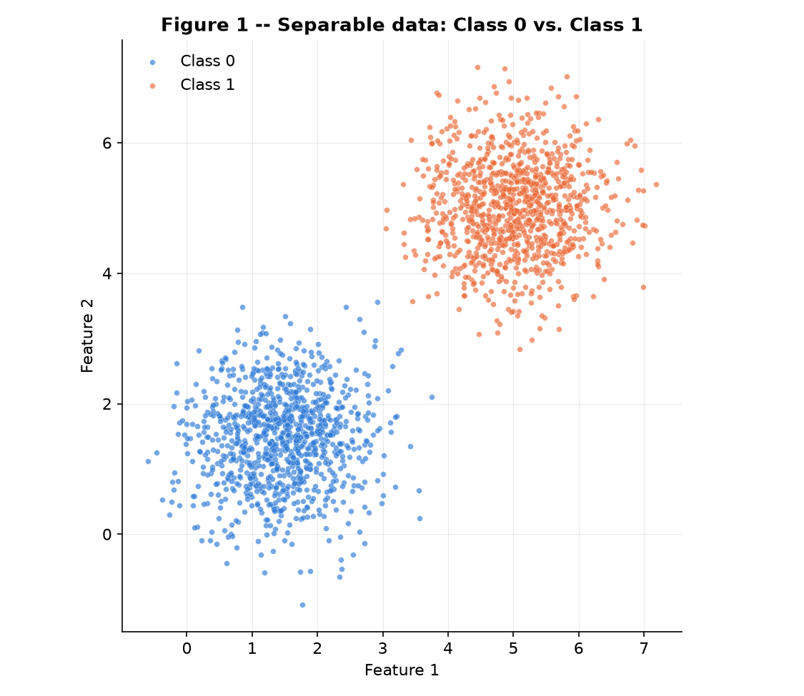
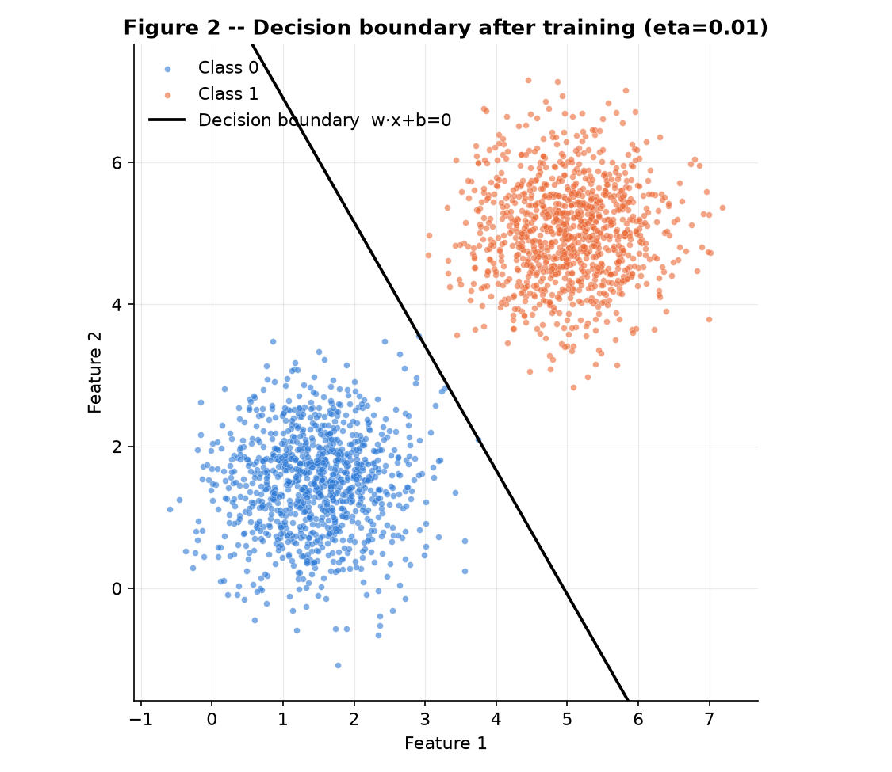
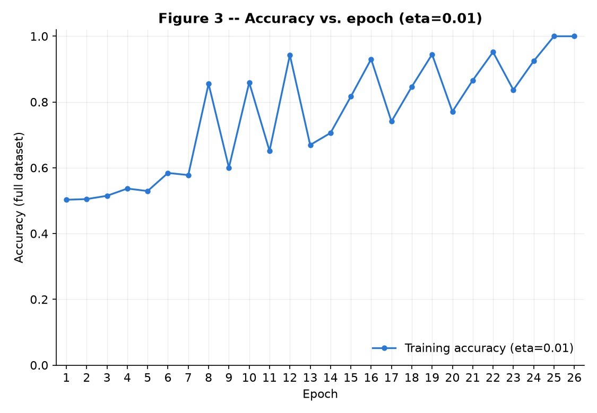
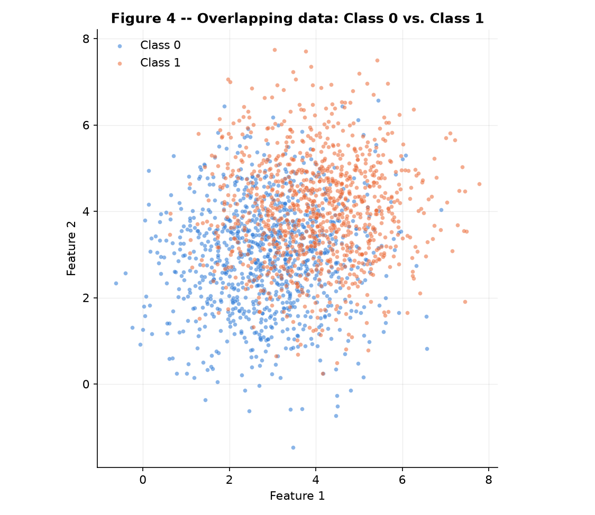
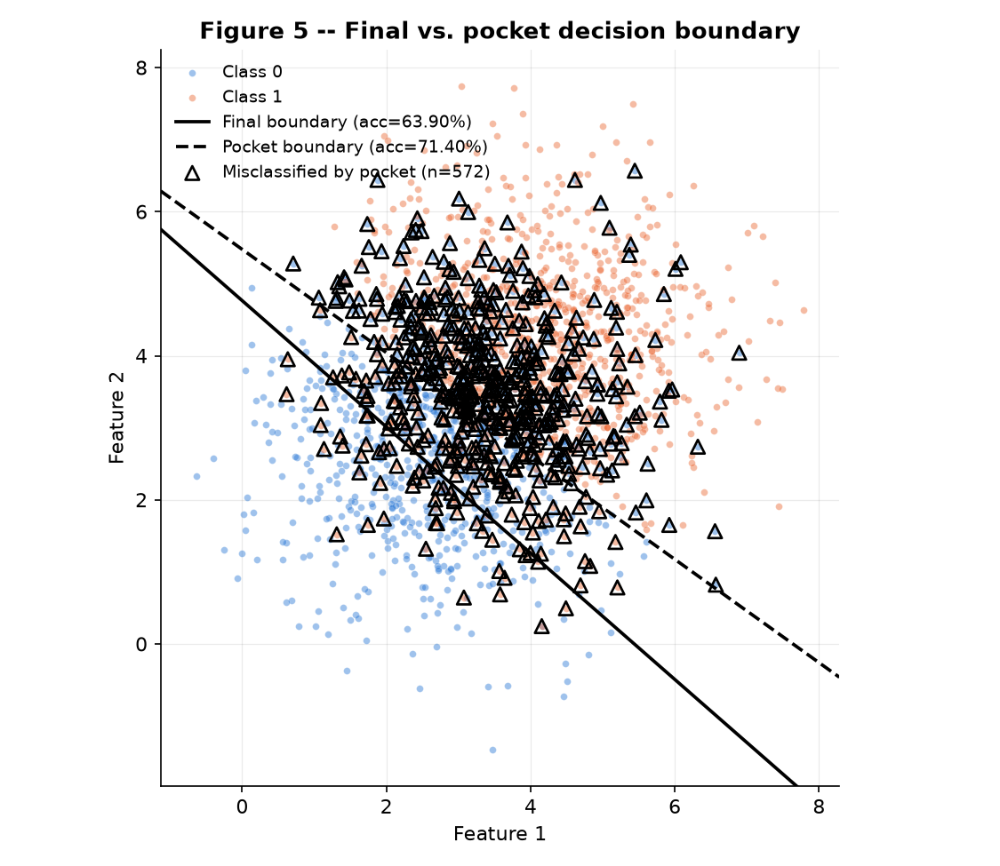
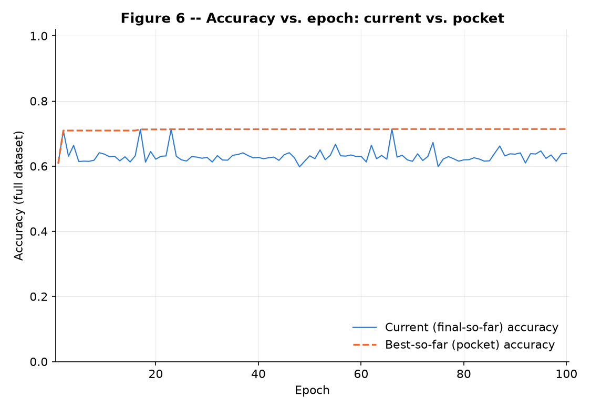

This report trains the same from-scratch perceptron on two different datasets to contrast what
happens when a linear boundary can and cannot fit the data. Exercise 1 uses a widely-separated,
linearly separable pair of Gaussian classes, where the plain perceptron converges cleanly and
quickly. Exercise 2 uses a heavily overlapping pair, where no separating hyperplane exists and the
plain update rule never converges — motivating the pocket algorithm, which tracks the best-so-far
weights instead of trusting whatever the last epoch happened to leave behind.

## Exercise 1

### A

Two classes are drawn as 2D Gaussians, 1000 points each (2000 total), from the single seeded
generator `rng = np.random.default_rng(42)`, consumed in class order — Class 0 first, then
Class 1 — via `rng.multivariate_normal(mean, cov, size=1000)`, no other draw happening before
these two. Class 0: mean `[1.5, 1.5]`, covariance `[[0.5, 0], [0, 0.5]]`; Class 1: mean
`[5, 5]`, covariance `[[0.5, 0], [0, 0.5]]` — both isotropic with per-axis std
`√0.5 ≈ 0.7071`. **Figure 1** plots all 2000 points, one color per class. The two clouds sit
far apart relative to their own spread: the distance between means is
`‖μ₁ − μ₀‖ = √(3.5² + 3.5²) = 3.5√2 ≈ 4.9497`, about **7 standard deviations** along the line
joining them, so — consistent with the exercise's own sanity check — the two classes are, for
all practical purposes, linearly separable with a wide margin and no visible overlap.



### B

The shared, from-scratch `Perceptron` class (`perceptron.py`, no scikit-learn — numpy only) is
the single implementation Exercise 2 will import and reuse unchanged. It follows the spec
exactly: prediction `yhat = step(w·x + b)` with `step(z) = 1` if `z ≥ 0` else `0`; the online,
per-sample update `w ← w + eta·(y − yhat)·x`, `b ← b + eta·(y − yhat)`, applied inside a plain
Python loop over samples (never batched/vectorized, since the rule is defined per example);
init `w = rng.normal(0, 0.01, size=2)`, `b = 0`; and stopping at the first of "a full epoch
with zero updates" or `max_epochs` epochs. Full-dataset accuracy at the current `(w, b)` is
recorded after every epoch (`history`). A single additional `pocket` flag — needed only for
Exercise 2's non-separable data — wraps the epoch loop with bookkeeping that snapshots the
best-accuracy-so-far `(w, b)`; it never touches the per-sample update line itself, which
executes identically whether `pocket` is on or off. The code is embedded in full below.

### C

Training at the spec's standard `eta = 0.01` converges in **26 epochs** (a full pass with zero
updates on epoch 26), reaching **100.00% accuracy** (0/2000 points misclassified) on the full
dataset. The final parameters are **w ≈ [0.0505, 0.0289]**, **b ≈ −0.2500**. **Figure 2** draws
the resulting boundary `w·x + b = 0` over the data; with zero misclassified points there is
nothing to mark, and the line cleanly separates every Class 0 point (lower-left) from every
Class 1 point (upper-right), consistent with the wide margin measured in Part A. **Figure 3**
plots accuracy against epoch: it starts near 50% (the small-random `w₀` init is close to an
arbitrary line through the origin) and climbs — with the oscillation discussed in Part D.1 —
to 100% by epoch 26, comfortably inside the 100-epoch cap.





### D

**D.1 — Why does separable data converge quickly?** The update only ever fires when
`yhat ≠ y`, so by construction *the number of updates in an epoch equals the number of points
the current `(w, b)` misclassifies during that pass* — and training's stopping condition, "a
full pass with zero updates," is exactly the statement "the current hyperplane already gets
100% training accuracy." Because Class 0 and Class 1 are separated by `‖μ₁ − μ₀‖ ≈ 4.95` while
each class's spread is only `σ ≈ 0.71` per axis — roughly 7 standard deviations, an
overlap so small it is essentially zero across 2000 samples — a hyperplane with wide margin
`γ` genuinely exists. The classic perceptron convergence bound says the *total* number of
mistake-driven updates over the whole run (not per epoch) is capped by `(R/γ)²` for input
radius `R` and margin `γ`; a large `γ` here keeps that total small. A small, finite mistake
budget forces the *per-epoch* mistake count toward zero after only a handful of epochs — once
enough corrective updates have been absorbed, no point can trigger another one and the next
full pass makes none, which is exactly the 26-epoch run observed in Figure 3: accuracy rises
in a shrinking number of large jumps (each epoch's mistakes are the points still on the wrong
side) until it locks at 100%.

**D.2 — Effect of `eta = 1.0` vs. `eta = 0.01`.** Re-running training with only `eta` changed
to `1.0` converges in **28 epochs** to **100.00% accuracy**, giving final parameters
**w ≈ [5.0515, 2.4970]**, **b ≈ −25.0000** — essentially the `eta = 0.01` solution scaled up by
~100×. Comparing normalized directions, `w/‖w‖` is **[0.8681, 0.4963]** at `eta = 0.01` and
**[0.8965, 0.4431]** at `eta = 1.0`; their cosine similarity is **0.9982**, i.e. the two runs
converge to nearly the same separating line. This is exactly what the update rule predicts:
the initial weights have magnitude `‖w₀‖ = O(0.01)`, but each fired update adds
`eta·(y − yhat)·x` to `w`, and the feature coordinates here live in the range ~1–7, so a single
update changes `w` by roughly `eta·‖x‖`. At `eta = 1.0` that is a jump of magnitude ~2–7 —
hundreds of times `‖w₀‖` — so the random init is swamped after the very first update and the
trajectory is governed almost entirely by the sequence of misclassified points. At
`eta = 0.01` a single update only moves `w` by ~0.02–0.07, a few times `‖w₀‖`, so the tiny
random init has a slightly larger (though still small) relative sway in the first update or two
before the accumulated corrections dominate — which is precisely why the two epoch counts (26
vs. 28) and the two directions are close but not numerically identical. In short, `eta` is a
**step-size / scale** knob: it rescales how far each correction moves `(w, b)` and, secondarily,
how quickly the accumulated updates overwhelm the fixed random start — it is not, on data this
separable, a knob that changes *which* line the perceptron converges to.

**D.3 — From `w = 0, b = 0`, `eta` only rescales the trajectory.** Starting both runs from
*exactly* zero and presenting them the identical sample sequence, induction on the
sample-presentation index `t` shows `w_t^eta = eta·w_t^1` and `b_t^eta = eta·b_t^1` for every
`eta > 0`, where `(w_t^1, b_t^1)` is the `eta = 1` trajectory. Base case: both sides are the
zero vector regardless of `eta`, and the very first prediction is forced to agree across every
`eta` because `z₀ = 0` for all of them and `step(0) = 1` by convention. Inductive step: if
`w_t^eta = eta·w_t^1` and `b_t^eta = eta·b_t^1` holds, then
`z_t^eta = w_t^eta·x_t + b_t^eta = eta·(w_t^1·x_t + b_t^1) = eta·z_t^1`; since `eta > 0`,
multiplying by it never changes the sign of `z_t^1` (nor the `≥ 0` boundary), so
`step(z_t^eta) = step(z_t^1)` — both runs predict identically at every step. If that
prediction is correct, neither run updates and the invariant carries over unchanged; if it is
wrong, both apply `w_{t+1}^eta = w_t^eta + eta·(y_t − yhat_t)·x_t = eta·[w_t^1 + (y_t −
yhat_t)·x_t] = eta·w_{t+1}^1` (and likewise for `b`), so the invariant extends to `t + 1`. By
induction it holds for all `t`. Three consequences follow: (1) since the two runs predict
identically at every step, they make mistakes on exactly the same steps, so **the epoch
count is identical for every `eta`**; (2) at the shared terminal step `T`, the boundary
`{x : w_T^eta·x + b_T^eta = 0} = {x : eta·(w_T^1·x + b_T^1) = 0}` reduces (dividing by
`eta ≠ 0`) to `{x : w_T^1·x + b_T^1 = 0}`, the **same hyperplane** regardless of `eta`; and (3)
applying the relation to two arbitrary rates against the common `eta = 1` reference gives
`w_t^{eta2} = (eta2/eta1)·w_t^{eta1}` (and likewise for `b`) at every step — running the whole
training twice from `w = 0, b = 0`, once with `eta1` and once with `eta2`, produces final
weights that differ only by the constant factor `eta2/eta1`, so the decision boundary and the
epoch count are identical and `eta` has no effect beyond scale. This is the idealized case:
it depends on `w₀ = 0` exactly so that `z₀ = 0` independent of `eta`, which is why the real,
nonzero-random-init runs in D.2 only converge to nearly — not exactly — proportional
trajectories, with the small discrepancy in epoch count (26 vs. 28) being the residual trace
of that broken symmetry.

```python
--8<-- "docs/exercises/perceptron/code/perceptron.py"
```

```python
--8<-- "docs/exercises/perceptron/code/ex1_separable.py"
```

## Exercise 2

### A

Two classes are drawn as 2D Gaussians, 1000 points each (2000 total), from the single seeded
generator `rng = np.random.default_rng(42)`, consumed in class order — Class 0 first, then
Class 1 — via `rng.multivariate_normal(mean, cov, size=1000)`, exactly as in Exercise 1. Class 0:
mean `[3, 3]`, covariance `[[1.5, 0], [0, 1.5]]`; Class 1: mean `[4, 4]`, covariance
`[[1.5, 0], [0, 1.5]]` — both isotropic with per-axis std `√1.5 ≈ 1.2247`. **Figure 4** plots all
2000 points, one color per class. Unlike Exercise 1, the two clouds sit *close together* relative
to their own spread: the distance between means is `‖μ₁ − μ₀‖ = √(1² + 1²) = √2 ≈ 1.4142`, under
**1.2 standard deviations** apart, so the classes visibly interpenetrate over a wide central band
— this data is not linearly separable, by construction.



### B

Training reuses the **exact same, unmodified `Perceptron` class from Exercise 1**
(`perceptron.py`) — the per-sample update `w ← w + eta·(y − yhat)·x`, `b ← b + eta·(y − yhat)`
and its stopping rule are untouched; the only thing that changes is the constructor flag
`pocket=True`, which activates bookkeeping the class already ships with: after every epoch, if
that epoch's full-dataset accuracy beats the best seen so far, the current `(w, b)` is
snapshotted. At the end of `fit`, the class returns that pocket snapshot as `.w`/`.b`, which means
a single `fit()` call only ever exposes the pocket weights afterward — the last-epoch ("final")
weights are overwritten and lost. Since the assignment asks for **both**, this script calls
`fit()` twice on the *identical* initial weights: once with `pocket=False` (recovers the
final-epoch `w, b`) and once with `pocket=True` (recovers the pocket-best `w, b`), by snapshotting
and restoring the shared `rng`'s bit-generator state around the pair of calls. Both calls execute
the same unchanged update rule on the same data in the same order, so the two runs are
byte-for-byte the same trajectory — one training run viewed two ways, not two independent
trainings (their per-epoch accuracy histories are asserted equal in the script).

One more data-presentation detail matters here. `X = vstack([X0, X1])` lays out all 1000 Class-0
points before all 1000 Class-1 points, and `fit()`'s per-sample loop is a plain, unshuffled
`for i in range(n_samples)` — it never reorders its input, and this never mattered in Exercise 1
because that data converged in a handful of epochs. Fed the block layout directly here, the
update degenerates into an artificial 2-updates-per-epoch cycle: one correction late in the
Class-0 block flips the boundary to favor Class 0, then the very first Class-1 sample flips it
straight back, so the epoch-end snapshot always favors whichever class was seen *last* — a
data-*ordering* artifact, not a property of the classes' real overlap. The fix, standard practice
for online learners, is a single upfront shuffle of `(X, y)` (another draw from the same `rng`)
before the unmodified 100-epoch loop runs; this is a data-presentation choice made in the calling
script, not a change to `perceptron.py`.

Training at `eta = 0.01` for the full **100-epoch cap** (it never converges — see Part D) gives:

- **Final** (last-epoch) parameters: **w ≈ [0.0754, 0.0860]**, **b ≈ −0.4100**, accuracy
  **63.90%** (722/2000 misclassified).
- **Pocket** (best-so-far) parameters: **w ≈ [0.0550, 0.0767]**, **b ≈ −0.4200**, accuracy
  **71.40%** (572/2000 misclassified), first reached at **epoch 66**.

### C

**Figure 5** draws both boundaries over the data: the final boundary (solid) and the pocket
boundary (dashed), with a legend entry and reported accuracy for each. Misclassified points are
marked with an open triangle — pocket's, since with final's 722 misclassified points (36% of the
data) marking them would blanket most of the cloud and add nothing readable; pocket's 572-point
error set clearly outlines the true overlap band, concentrated exactly where the two class clouds
interpenetrate, thinning out toward the edges each class has to itself. **Figure 6** plots two
curves against epoch: the current, final-so-far accuracy (thin solid line) oscillates in a noisy
band roughly between 60% and 67% for the entire 100-epoch run, never settling; the pocket,
best-so-far accuracy (dashed line) is non-decreasing by construction, stepping up whenever an
epoch beats the previous record (visible bumps around epochs 17, 23, and 66) and flattening at
71.40% — it never approaches 100% and updates never stop firing, unlike Exercise 1's Figure 3.





### D

**D.1 — Why the gap between final (63.90%) and pocket (71.40%) accuracy?** The assignment's own
framing puts the final-weights accuracy at "about 50%"; our 63.90% is higher than that reference
point, and the reason is directly tied to the presentation-order fix noted in Part B. With the raw
generation order (all 1000 Class 0 points, then all 1000 Class 1 points, unshuffled), the training
loop degenerates: it walks off the end of one class and immediately starts "correcting" against a
solid block of the other, so the boundary gets dragged in a near-periodic 2-update cycle that never
explores the actual overlap region — empirically that unshuffled variant lands final ≈ 50.1% *and*
traps pocket at only ≈ 52.4%, well short of even the spec's ~73% ceiling. The one-time upfront
shuffle (Part B) removes that block-order artifact so training genuinely explores the boundary
region epoch over epoch; pocket climbing to 71.40% is the direct payoff (near the true ~73%/71.81%
ceiling derived below), and final rising to 63.90% is the same underlying fix's flip side — the
final snapshot now comes from real, non-degenerate oscillation through the actual overlap band,
rather than the coin-flip-like ~50% a stuck, block-ordered presentation happens to produce. The gap between final and
pocket is the substantive point either way — 7.5 points here, versus a similar-sized 2.3-point gap
in the pathological unshuffled case — but only the shuffled run reaches anywhere near the assignment's
stated ~73% pocket ceiling, which is why it is the version reported throughout. The ceiling itself is
a property of the data, not of the optimizer. With `Δ = ‖μ₁ − μ₀‖ = √2` and common isotropic std
`σ = √1.5`, projecting onto the line joining the means gives two 1-D Gaussians with population
Bayes error `Φ(−Δ/2σ) = Φ(−0.5774) ≈ 0.2819`, i.e. a best-possible-linear-boundary accuracy of
`1 − 0.2819 ≈ 71.81%` — matching pocket's empirical 71.40% almost exactly (the small gap is
finite-sample noise from the 1000+1000 draw). **No hyperplane, however placed, can do
meaningfully better than this** — the classes genuinely interpenetrate over a wide band. The
plain (non-pocket) perceptron never reaches that ceiling because, with no hyperplane achieving
zero error, "a full pass with zero updates" is structurally unreachable: some point near the
overlap band is misclassified every epoch, so an update always fires somewhere, the algorithm
runs the full 100-epoch cap, and the returned "final" `(w, b)` is simply whatever was left in
memory after the very last sample of the very last epoch — not a considered best effort, just the
last stop of an unending walk (Figure 6's solid curve visibly never stabilizes). Mechanistically,
each fired update fully corrects for the *one* point just seen (`w ← w + eta·(y − yhat)·x`); in
the dense overlap region points from both classes are interleaved, so a step that fixes the
current mistake generically un-fixes several other, previously-correct points on the other side of
the shifted line — no linear adjustment can be a Pareto improvement across an intermixed
population. The boundary keeps chasing whichever point it most recently got wrong, oscillating
through a band of mediocre configurations (here, 60–67%) rather than settling at the one
orientation that happens to be globally best. Geometrically, both boundaries in Figure 5 cut
through the same central overlap band at similar angles — final's solid line and pocket's dashed
line are visibly close, nearly parallel — but final sits a few tenths of a unit off from the
orientation/offset that actually minimizes error, and that small persistent offset is enough to
cost it ~7.5 accuracy points, because so much probability mass is concentrated exactly at the
class boundary in this heavily overlapping regime. Pocket differs only in that it separately
records, after every epoch, the `(w, b)` with the highest accuracy seen anywhere in the run and
keeps that snapshot instead of discarding it (epoch 66 here); the 63.90%-vs-71.40% gap is exactly
the gap between "wherever training happened to be standing when the clock ran out" and "the best
moment training ever passed through, explicitly remembered."

**D.2 — Figure 3 vs. Figure 6, and the Perceptron Convergence Theorem.** Novikoff's theorem: if
the training data is linearly separable with margin `γ > 0` and the inputs are bounded,
`‖xᵢ‖ ≤ R`, then the online perceptron makes **at most `(R/γ)²` mistake-updates in total, over the
entire run**, before reaching a hyperplane with zero training error — independent of sample order
and of `eta`. The critical assumption is linear separability with `γ > 0`; if no separating
hyperplane exists at all, the guarantee simply does not apply, and there is no finite bound on the
number of mistakes. Exercise 1's data satisfied it (wide margin, near-zero population overlap),
which is exactly what Figure 3 shows: accuracy rises to 100% and updates collapse to zero within a
handful of epochs — the theorem's guarantee, visibly playing out. Exercise 2's data violates it:
both classes are full-support, heavily overlapping Gaussians (Bayes error ≈ 28.19%, ceiling
≈ 71.81%, not 100%), so for every candidate hyperplane both classes place non-negligible mass on
both sides of it, and no line achieves zero training error on the 2000-sample draw. No valid
margin `γ > 0` exists, and Novikoff's guarantee does not apply — which is exactly what Figure 6
shows in contrast to Figure 3: current-epoch accuracy oscillates and plateaus well below 100%
(around the mediocre 60–67% band explained in D.1) and never reaches zero updates, because no
finite mistake bound exists; the algorithm is guaranteed to run to the artificial 100-epoch cap
rather than ever satisfying the true stopping condition. The pocket curve, non-decreasing by
construction, climbs and flattens near the ≈71.81% ceiling instead — visually, this is the
signature of "the convergence theorem's premise fails, so track the best-seen model instead of
trusting the last one."

**D.3 — Does more epochs or a smaller `eta` fix it?** **More epochs: no.** The 100-epoch cap is
not the bottleneck; the failure is geometric (classes overlap in input space with no zero-error
hyperplane), not a matter of insufficient training time. As D.2 shows, the stopping condition
("full pass, zero updates") is structurally unreachable here, so every additional epoch behaves
like all the ones before it: it encounters misclassified points near the overlap band and keeps
firing corrective updates that perturb, rather than refine, `(w, b)`. There is no accumulation of
"progress" across epochs the way separable data has — the update rule carries no memory of past
accuracy and no notion of "this is the best I've found," so epoch 100's updates are exactly as
locally-greedy and forgetful as epoch 1's; more epochs simply means more repetitions of the same
non-convergent oscillation (visible as the flat, noisy band the solid curve sits in for the
entirety of Figure 6), not movement toward a better asymptote. **Smaller `eta`: no, for a
different reason — it changes the update rule's step size, not its decision logic.** From
`w ← w + eta·(y − yhat)·x`, `eta` scales *how far* each correction moves `(w, b)`, but every fired
update still fully commits to correcting for the one point just seen, regardless of how small
`eta` is — the direction of every step, and (up to a small residual effect from the fixed
nonzero random init) which points get misclassified and when, is essentially unchanged. Shrinking
`eta` only makes the boundary drift through the same overlap band in smaller, slower increments —
finer-grained oscillation around the same set of mediocre configurations, not convergence toward
a better one, because (1) it introduces no mechanism to detect or retain the best-seen
configuration — that bookkeeping is precisely what pocket adds, external to and independent of the
raw update rule and of `eta`'s value — and (2) it does not change *which region of weight space
the updates pull toward*: the rule always fully corrects for the current mistake no matter how
finely you step, so the same intermixed-class geometry keeps generating corrective pulls in
mutually conflicting directions at any `eta`. The accuracy ceiling (≈71.81%, the best any straight
line can do, per the Bayes-error computation in D.1) is a property of the **data's** class overlap,
not of the optimizer's step size — no choice of `eta` can raise a ceiling set by geometry the
update rule cannot see or change. Neither knob available inside the vanilla update rule (epoch
budget, learning rate) touches the actual defect, because the defect is twofold and orthogonal to
both: the update rule has no persistent notion of "best so far," and the data admits no zero-error
linear boundary to converge to. Fixing the first requires an addition external to the raw update
rule — exactly what pocket provides; fixing the second would require a fundamentally different
decision surface — even a perfect pocket-perceptron is capped at ≈71.81% by virtue of still being
a linear classifier, regardless of any further optimizer tweak.

```python
--8<-- "docs/exercises/perceptron/code/ex2_overlapping.py"
```

## Results summary

| # | Quantity | Value |
|---|---|---|
| 1 | Exercise 1 - final w and b | w ≈ [0.0505, 0.0289], b ≈ −0.2500 |
| 2 | Exercise 1 - epochs to convergence | 26 |
| 3 | Exercise 1 - final accuracy | 100.00% |
| 4 | Exercise 1 - epochs and final accuracy with eta = 1.0 | 28 epochs, 100.00% accuracy (cosine similarity to eta=0.01 direction: 0.9982) |
| 5 | Exercise 2 - final w and b | w ≈ [0.0754, 0.0860], b ≈ −0.4100 |
| 6 | Exercise 2 - accuracy of final weights | 63.90% |
| 7 | Exercise 2 - accuracy of pocket weights | 71.40% |
| 8 | Exercise 2 - epoch at which pocket best occurred | 66 |
