# 1. EDA — Will this station flood tomorrow?

**Project:** ASIA-FLOOD 25-Year Flood Risk Atlas · **Task:** binary classification ·
**Target:** `flood_event_occurred` on day *t+1*, for the same station

**Team:** Luigi Lopes · Lucas Abatepietro · Marcelo Alonso

This is the first deliverable of the classification project: an exploratory analysis of the
dataset that will be used until the end of the semester, ending in a preprocessing pipeline
ready for modelling. **No model is trained here.**

The question is asked at 456,550 station-days: given everything a river monitoring station has recorded
up to and including day *t*, will it report a flood on day *t+1*?

## 0. Proposal

| | |
|---|---|
| **Dataset** | ASIA-FLOOD: 25-Year Flood Risk Atlas (2000–2024) |
| **Source** | [Kaggle](https://www.kaggle.com/datasets/aliahmadmphil/asia-flood-25-year-flood-risk-atlas), by aliahmadmphil |
| **Licence** | CC BY-SA 4.0 |
| **Size** | 456,600 rows × 21 columns (`station_daily_data_full.csv`) |
| **Task** | Classification — will station *s* flood on day *t+1*? |
| **Target** | `flood_event_occurred`, shifted one day forward within each station |
| **Features** | raw: **14 numerical / 6 categorical** + `date` · modelled: 6 numerical + 2 categorical → **21** after the pipeline |
| **First risk** | two columns (`flood_risk_score`, `severity_level`) are the target in disguise — stage 1B quantifies it |

The file carries 25 years of daily records for 50 river-monitoring stations across 10 Asian
basins and 7 countries: rainfall, river level, soil moisture and temperature, plus static basin
context and three outcome columns. A one-day-ahead flood warning is the natural task: it is the
horizon at which a warning is still actionable, and the dataset is a daily panel built for it.

*Figures are numbered by the item they belong to — **Figure 3B.2** is the second figure of item
3B — so each item's figure budget is visible in the numbering itself (stage 1 and the synthesis, which have no per-item cap, are numbered sequentially: Figures 1.1–1.5 and 5.1–5.2). Every figure carries a
title, labelled axes with units and a legend, and is followed by one explicit conclusion.*


## 1. Initial inspection

Stage 1 fixes the vocabulary: what is in the file, what is wrong with it, what is predicted, and which rows may be used to fit anything. Every number is printed by [`t1_inspection.py`](https://github.com/luigilopesz/Neural-Networks-Deep-Learning/blob/main/docs/projects/eda/code/t1_inspection.py), which re-derives it from `data/station_daily_data_full.csv`.

### A. Data dictionary

**Source.** *ASIA-FLOOD: 25-Year Dataset* (Kaggle, author `aliahmadmphil`), licence **CC BY-SA 4.0**. `documentation/metadata.json` declares version 3.0, 2000–2024, **456,600** records, **50** stations, **10** basins. The README says "Generated on: 2026-07-23", so the data is synthetic (see the warning at the top).

**What a row is.** One **monitoring station on one calendar day**: a *balanced daily panel* of **456,600 rows × 21 columns** = 50 stations × 9,132 days, 2000-01-01 → 2024-12-31, with no gaps.

| column | meaning | dtype | unit | role |
|---|---|---|---|---|
| `station_id` | Monitoring-station key, `ASIA_0001`…`ASIA_0050` | `str` | – | identifier |
| `station_name` | Place name of the station; 1:1 with `station_id` | `str` | – | identifier |
| `basin` | River basin (10 levels, 5 stations each) | `str` | – | static-per-station |
| `country` | Country label attached to the basin (7 levels) | `str` | – | static-per-station |
| `latitude` | Station latitude, repeated on all of its rows | `float64` | decimal degrees | static-per-station |
| `longitude` | Station longitude, repeated on all of its rows | `float64` | decimal degrees | static-per-station |
| `date` | Calendar day of the observation | `datetime64[us]` | – | calendar |
| `year` | Calendar year, 2000–2024 | `int64` | year | calendar |
| `month` | Calendar month, 1–12 | `int64` | month | calendar |
| `day` | Day of month, 1–31 | `int64` | day | calendar |
| `day_of_year` | Ordinal day inside the year, 1–366 | `int64` | day-of-year | calendar |
| `rainfall_mm` | Daily rainfall accumulation (2.02 … 1,775.72) | `float64` | **mm/day** | measurement |
| `river_level_m` | River stage at the gauge (0.66 … 204.67) | `float64` | **m** | measurement |
| `soil_moisture_percent` | Volumetric soil moisture, censored at 100.00 (0.39 … 100.00) | `float64` | **%** | measurement |
| `temperature_celsius` | Daily mean air temperature (−2.31 … 45) | `float64` | **°C** | measurement |
| `flood_risk_score` | Synthesised composite risk index, 1.00 … 10.00 on a 0.01 grid | `float64` | index 1–10 | outcome-derived |
| `flood_event_occurred` | Same-day flood label: 1 if the station flooded that day | `int64` | 0/1 | label |
| `severity_level` | 4-level binning of `flood_risk_score` (Low/Moderate/High/Extreme) | `str` | – | outcome-derived |
| `season` | Meteorological season, deterministic from `month` | `str` | – | calendar |
| `monsoon_season` | 1 for Jun–Oct, else 0; deterministic from `month` | `int64` | 0/1 | calendar |
| `data_quality_score` | Per-row quality score, 0.88 … 0.99; uncorrelated with everything | `float64` | index 0.88–0.99 | measurement |

Six columns (`year`, `month`, `day`, `day_of_year`, `season`, `monsoon_season`) are deterministic re-encodings of `date` (**0 mismatches** on all 456,600 rows). Three (`flood_risk_score`, `severity_level`, `flood_event_occurred`) are outcome-derived (Section B).

**Companion files.** `station_daily_data_full.csv` (456,600 × 21) is the **only data source used**. `station_daily_data.csv` (100,000 × 21) is a uniform 21.90 % random sample of it and is **not used**: it keeps 21.90 % of the rows and breaks the daily time axis that lag and window features need. `vulnerability_data.csv` (10 × 18, one row per basin) and `asia_flood_geospatial.geojson` (10 basin `Polygon`s) are static context only.

### B. Quality

**Missing values — there are none.** All 21 columns report **count 0 (0.00 %)**: 0 of 9,588,600 cells. That *is* the finding: nothing to impute, and none may be claimed. An imputer in the pipeline is only a robustness guard for a future partial day.

**Duplicates and panel completeness.** **0** fully duplicated rows, **0** duplicated `(station_id, date)` pairs, **0** missing days. Every station has exactly **9,132** rows, and 50 × 9,132 = **456,600**: the panel is rectangular and complete.

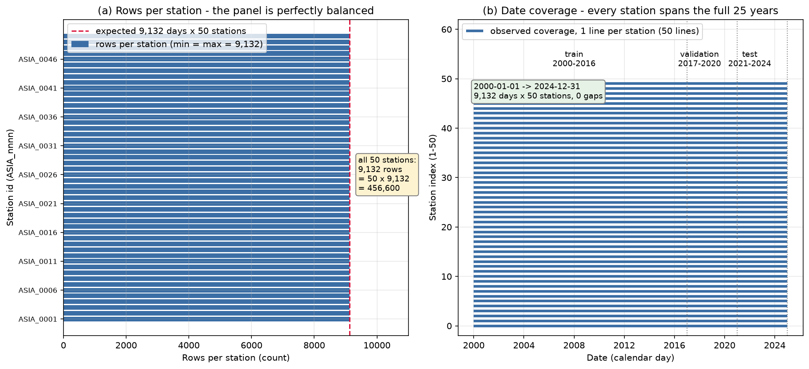

**Figure 1.1.** Panel completeness. **(a)** Rows per station against the expected 9,132. **(b)** Date coverage per station, with the three split windows marked. *Conclusion:* the panel is **balanced and gap-free**, so no station or period needs special handling.

**Inconsistencies, quantified.**

1. **One genuine contradiction — 32 rows.** Exactly **32 rows have `flood_risk_score == 7.00`**: all are `severity_level == "Extreme"` and all have `flood_event_occurred == 0`, because the label is the strict rule `risk > 7.0` while the Extreme bin includes 7.00.
2. **`soil_moisture_percent` is censored at exactly 100.00** — **9,153 rows (2.0046 %)**, a clipping artefact, not a measurement.
3. **`latitude`/`longitude` are constants**: 1 unique value per station, only **50** distinct coordinate pairs (`(station_name, latitude, longitude)` is duplicated on **456,550** rows). They are static metadata repeated on every row.
4. **`country` is redundant**: `basin → country` is a function (10 basins, 7 countries), so it adds nothing to `basin`.
5. **Names contradict coordinates**: the five `Mekong` stations are all tagged `country == "Vietnam"`, yet "Luang Prabang" sits at 16.1453 °N 103.0213 °E, which is Thailand, not Laos. Names are decorative; the coordinates are what the file encodes.

**Columns to drop, each with its reason** (the single source of truth is `DROPPED` in `code/data.py`):

| dropped column | reason |
|---|---|
| `severity_level` | target leakage — a deterministic binning of `flood_risk_score` |
| `flood_risk_score` | target leakage / redundant — `risk > 7.0` reproduces the same-day label on 456,600/456,600 rows (ROC-AUC 1.0000); r = 0.934 with `soil_moisture_percent`, and a *weaker* next-day predictor (AUC 0.8088) |
| `data_quality_score` | noise — \|r\| ≤ 0.004 against every other column (max 0.0022); next-day ROC-AUC 0.5072 |
| `station_name` | redundant — 1:1 with `station_id` |
| `country` | redundant — a function of `basin` |
| `day` | noise — day-of-month, r = 0.0007 with the next-day target |
| `latitude`, `longitude` | constant within station |

This leaves **6 numeric** inputs (`rainfall_mm`, `river_level_m`, `soil_moisture_percent`, `temperature_celsius`, `day_of_year`, `monsoon_season`) and **2 categorical** ones (`basin`, `season`): 8 model features from 21 raw columns.

**Leakage investigation.** This is the decisive finding of stage 1.

!!! warning "Two columns give the answer away"
    On **all 456,600 rows**, the same-day label is exactly the threshold rule

    ```
    flood_event_occurred  ==  (flood_risk_score > 7.0)
    ```

    with **max(risk | flood = 0) = 7.00** and **min(risk | flood = 1) = 7.01**: the classes are linearly separable on that one column (ROC-AUC **1.0000**). `severity_level` is a second copy of the same information.

| `severity_level` | `flood_risk_score` min | max | rows | floods |
|---|---|---|---|---|
| Low | 1.00 | 2.99 | 234,226 | 0 |
| Moderate | 3.00 | 4.99 | 129,974 | 0 |
| High | 5.00 | 6.99 | 82,479 | 0 |
| Extreme | 7.00 | 10.00 | 9,921 | 9,889 |
| **all** | 1.00 | 10.00 | **456,600** | **9,889** |

`severity_level` is `cut(risk, [1, 3, 5, 7, 10.01], right=False)`, reproduced on **456,600 / 456,600** rows (pandas' default `right=True` reproduces only 450,602). The Extreme bin holds 9,921 rows but only 9,889 floods: that is the 32-row contradiction above.

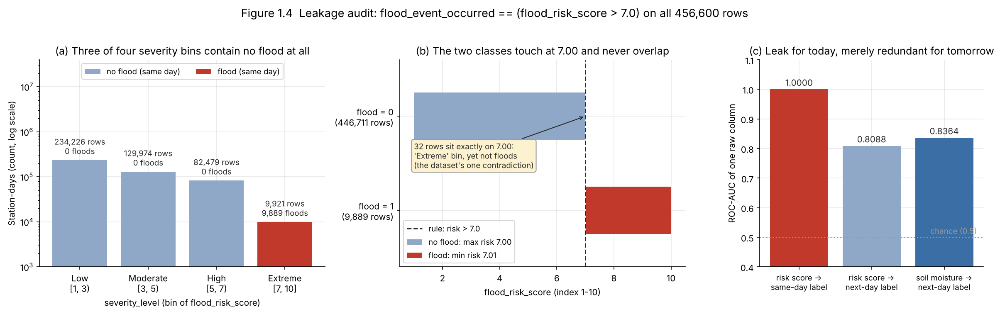

**Figure 1.4.** The leakage audit. **(a)** Rows per `severity_level` bin, same-day floods in red: Low, Moderate and High (**446,679** rows together) contain **0** floods. **(b)** Range of `flood_risk_score` per same-day class: the largest non-flood value is **7.00**, the smallest flood value **7.01**. **(c)** ROC-AUC of single raw columns: **1.0000** for the risk score against the same-day label, only **0.8088** against the next-day label — below soil moisture's **0.8364**. *Conclusion:* the risk score *is* the same-day label up to one threshold (a leak); for the next-day target it is a weaker copy of columns that are already features, so excluding it loses nothing.

**The nuance for a one-day-ahead target.** For the *same-day* label these columns are leakage. For the project's target `y(t) = flood_event_occurred(t+1)`, a value observed at *t* is merely *stale*. They are excluded anyway because they are **redundant, not informative**: `flood_risk_score` correlates r = **0.9337** with `soil_moisture_percent` (0.6643 with `river_level_m`, 0.5949 with `rainfall_mm`), and as a next-day predictor it scores ROC-AUC **0.8088**, below `soil_moisture_percent` (**0.8364**) and barely above `rainfall_mm` (0.8091).

### C. Target

The deliverable's label is the **one-day-ahead flood event**,

```
y(t) = flood_event_occurred(t + 1)        groupby("station_id")["flood_event_occurred"].shift(-1)
```

Shifting drops the last day of every station (**50 rows**), leaving **456,550 usable rows**.

| | count | share |
|---|---|---|
| `y = 0` (no flood tomorrow) | 446,661 | 97.834 % |
| `y = 1` (flood tomorrow) | 9,889 | **2.166 %** |
| imbalance (negatives : positives) | — | **45.2 : 1** |

The majority-class accuracy is **97.83 %**: that is the trivial baseline, stated once, and **accuracy is never used again**. The headline metric is **PR-AUC**, with ROC-AUC alongside.

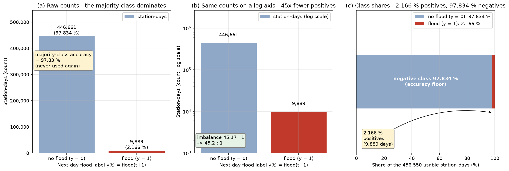

**Figure 1.2.** Class balance of the next-day label over 456,550 usable station-days: **(a)** raw counts, **(b)** log axis (45.17 : 1), **(c)** class shares. *Conclusion:* the problem is **severely imbalanced** — "never floods" is 97.83 % accurate, so every metric must be read against the 2.166 % base rate.

**The seasonal gate is part of the target.** **0 floods** occur in January–April and in November–December; **95.04 %** of floods (same-day) fall in July–September (**94.31 %** under the next-day label, where June absorbs 92 positives). The flood rate is **5.1702 %** when `monsoon_season = 1` against **0.000377 %** (1 flood in 265,350 rows) when it is 0 — about 13,700×. "Never flood outside the monsoon" is a free baseline, so any model must be judged **inside the monsoon window**, where the base rate is ~5.2 %, not 2.2 % (month-by-month in 3B).

### D. Train and test

**A temporal split is appropriate; a stratified-random one is not.**

1. **Rows one day apart are near-duplicates.** Pooled within-station lag-1 autocorrelation is **0.968** for temperature, **0.820** for soil moisture, 0.772 for the risk score, 0.220 for river level, 0.162 for rainfall.
2. **A random split leaks across the boundary.** With `train_test_split(test_size=0.20, random_state=42, stratify=…)`, **1,250 of 1,250** `(station, year)` blocks and **9,132 of 9,132** dates appear on both sides, and **145,898** adjacent-day pairs straddle the boundary. The date-based split shares **0** dates and has **100** straddling pairs (2 year boundaries × 50 stations).

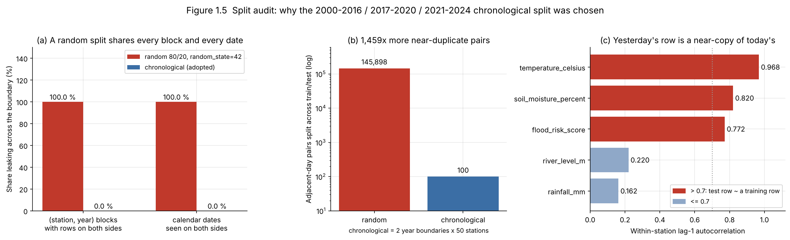

**Figure 1.5.** The split audit. **(a)** Share of `(station, year)` blocks and dates with rows on both sides: **100.0 %** (random) against **0.0 %** (chronological). **(b)** Adjacent-day pairs across the boundary: **145,898** against **100** (1,459× fewer). **(c)** Lag-1 autocorrelation of the features. *Conclusion:* a random split would put near-copies of training rows in the test set, so its score would measure memorised neighbours rather than forecasting skill.

**The split adopted** (`SPLITS` in `code/data.py`) is chronological, by date, identical dates for every station, with the seed fixed at **`random_state = SEED = 42`** for every stochastic step (sampling, PCA, t-SNE, UMAP).

| split | years | rows usable (next-day) | floods | next-day rate | stations |
|---|---|---|---|---|---|
| **train** | 2000–2016 | **310,500** | 6,566 | **2.1147 %** | 50 |
| **validation** | 2017–2020 | **73,050** | 1,620 | **2.2177 %** | 50 |
| **test** | 2021–2024 | **73,000** | 1,703 | **2.3329 %** | 50 |

The test year window holds 73,050 rows, but the 50 last-day rows (2024-12-31) have no *t+1*, leaving **73,000** usable; 310,500 + 73,050 + 73,000 = **456,550**.

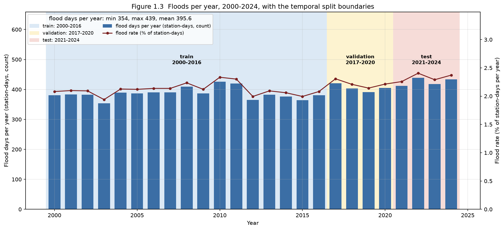

**Figure 1.3.** Flood days per year 2000–2024 (bars) and annual flood rate (line), with the three windows shaded. *Conclusion:* flood counts are **stable across all 25 years** (minimum 354, maximum 439, mean 395.6), so a chronological split has no regime change to trip on. There is a mild upward drift (2.0820 % in 2000, 2.3716 % in 2024), which is why the **test** rate is the one quoted as the test base rate.

!!! note "Fitting discipline from here on"
    **Every preprocessing statistic — scalers, imputers, category vocabularies, any decision threshold — is fitted on the training split only.** Validation and test rows are only transformed.

## 2. Univariate analysis

### A. Numerical

All 13 numerical columns are described on **all 456,600 rows** (every column has `count = 456,600`; nothing is imputed). *Skewness* is the adjusted Fisher–Pearson G1 (`scipy.stats.skew(bias=False)`); *kurtosis* is **excess** kurtosis (0 = Gaussian); *outside* counts rows beyond Q1 − 1.5·IQR or Q3 + 1.5·IQR. Every number is printed by [`t2_numeric.py`](https://github.com/luigilopesz/Neural-Networks-Deep-Learning/blob/main/docs/projects/eda/code/t2_numeric.py); no model is fitted.

**Table 2A.1 — the four measurements** (the columns that matter; all 13 are in the collapsible below).

| column | mean | median | std | min | max | skewness | excess kurtosis | n outside (%) |
|---|:--:|:--:|:--:|:--:|:--:|:--:|:--:|:--:|
| `rainfall_mm` | 20.28 | 10.76 | 41.92 | 2.02 | 1,775.72 | 10.513 | 158.202 | 9,274 (2.03) |
| `river_level_m` | 5.57 | 4.42 | 5.65 | 0.66 | 204.67 | 9.532 | 140.606 | 9,273 (2.03) |
| `soil_moisture_percent` | 36.94 | 31.00 | 18.15 | 0.39 | 100.00 | 0.864 | 0.857 | 9,180 (2.01) |
| `temperature_celsius` | 24.49 | 24.49 | 10.49 | -2.31 | 45.00 | 0.006 | -1.196 | 0 (0.00) |

??? note "Table 2A.2 — descriptive statistics for all 13 numerical columns"

    | column | count | mean | std | min | 1 % | 25 % | median | 75 % | 99 % | max | skewness | kurtosis | n outside | % outside |
    |---|:--:|:--:|:--:|:--:|:--:|:--:|:--:|:--:|:--:|:--:|:--:|:--:|:--:|:--:|
    | **Measurements** (raw sensor columns) |  |  |  |  |  |  |  |  |  |  |  |  |  |  |
    | `rainfall_mm` | 456,600 | 20.28 | 41.92 | 2.02 | 2.57 | 5.72 | 10.76 | 25.95 | 209.16 | 1,775.72 | 10.513 | 158.202 | 9,274 | 2.03 |
    | `river_level_m` | 456,600 | 5.57 | 5.65 | 0.66 | 1.93 | 3.16 | 4.42 | 6.79 | 30.19 | 204.67 | 9.532 | 140.606 | 9,273 | 2.03 |
    | `soil_moisture_percent` | 456,600 | 36.94 | 18.15 | 0.39 | 10.97 | 22.07 | 31.00 | 52.57 | 100.00 | 100.00 | 0.864 | 0.857 | 9,180 | 2.01 |
    | `temperature_celsius` | 456,600 | 24.49 | 10.49 | -2.31 | 5.83 | 15.25 | 24.49 | 33.77 | 43.88 | 45.00 | 0.006 | -1.196 | 0 | 0.00 |
    | **Static geography** (constant within station) |  |  |  |  |  |  |  |  |  |  |  |  |  |  |
    | `latitude` | 456,600 | 23.0414 | 5.3662 | 12.7104 | 12.7104 | 18.6490 | 23.9696 | 27.0986 | 33.4752 | 33.4752 | -0.214 | -0.818 | 0 | 0.00 |
    | `longitude` | 456,600 | 93.0482 | 15.9320 | 60.5478 | 60.5478 | 85.1654 | 96.9826 | 103.0756 | 115.8379 | 115.8379 | -0.561 | -0.691 | 0 | 0.00 |
    | **Outcome-derived** (dropped — see the caveat below) |  |  |  |  |  |  |  |  |  |  |  |  |  |  |
    | `flood_risk_score` | 456,600 | 3.44 | 1.67 | 1.00 | 1.01 | 2.09 | 2.92 | 4.75 | 8.90 | 10.00 | 0.849 | 0.534 | 5,973 | 1.31 |
    | `data_quality_score` | 456,600 | 0.9349 | 0.0317 | 0.8800 | 0.8810 | 0.9070 | 0.9350 | 0.9620 | 0.9890 | 0.9900 | 0.003 | -1.199 | 0 | 0.00 |
    | **Calendar** (deterministic re-encodings of `date`) |  |  |  |  |  |  |  |  |  |  |  |  |  |  |
    | `year` | 456,600 | 2,012.00 | 7.21 | 2,000 | 2,000 | 2,006 | 2,012 | 2,018 | 2,024 | 2,024 | 0.000 | -1.204 | 0 | 0.00 |
    | `month` | 456,600 | 6.52 | 3.45 | 1 | 1 | 4 | 7 | 10 | 12 | 12 | -0.009 | -1.208 | 0 | 0.00 |
    | `day` | 456,600 | 15.73 | 8.80 | 1 | 1 | 8 | 16 | 23 | 31 | 31 | 0.007 | -1.194 | 0 | 0.00 |
    | `day_of_year` | 456,600 | 183.14 | 105.45 | 1 | 4 | 92 | 183 | 274 | 362 | 366 | 0.000 | -1.200 | 0 | 0.00 |
    | **Seasonal gate** |  |  |  |  |  |  |  |  |  |  |  |  |  |  |
    | `monsoon_season` | 456,600 | 0.42 | 0.49 | 0 | 0 | 0 | 0 | 1 | 1 | 1 | 0.329 | -1.892 | 0 | 0.00 |

??? note "Table 2A.3 — the 1.5×IQR fences"

    | column | 25 % (Q1) | 75 % (Q3) | IQR | lower fence | upper fence | n outside | % outside |
    |---|:--:|:--:|:--:|:--:|:--:|:--:|:--:|
    | `rainfall_mm` | 5.72 | 25.95 | 20.23 | -24.62 | 56.30 | 9,274 | 2.03 |
    | `river_level_m` | 3.16 | 6.79 | 3.63 | -2.29 | 12.23 | 9,273 | 2.03 |
    | `soil_moisture_percent` | 22.07 | 52.57 | 30.50 | -23.68 | 98.32 | 9,180 | 2.01 |
    | `temperature_celsius` | 15.25 | 33.77 | 18.52 | -12.53 | 61.55 | 0 | 0.00 |
    | `latitude` | 18.6490 | 27.0986 | 8.4496 | 5.9746 | 39.7730 | 0 | 0.00 |
    | `longitude` | 85.1654 | 103.0756 | 17.9102 | 58.3001 | 129.9409 | 0 | 0.00 |
    | `flood_risk_score` | 2.09 | 4.75 | 2.66 | -1.90 | 8.74 | 5,973 | 1.31 |
    | `data_quality_score` | 0.9070 | 0.9620 | 0.0550 | 0.8245 | 1.0445 | 0 | 0.00 |
    | `year` | 2,006 | 2,018 | 12 | 1,988 | 2,036 | 0 | 0.00 |
    | `month` | 4 | 10 | 6 | -5 | 19 | 0 | 0.00 |
    | `day` | 8 | 23 | 15 | -14 | 46 | 0 | 0.00 |
    | `day_of_year` | 92 | 274 | 182 | -181 | 547 | 0 | 0.00 |
    | `monsoon_season` | 0 | 1 | 1 | -2 | 2 | 0 | 0.00 |

Nine of the thirteen columns have **no** point outside their fence; the four that do are the three skewed measurements and the dropped `flood_risk_score`.

**`rainfall_mm` — severely right-skewed.** Mean 20.28 mm against a median of 10.76 mm (**1.88×**); the maximum, 1,775.72 mm, is **165.0×** the median. Skewness **10.513** and excess kurtosis **158.202** are the largest in the dataset. `log1p` brings the skew to **0.69**, the kurtosis to **1.08** and the mean/median ratio to **1.06×**.

**`river_level_m` — the same, milder.** Mean/median **1.26×**, maximum 204.67 m = **46.3×** the median, skewness **9.532**. `log1p` gives skew **1.50**, kurtosis **5.65**, ratio **1.04×**: a bounded-below, unbounded-above gauge reading has a log-normal-looking tail.

**`soil_moisture_percent` — moderately skewed and censored.** `log1p` moves the skew only to **-0.10**, so the transform is optional, but the column has a defect no transform repairs:

!!! warning "Right-censored at exactly 100.00 %"
    **9,153 rows (2.005 %)** hold the value 100.00 (next distinct value: 99.93); the whole top 1 % of the column is pinned there. This is a ceiling artefact of the generator, not a measurement. Any transform must be **monotone** so the 9,153 rows stay tied (`log1p(100.00) = 4.62`). Of the 9,180 rows outside the fence (98.32), 9,153 are this tie and only **27** are genuine tail readings.

**`temperature_celsius` — flat, not bell-shaped.** Skewness **0.006**, excess kurtosis **-1.196**, mean = median = 24.49 °C, **0** rows outside the fence. The monthly means run from 10.73 °C (month 3) to 38.28 °C (month 9), a **27.55 °C** cycle, against a within-month sd of only **3.45–4.10 °C**: the cycle is **6.7–8.0×** the daily spread, which is why the pooled histogram is flat. It is also censored at 45.00 °C (**1,788 rows, 0.392 %**), invisibly to the IQR rule.

**The other nine columns.** `latitude`/`longitude` have exactly **50** distinct values (one per station, 2.000 % of rows each), so their 1st/99th percentiles equal the min/max; they are station identifiers in disguise, not features. `flood_risk_score` (1.00–10.00 on a 0.01 grid, skew 0.849, 5,973 rows outside 8.74) and `data_quality_score` (0.88–0.99, skew **0.003**, **0** outside) are dropped in stage 1B (leakage and noise). `year`, `month`, `day`, `day_of_year` reproduce `date` exactly (**0** mismatches) and have excess kurtosis **-1.194 to -1.208** with |skew| ≤ 0.009, the signature of a uniform distribution, as a balanced panel must produce. `monsoon_season` has mean 0.42.

#### Figure 2A.1 — raw vs `log1p`

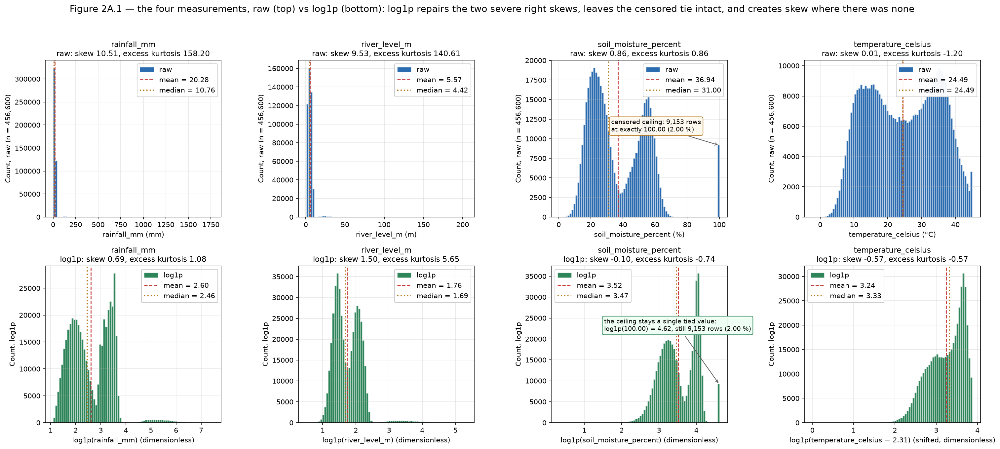

**Figure 2A.1.** Top row: raw values; bottom row: `log1p` (temperature shifted by its minimum, -2.31 °C). `rainfall_mm` and `river_level_m` go from an unreadable spike to a near-symmetric peak (mean/median 1.88× → 1.06× and 1.26× → 1.04×). `soil_moisture_percent` keeps its bar at the ceiling (9,153 tied rows). `temperature_celsius` starts symmetric (skew 0.006) and the transform manufactures a skew of **-0.57**.

**Conclusion (Figure 2A.1): `log1p` is justified for `rainfall_mm` and `river_level_m` only — it repairs their tails, leaves the soil-moisture ceiling in place and would damage `temperature_celsius`.**

#### Figure 2A.2 — the 1.5×IQR fences and the tails they flag

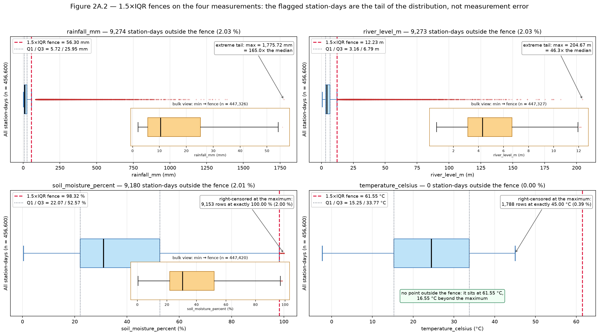

**Figure 2A.2.** Boxplots on the full range, with the upper fence (dashed red) and an inset on the bulk only. The `rainfall_mm` fence sits at 56.30 mm and flags 9,274 station-days (2.03 %), with the tail running **31.5×** past it; `river_level_m` is identical (fence 12.23 m, 9,273 rows). `soil_moisture_percent` is flagged for a *single tied value* (9,153 of 9,180 rows) and `temperature_celsius` has no flagged row (fence 16.55 °C beyond its maximum).

**Conclusion (Figure 2A.2): the flagged tails are continuous and dense, not impossible readings, so an outlier filter would delete signal rather than errors.**

#### Figure 2A.3 — `temperature_celsius`: one seasonal sinusoid behind a flat density

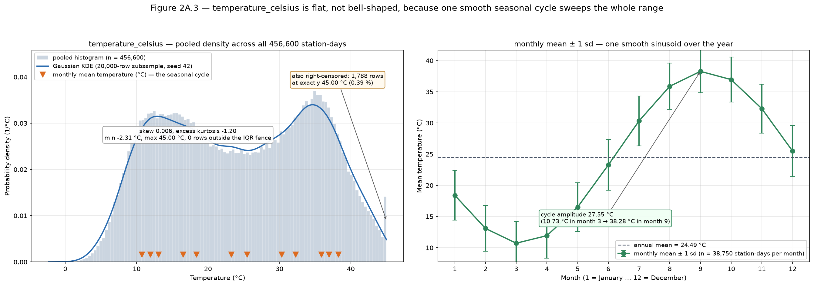

**Figure 2A.3.** Left: pooled density over 456,600 station-days (120 bins, Gaussian KDE on a 20,000-row subsample, `SEED` = 42). Right: monthly mean ± 1 sd. The mean travels from 10.73 °C to 38.28 °C (amplitude 27.55 °C) while the within-month sd is 3.45–4.10 °C, so the two soft modes are the turning points where one seasonal cycle lingers. The spike at 45.00 °C is the censoring.

**Conclusion (Figure 2A.3): the flat temperature density is one seasonal cycle, not a mixture or an error, so the column is left untransformed.**

**What this hands to stage 4A:** `log1p` on `rainfall_mm` and `river_level_m` only (skew 10.513 → 0.69 and 9.532 → 1.50); no transform on `temperature_celsius`; any `soil_moisture_percent` transform must be monotone (9,153 tied rows); no row removal or winsorising (9,274 + 9,273 + 9,180 flagged rows form continuous tails); `StandardScaler` after `log1p`, fitted on train only.

**Code:** [`t2_numeric.py`](https://github.com/luigilopesz/Neural-Networks-Deep-Learning/blob/main/docs/projects/eda/code/t2_numeric.py) *(in the repository, not embedded here)*

### B. Categorical

Seven columns carry categorical information: `station_id`, `station_name`, `basin`, `country`, `severity_level`, `season` and `monsoon_season` (a 0/1 flag, counted here as a two-level categorical). All counts are over the **full panel of 456,600 rows** (50 stations × 9,132 days); on the 456,550-row one-day-ahead frame no level share moves by more than **0.0082 percentage points**. There are 127 distinct levels in total and **0 of them hold less than 1 %** of the rows.

**Table 2B.1 — cardinality and frequency of every categorical column** (n = 456,600 rows).

| column | cardinality | most frequent level — rows (share) | least frequent level — rows (share) | levels < 1 % of rows |
|---|---:|---|---|---:|
| `station_id` | **50** | all 50 tied — 9,132 (**2.0000 %**) | all 50 tied — 9,132 (**2.0000 %**) | 0 |
| `station_name` | **50** | all 50 tied — 9,132 (**2.0000 %**) | all 50 tied — 9,132 (**2.0000 %**) | 0 |
| `basin` | **10** | all 10 tied — 45,660 (**10.0000 %**) | all 10 tied — 45,660 (**10.0000 %**) | 0 |
| `country` | **7** | China / India / Myanmar — 91,320 (**20.0000 %**) | Afghanistan / Pakistan / Thailand / Vietnam — 45,660 (**10.0000 %**) | 0 |
| `severity_level` ⚠ *leaky* | **4** | Low — 234,226 (51.2979 %) | Extreme — 9,921 (**2.1728 %**) | 0 |
| `season` | **4** | Spring / Summer — 115,000 (25.1862 %) | Winter — 112,850 (**24.7153 %**) | 0 |
| `monsoon_season` | **2** | 0 (Nov-May) — 265,350 (58.1143 %) | 1 (Jun-Oct) — 191,250 (41.8857 %) | 0 |

??? note "Table 2B.2 — every level of the five non-identifier columns"

    | column | level | rows | share of rows |
    |---|---|---:|---:|
    | `basin` | Brahmaputra, Chao Phraya, Ganges, Helmand, Indus, Irrawaddy, Mekong, Pearl, Salween, Yangtze | 45,660 each | 10.0000 % each |
    | `country` | China, India, Myanmar | 91,320 each | 20.0000 % each |
    | `country` | Afghanistan, Pakistan, Thailand, Vietnam | 45,660 each | 10.0000 % each |
    | `severity_level` | Low | 234,226 | 51.2979 % |
    | `severity_level` | Moderate | 129,974 | 28.4656 % |
    | `severity_level` | High | 82,479 | 18.0637 % |
    | `severity_level` | Extreme | 9,921 | 2.1728 % |
    | `season` | Spring | 115,000 | 25.1862 % |
    | `season` | Summer | 115,000 | 25.1862 % |
    | `season` | Autumn | 113,750 | 24.9124 % |
    | `season` | Winter | 112,850 | 24.7153 % |
    | `monsoon_season` | 0 (Nov-May) | 265,350 | 58.1143 % |
    | `monsoon_season` | 1 (Jun-Oct) | 191,250 | 41.8857 % |

#### The finding: there is no rare category and no high-cardinality problem

- **The panel is balanced by construction.** Every station has exactly **9,132 rows (2.0000 %)**; every basin has exactly **45,660 rows (10.0000 %)** and 5 stations; `country` is 20.0000 % or 10.0000 %.
- **Calendar columns are near-uniform:** `season` max/min is **1.02×**; `monsoon_season` splits **41.8857 % / 58.1143 %** (1.39×).
- **The smallest share anywhere is 2.0000 %** (per station), **2×** the 1 % rare-category threshold.
- **Cardinality is high only for the identifiers.** `station_id` and `station_name` have k = 50 (above the usual k > 20 heuristic), but their levels are equal, not rare; one-hot encoding both would add **100 uninformative columns**.
- **This is not the class imbalance**, which belongs to the target (**9,889 positives in 456,550 rows, 2.1660 %**); categorical levels range from 2.0000 % to 58.1143 %, so `handle_unknown="ignore"` (item 4A) cannot zero out a meaningful share of the test set.

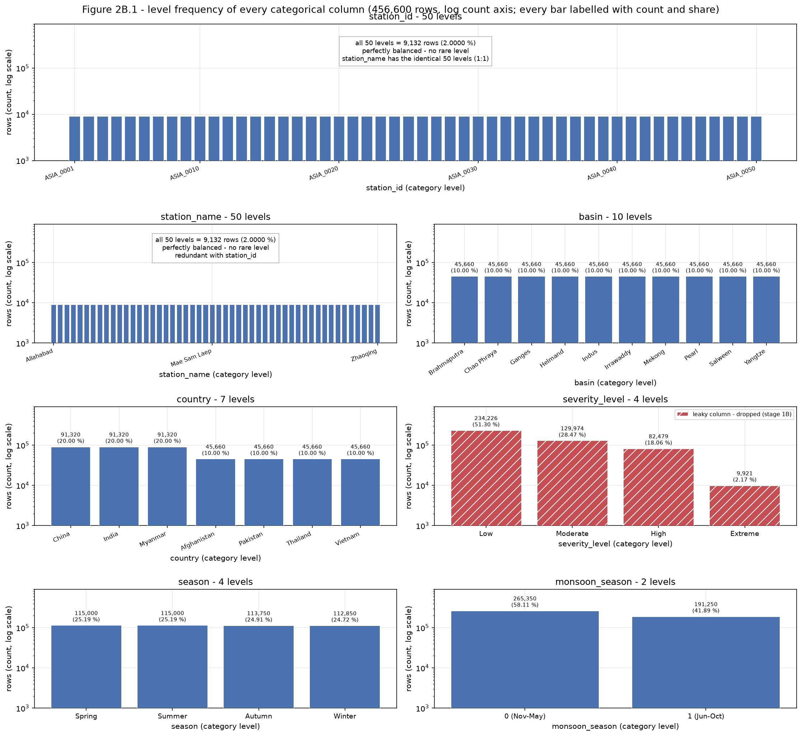

**Figure 2B.1.** Level frequency of every categorical column (456,600 rows, log count axis; bars labelled with count and share). The flat panels (`station_id`, `station_name`, `basin`) show 50 × 9,132, 50 × 9,132 and 10 × 45,660 with no spread. Only `severity_level` (hatched, leaky, dropped) is skewed.

**Conclusion (Figure 2B.1): no categorical level is rare — outside the dropped leaky column the smallest share is 2.0000 % — so nothing needs collapsing.**

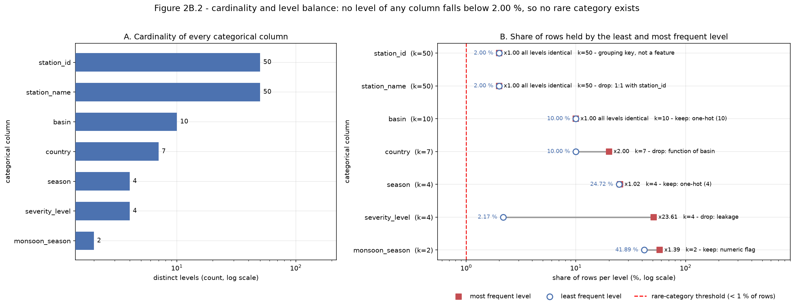

**Figure 2B.2.** Cardinality (A) and least/most frequent level share per column (B); the red dashed line is the 1 % threshold. Every dumbbell sits to its right (closest: `severity_level`, 2.17 %), and the pairs collapse to a point for `station_id`, `station_name` and `basin` (max/min = 1.00×). The widest spread, 23.61×, is the leaky `severity_level`.

**Conclusion (Figure 2B.2): every level sits above the 1 % rare-category line (closest approach 2.17 %, in the dropped `severity_level`); the 50-level identifiers are high-cardinality because they are balanced, not because they are rare.**

#### The one exception, and why it is not a rare-category problem

`severity_level = "Extreme"` holds **9,921 rows (2.1728 %)**, the only level near the 1 % mark. It is not treated as rare because the column is not a feature: it is a deterministic binning of `flood_risk_score` and is dropped for leakage in item 1B. Its 23.61× skew (51.2979 % Low vs 2.1728 % Extreme) never reaches the model; without it the smallest level share is 10.0000 % (any basin).

#### Redundancy and re-encodings

!!! note "`station_name` is 1:1 with `station_id` — drop one"
    Both have **50 levels** and the pair has exactly **50 distinct combinations** over 456,600 rows, so `station_name` is dropped. `station_id` stays only as a grouping key (for the *t+1* target shift and per-station window features).

!!! note "`country` is a function of `basin` — redundant"
    All **10 basins map to exactly one country** (max countries per basin = 1; 45,660 rows per cell), so `country` (7 levels) adds nothing over `basin` (10 levels) and is dropped.

!!! note "`season` and `monsoon_season` are deterministic re-encodings of `month`"
    `season` (Mar-May Spring, Jun-Aug Summer, Sep-Nov Autumn, Dec-Feb Winter) and `monsoon_season` (1 for months 6-10) each show **0 mismatches** over 456,600 rows. They are kept as explicit calendar gates because `month` is not a model input: `monsoon_season` as a 0/1 numerical flag, `season` one-hot encoded.

!!! note "`latitude` and `longitude` are station constants"
    Each station has exactly **1 distinct latitude and 1 distinct longitude** (**50 distinct** `(station_name, latitude, longitude)` triples over 456,600 rows), so they are treated as identifiers and dropped in item 1B.

#### What survives into the model

`CATEGORICAL = ["basin", "season"]` gives **14 one-hot indicator columns** (basin 10 + season 4), the only categorical columns that are neither leaky nor implied by another. Dropped: `severity_level` (leakage), `station_name` (1:1 with `station_id`), `country` (function of `basin`), `latitude`/`longitude` (constants). `station_id` is a grouping key only; `monsoon_season` is a numerical 0/1 flag.

**Code:** [`t3_categorical.py`](https://github.com/luigilopesz/Neural-Networks-Deep-Learning/blob/main/docs/projects/eda/code/t3_categorical.py) *(in the repository, not embedded here)*

## 3. Bivariate and multivariate analysis

All statistics below are descriptive, computed on the full usable panel: 456,550 station-days (50 stations × 9,131 days with a defined *t+1*), 9,889 positives, base rate **2.166 %**, imbalance **45.17 : 1**. No model is trained; `roc_auc_score` is applied to single raw columns only as a rank statistic.

### A. Numerical × numerical

#### Why Spearman is the primary method

The measurements are far from elliptical. `rainfall_mm` has skew **10.5127** and excess kurtosis **158.1862** (max 1,775.72 mm/day); `river_level_m` has skew **9.5313** and kurtosis **140.5934** (max 204.67 m); `soil_moisture_percent` (0.8642 / 0.8563, censored at 100 %) and `temperature_celsius` (0.0057 / −1.1964) are mild. Pearson is a leverage statistic that a few extreme monsoon days can dominate, whereas Spearman uses ranks and is invariant to monotone transforms such as `log1p`. We therefore report **Spearman as the primary coefficient and Pearson beside it**; the gap between them is the evidence. Only one of the six pairs has Pearson above Spearman, `rainfall_mm` ↔ `river_level_m` (0.9604 vs 0.8689), while for the other five Pearson is lower by 0.03 to 0.36.

??? note "Table 3A.1 — all six pairs among the four measurements (n = 456,550)"

    | pair | Pearson | Spearman | gap (P − S) |
    |---|---|---|---|
    | `rainfall_mm` ↔ `river_level_m` | **0.9604** | **0.8689** | +0.0915 |
    | `rainfall_mm` ↔ `soil_moisture_percent` | 0.6103 | 0.8455 | −0.2353 |
    | `rainfall_mm` ↔ `temperature_celsius` | 0.3082 | 0.6688 | −0.3607 |
    | `river_level_m` ↔ `soil_moisture_percent` | 0.6652 | 0.8618 | −0.1966 |
    | `river_level_m` ↔ `temperature_celsius` | 0.3427 | 0.6188 | −0.2761 |
    | `soil_moisture_percent` ↔ `temperature_celsius` | 0.7197 | 0.7500 | −0.0303 |

??? note "Table 3A.2 — trimming test for `rainfall_mm` ↔ `river_level_m`"

    | subset | n | % of panel | Pearson | Pearson on `log1p` | Spearman |
    |---|---|---|---|---|---|
    | all rows | 456,550 | 100.00 % | 0.9604 | 0.9054 | 0.8689 |
    | all rows, rainfall ≤ 100 mm | 447,547 | 98.03 % | 0.8927 | 0.8798 | 0.8608 |
    | monsoon only | 191,250 | 41.89 % | **0.9632** | 0.9149 | **0.6110** |
    | monsoon only, rainfall ≤ 100 mm | 182,247 | 39.92 % | **0.6072** | 0.5734 | **0.5504** |
    | outside monsoon | 265,300 | 58.11 % | 0.5353 | 0.5351 | 0.5468 |

!!! note "Conclusion — Spearman is the justified method"
    Inside the monsoon, removing the **4.71 %** of days with rainfall above 100 mm collapses Pearson from **0.9632 to 0.6072**, onto the Spearman value **0.6110** (Spearman only moves to 0.5504). The 0.96 is the leverage of a few thousand extreme days. Outside the monsoon, with no such tail, Pearson (0.5353) and Spearman (0.5468) agree.

#### The correlation matrix

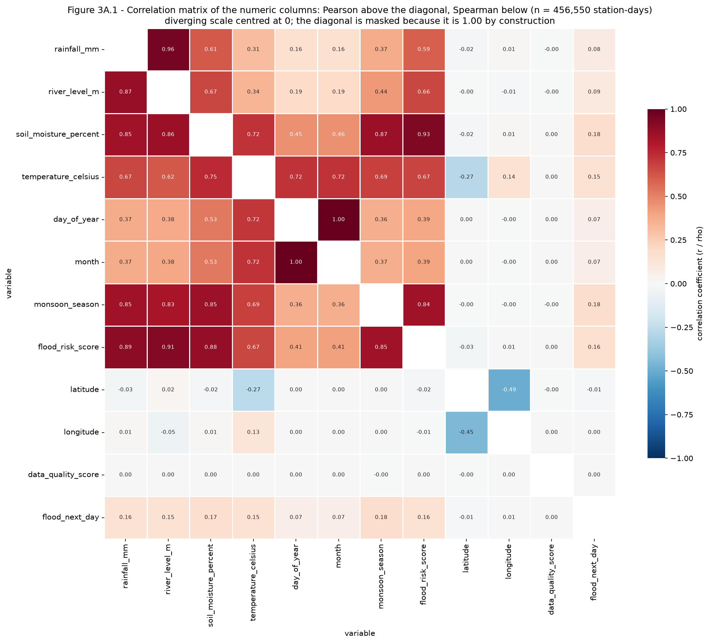

*Figure 3A.1 — Correlation matrix of the numeric columns: Pearson above the diagonal, Spearman below, diverging scale centred at 0. n = 456,550 station-days.*

**Conclusion (Figure 3A.1): the matrix separates into one tight water block (`rainfall_mm`, `river_level_m`, `soil_moisture_percent`, `flood_risk_score`), one calendar block (`day_of_year` ↔ `month` = 0.9965) and a dead block (`latitude`, `longitude`, `data_quality_score`) with no relation to the target.**

#### Redundant pairs

**Table 3A.3 — redundant pairs and seasonality confounders (Pearson / Spearman).**

| pair | Pearson | Spearman | reading |
|---|---|---|---|
| `rainfall_mm` ↔ `river_level_m` | +0.9604 | +0.8689 | the most correlated pair; river level is roughly rescaled rainfall |
| `flood_risk_score` ↔ `soil_moisture_percent` | +0.9337 | +0.8781 | the score is redundant, not informative (stage 1B) |
| `month` ↔ `day_of_year` | +0.9965 | +0.9965 | one date encoded twice, keep one |
| `soil_moisture_percent` ↔ `temperature_celsius` | +0.7197 | +0.7500 | seasonal artefact: both track `day_of_year` (r = 0.7211 and 0.4549) |
| `data_quality_score` ↔ everything | max \|r\| = 0.0036 | n/a | noise, dropped |
| `year` ↔ everything | max \|r\| = 0.0369 | n/a | no drift, so the chronological split is fair |

Both members of the redundant pair stay in the feature set, because correlation is not shared information about the label. Their single-column ROC-AUC against the next-day label is 0.8364 for `soil_moisture_percent`, 0.8091 for `rainfall_mm` and 0.7948 for `river_level_m`, and river level physically lags rainfall. **Decision: keep `rainfall_mm` and `river_level_m` and let the modelling-phase ablation decide.**

??? note "Table 3A.4 — point-biserial r with `flood_next_day` (n = 456,550)"

    | column | r | column | r |
    |---|---|---|---|
    | `soil_moisture_percent` | **+0.1771** | `flood_event_occurred` (t) | +0.0558 |
    | `monsoon_season` | **+0.1752** | `latitude` | −0.0101 |
    | `flood_risk_score` *(dropped, leaky)* | +0.1623 | `longitude` | +0.0049 |
    | `temperature_celsius` | +0.1497 | `year` | +0.0046 |
    | `river_level_m` | +0.0946 | `data_quality_score` | +0.0036 |
    | `rainfall_mm` | +0.0850 | `day` | +0.0007 |
    | `month` | +0.0666 | `day_of_year` | +0.0662 |

The ranking inverts: today's soil moisture (0.1771) and temperature (0.1497) matter more for tomorrow than today's rainfall (0.0850), which itself outranks the day's own flood label at *t* (0.0558).

#### Rainfall × river level on the raw scale

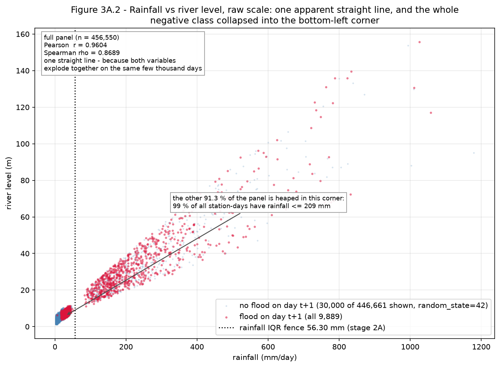

*Figure 3A.2 — `rainfall_mm` × `river_level_m`, coloured by the next-day label. All 9,889 positives plus a 30,000-row random sample of the 446,661 negatives (6.7 %, `random_state=42`), 39,889 points. The dotted line is the stage 2A IQR fence at 56.30 mm.*

**Conclusion (Figure 3A.2): on the raw scale the pair traces one straight line, but 99 % of station-days sit below 209 mm/day and the two classes overlap almost completely where the data lives, so the line is drawn by the shared extreme tail.**

#### The same pair on `log1p` axes

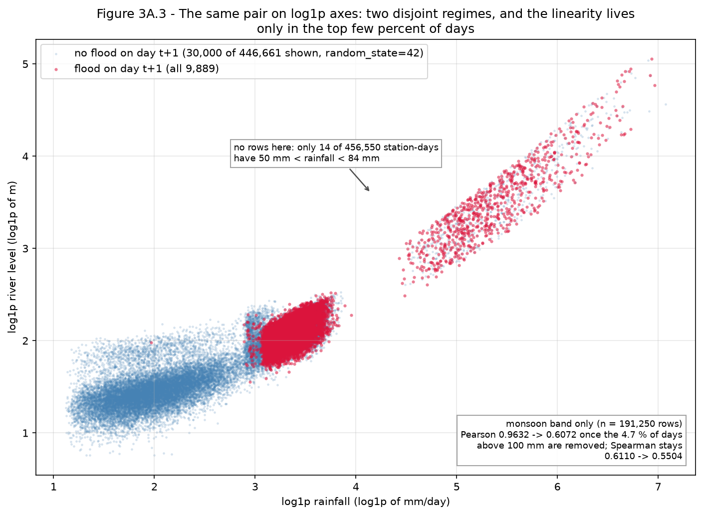

*Figure 3A.3 — the same 39,889 points on `log1p` axes.*

**Conclusion (Figure 3A.3): `log1p` reveals two disjoint regimes (dry season 2.02–41.39 mm, monsoon 16.72–1,775.72 mm) separated by a hole holding only 14 of 456,550 station-days (0.0031 %), and within the monsoon the linear correlation lives in the top ~5 % of days.**

The next-day flood rate is also not monotone in rainfall. It peaks at **7.644 %** in the 8th decile (23.63–28.52 mm, n = 45,668, 3,491 floods) and falls to **3.948 %** in the top decile (above 33.22 mm, n = 45,589, 1,800 floods). This explains why `rainfall_mm` has a point-biserial r of only 0.0850 despite a single-column ROC-AUC of 0.8091, since a monotone coefficient cannot describe a non-monotone relation.

### B. Categorical × target

Rates are against `flood_next_day`, with `n` per level. Overall mean: **2.1660 %** (9,889 / 456,550).

**Table 3B.2 — flood rate by `monsoon_season` and by `season`.**

| grouping | level | n | floods | rate (%) |
|---|---|---|---|---|
| `monsoon_season` | 1 (Jun–Oct) | 191,250 | 9,888 | **5.1702** |
| `monsoon_season` | 0 | 265,300 | 1 | **0.00038** |
| `season` | Summer (Jun–Aug) | 115,000 | 6,373 | 5.5417 |
| `season` | Autumn (Sep–Nov) | 113,750 | 3,515 | 3.0901 |
| `season` | Spring (Mar–May) | 115,000 | 1 | 0.0009 |
| `season` | Winter (Dec–Feb) | 112,800 | 0 | 0.0000 |

??? note "Table 3B.1 — flood rate by month"

    | month | n | floods | rate (%) |
    |---|---|---|---|
    | Jan | 38,750 | 0 | 0.000 |
    | Feb | 35,350 | 0 | 0.000 |
    | Mar | 38,750 | 0 | 0.000 |
    | Apr | 37,500 | 0 | 0.000 |
    | May | 38,750 | 1 | 0.003 |
    | Jun | 37,500 | 92 | 0.245 |
    | **Jul** | 38,750 | 3,149 | **8.126** |
    | **Aug** | 38,750 | 3,132 | **8.083** |
    | **Sep** | 37,500 | 3,045 | **8.120** |
    | Oct | 38,750 | 470 | 1.213 |
    | Nov | 37,500 | 0 | 0.000 |
    | Dec | 38,700 | 0 | 0.000 |

??? note "Table 3B.3 — flood rate by `basin` (5 stations each)"

    | basin | floods (n = 45,655 each) | rate (%) |
    |---|---|---|
    | Chao Phraya | 1,128 | **2.4707** |
    | Mekong | 1,093 | 2.3940 |
    | Pearl | 1,020 | 2.2341 |
    | Irrawaddy | 1,013 | 2.2188 |
    | Salween | 994 | 2.1772 |
    | Ganges | 979 | 2.1443 |
    | Indus | 929 | 2.0348 |
    | Helmand | 925 | 2.0261 |
    | Yangtze | 919 | 2.0129 |
    | Brahmaputra | 889 | **1.9472** |

??? note "Table 3B.4 — country and station extremes"

    `country` is a function of `basin` (stage 1B); pooled rates are Thailand 2.4707 % (n = 45,655), Vietnam 2.3940 %, Myanmar 2.1980 % (n = 91,310), China 2.1235 %, India 2.0458 %, Pakistan 2.0348 % and Afghanistan 2.0261 %. Station extremes (n = 9,131 each): Bangkok 236 floods (2.5846 %), Sing Buri 232 (2.5408 %); Dibrugarh 169 (1.8508 %), Pandu 149 (1.6318 %).

#### Flood rate by month

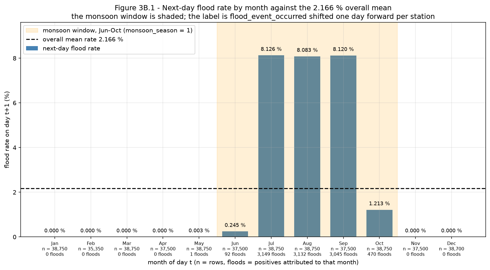

*Figure 3B.1 — next-day flood rate by month against the 2.166 % overall mean, monsoon window (Jun–Oct) shaded; `n` and positives per month are in the tick labels.*

**Conclusion (Figure 3B.1): the monsoon gate is the whole story: six months have exactly zero next-day floods, May and June have one and 92, and Jul/Aug/Sep sit at 8.13 %, 8.08 % and 8.12 % against a 2.166 % mean, holding 94.31 % of every flood.**

#### Flood rate by basin

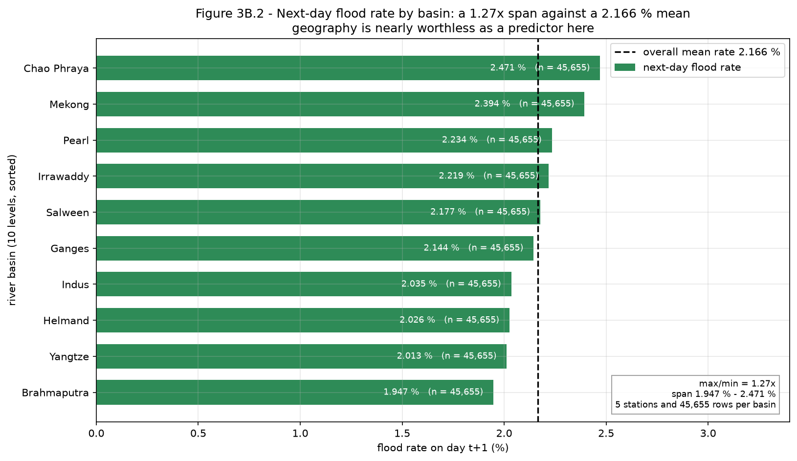

*Figure 3B.2 — next-day flood rate by basin, sorted, with the overall mean as reference line and `n` inside each bar.*

**Conclusion (Figure 3B.2): basin rates span only 1.947 % (Brahmaputra) to 2.471 % (Chao Phraya), a 1.27× ratio around a 2.166 % mean, so geography is nearly worthless as a predictor and `basin` is worth keeping only as cheap static context.**

#### Flood rate by station

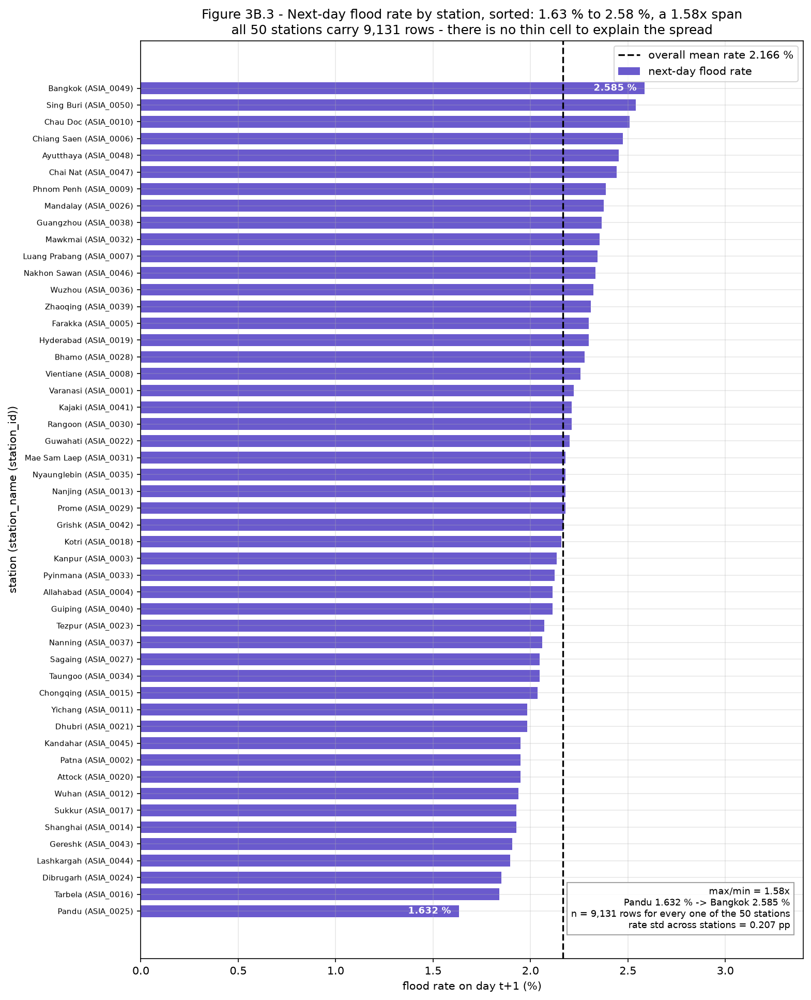

*Figure 3B.3 — next-day flood rate for all 50 stations, sorted, same reference line. Every station carries exactly 9,131 rows.*

**Conclusion (Figure 3B.3): the station spread is 1.632 % (Pandu) to 2.585 % (Bangkok), a 1.58× ratio with std 0.207 pp across 50 levels, and since n = 9,131 everywhere this is a genuinely small effect, not a small-sample artefact.**

!!! warning "Headline for 3B"
    The only categorical that matters is the monsoon gate: **5.1702 %** inside Jun–Oct against **0.00038 %** outside (1 flood in 265,300 rows), a ratio of about 13,700×. A "never flood outside the monsoon" rule is free and belongs in every baseline, and metrics must also be reported inside the window, where the base rate is 5.2 %, not 2.2 %.

### C. Numerical × categorical

#### Location *and* spread, by monsoon flag

**Table 3C.1 — the four measurements by `monsoon_season` (n = 265,300 outside, 191,250 inside).**

| measurement | mean outside | mean inside | location × | std outside | std inside | spread × |
|---|---|---|---|---|---|---|
| `rainfall_mm` | 7.0954 | **38.5753** | **5.44×** | 3.6109 | **60.0142** | **16.62×** |
| `river_level_m` | 3.4795 | 8.4719 | 2.43× | 0.9981 | 7.7725 | 7.79× |
| `soil_moisture_percent` | 23.6092 | 55.4311 | 2.35× | 6.5610 | 11.7580 | 1.79× |
| `temperature_celsius` | 18.3832 | 32.9699 | 1.79× | 8.2453 | 6.6739 | 0.81× |

#### Rainfall by monsoon, raw and `log1p`

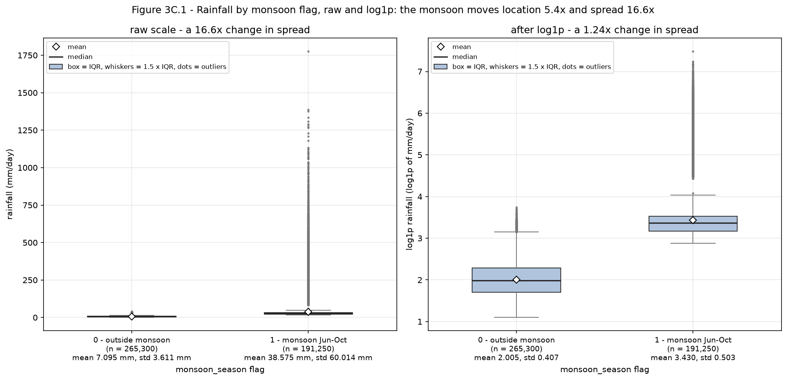

*Figure 3C.1 — rainfall by `monsoon_season`, raw (left) and `log1p` (right), with mean and standard deviation annotated under the tick labels.*

**Conclusion (Figure 3C.1): the monsoon is not only a shift: location moves 5.44× (7.095 → 38.575 mm) but spread moves 16.62× (std 3.611 → 60.014 mm); after `log1p` the spread ratio falls to 1.24× (std 0.407 → 0.503) while the location shift survives (2.005 → 3.430, 1.71×).**

!!! note "Consequence for stage 4A"
    A single `StandardScaler` under a 16.62× spread change would compress the dry season, 58.11 % of the data, into a sliver. Hence `log1p` first (spread ratio 1.24×), then `StandardScaler`.

??? note "Table 3C.2 — the four measurements by `basin` (n = 45,655 each) and rainfall variance decomposition"

    | measurement | mean range | location ratio | std range | spread ratio |
    |---|---|---|---|---|
    | `rainfall_mm` | 19.3523 – 21.6050 mm/day | **1.12×** | 38.2112 – 45.7781 | 1.20× |
    | `river_level_m` | 5.3154 – 5.9044 m | **1.11×** | 5.1884 – 6.1407 | 1.18× |
    | `soil_moisture_percent` | 36.5508 – 37.5431 % | **1.03×** | 17.7253 – 18.7213 | 1.06× |
    | `temperature_celsius` | 19.7557 – 29.3387 °C | 1.49× | 10.0192 – 10.0669 | 1.0048× |

    Rainfall variance decomposition: η² = SS_between / SS_total is **0.0414 %** for `station_id` (50 levels) and **0.0337 %** for `basin` (10 levels).

#### The four measurements by basin

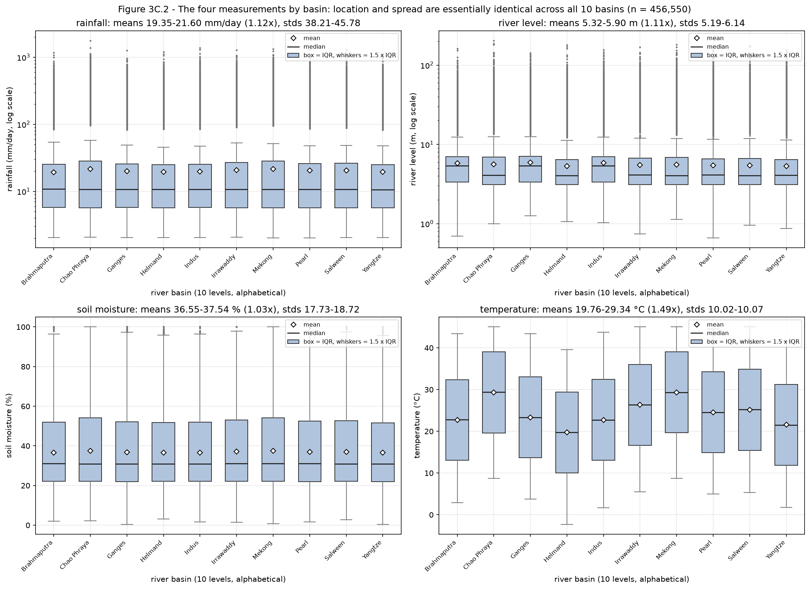

*Figure 3C.2 — the four measurements by basin, 2×2 grid, log scale for `rainfall_mm` and `river_level_m`. Box = IQR, diamonds = means. n = 456,550.*

**Conclusion (Figure 3C.2): for the three water variables the 10 basins are indistinguishable in location and spread (std ratios at most 1.20×), and the only measurable difference is `temperature_celsius` (means 19.76 → 29.34 °C, 1.49×), a latitude effect rather than a hydrological one.**

#### River level by basin

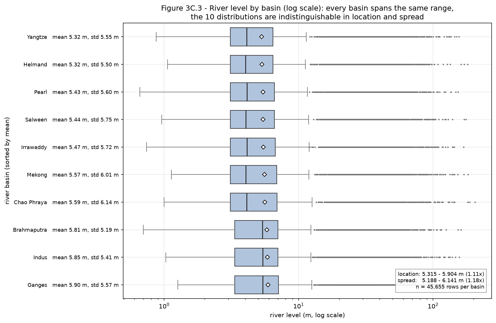

*Figure 3C.3 — river level by basin on a log scale, sorted by mean; per-basin mean and standard deviation are in the tick labels.*

**Conclusion (Figure 3C.3): location varies by only 1.11× (5.315 → 5.904 m) and spread by 1.18× (std 5.188 → 6.141 m), so `basin` carries essentially no information about river level, as the rainfall decomposition (η² = 0.0337 %) predicts.**

!!! warning "Do not oversell station-level features"
    Between-station variance is **0.0414 %** of total rainfall variance, so station fixed effects and per-station z-scores will mostly encode season, not catchment character. The signal has to come from the temporal structure inside the monsoon window.

**Code:** [`t4_bivariate.py`](https://github.com/luigilopesz/Neural-Networks-Deep-Learning/blob/main/docs/projects/eda/code/t4_bivariate.py) *(in the repository, not embedded here)*

## 4. Preprocessing

### A. Strategies

Four strategies, each tied to a finding from stages 1–3. Every statistic is fitted on the **training window only**: train 2000–2016 (310,500 rows), validation 2017–2020 (73,050), test 2021–2024 (73,000 usable). The split is chronological with identical dates for every station, because adjacent days are near-duplicates and the label is 45.2 : 1.

#### Table 4A.1 — the four strategies and the finding behind each

| Strategy | Decision | Finding that motivates it | Rejected |
|---|---|---|---|
| **Missing values** | `SimpleImputer` (median / most-frequent); **0 cells are actually imputed** | 1B: **0 missing values in all 21 columns (0.00 %)**; **0 of 9,588,600 cells** | No imputer (a missing category would crash or encode as a new basin) |
| **Outliers** | **0 rows removed, 0 clipped**; `log1p` + `is_extreme_rainfall` flag | **100.000 % of the 9,274 rows above the `rainfall_mm` 1.5×IQR fence (56.30 mm) are same-day floods**, against **0.137 %** below; an IQR filter would delete **93.8 %** of same-day positives (9,274 of 9,889) | IQR filtering, winsorising |
| **Categorical encoding** | `OneHotEncoder(handle_unknown="ignore", sparse_output=False)` on `basin` (10) and `season` (4) → 14 columns | 2B: **no rare category** — stations 2.0000 % each, basins 10.0000 %, seasons 24.7070–25.1889 % | Ordinal, target encoding, rare-level grouping |
| **Scaling** | `log1p` **first** on `rainfall_mm` and `river_level_m`, then `StandardScaler`; ceilings kept | skew **10.5132** / **9.5317**; monsoon rainfall spread **16.62×** off-monsoon; two measurements **right-censored** (100.00 %, 45.00 °C); neural-network target | `log1p` on temperature; pooled scaler without `log1p`; repairing ceilings |

---

#### A.1 Missing values — the honest finding is that there is none

The raw panel holds **0 missing cells in 456,600 × 21 = 9,588,600 (0.00 %)**, so `SimpleImputer` changes no cell. It stays as a **robustness measure for a partial future day**, not as a repair; claiming this dataset needed imputation would be false. The categorical imputer was **measured**: a missing `basin` handed to the encoder alone is either encoded silently as an all-zero block (an unseen string or `None`) or raises a `TypeError` (all-missing `float64`), so the imputer removes both failure modes. Caveat: `most_frequent` is a **10-way tie** on `basin` (each exactly 10.0000 %), so that fill is arbitrary; `season` has a real mode (25.1889 %). A future day then transforms with **0 NaN**, with rainfall imputed at **-0.162490 σ** (train median 10.72 mm vs train mean).

#### A.2 Outliers — the "outliers" are the flood days

The 1.5×IQR fence on `rainfall_mm` is **56.2950 mm** (Q1 5.72, Q3 25.95, IQR 20.23) and flags **9,274 rows (2.031 %)**; **100.000 % are floods**, against **0.137 %** among the other 447,326. The union with the `river_level_m` fence flags **9,280 rows (2.032 %)**. These rows are the event being predicted, not errors: 9,889 − 9,274 = **615** floods lie below the fence, so an IQR filter would delete **93.8 %** of the positives (9,274 of 9,889).

**Rows removed: 0. Rows winsorised or clipped: 0.** Instead:

1. **`log1p`** on the right tail (A.4) cuts the extreme days' leverage while staying strictly monotone (Spearman = **1.000000**).
2. **An `is_extreme_rainfall` flag** (raw rainfall above the declared constant **56.30 mm**) flags **2.0110 %** of train. A fence fitted on train only would be **55.89 mm**, yet it **disagrees with the constant on 0 of 456,600 rows**, so the constant is leakage-free.
3. **No row removal**, because rows are the only place the positive class exists.

For the **next-day** target actually predicted, the 6,244 flagged train rows carry a flood rate of **8.456 %** against **1.985 %** below the fence (**4.26× lift**), so extreme rainfall is a strong feature, not a label. They hold **528** of the 6,566 training positives (**8.0 %**; derived: 6,244 × 8.456 %): a filter would cost fewer positives here, but still delete the rows that describe the event.

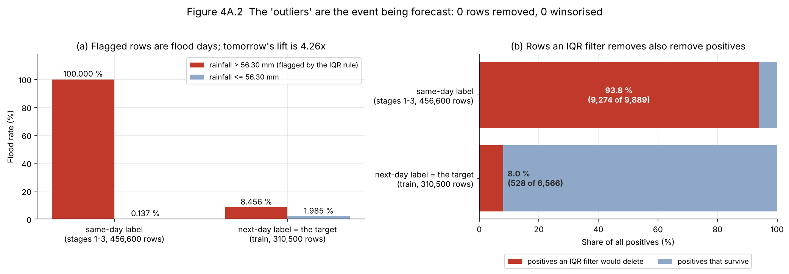

**Figure 4A.2.** The outlier decision. **(a)** Flood rate above and below the 56.30 mm fence: same-day **100.000 %** against **0.137 %**; next-day on train **8.456 %** against **1.985 %**. **(b)** Share of positives an IQR filter would delete: **93.8 %** (9,274 of 9,889) same-day, **8.0 %** (528 of 6,566) next-day.

**Conclusion (Figure 4A.2): the IQR rule finds flood days, not errors, so 0 rows are removed or winsorised; `log1p` tames their leverage and `is_extreme_rainfall` restores their magnitude.**

#### A.3 Categorical encoding — 14 dense columns, and a defined answer for unseen levels

`OneHotEncoder(handle_unknown="ignore", sparse_output=False)` on `basin` (10 levels) and `season` (4) gives **14 columns**. The test-only-category case was executed: an unseen basin and/or season maps to **all zeros** with **0 NaN**, while a known level in the same row still encodes. There is **no rare category to collapse**: stations 50 levels at **2.0000 %**, basins 10 at **10.0000 %**, seasons 4 at **24.7070 %–25.1889 %**, so frequency grouping has nothing to act on. Ordinal encoding is rejected (basins have no order) and target encoding too (a supervised statistic, a leakage risk). `sparse_output=False` because the network is fed dense mini-batches.

#### A.4 Scaling — `log1p` first, then standardise

`rainfall_mm` has skew **10.5132** and excess kurtosis **158.2017**; `river_level_m` **9.5317** and **140.6058** (full panel; train values below). `temperature_celsius` is symmetric (skew **0.0057**) and has negatives (min -2.31 °C), so `log1p` is undefined there and a shifted log would manufacture a skew of **-0.57**; it is only standardised.

??? note "Table 4A.2 — skew and kurtosis before and after the numeric branch (train)"

    | column | skew raw (train) | skew after `log1p` | kurtosis raw | kurtosis after `log1p` | after the pipeline |
    |---|:--:|:--:|:--:|:--:|:--:|
    | `rainfall_mm` | 10.5802 | **0.6837** | 160.9068 | **1.0746** | -1.7912 → 5.8685 σ |
    | `river_level_m` | 9.5798 | **1.4888** | 142.6101 | **5.6453** | -2.9015 → 8.1045 σ |
    | `soil_moisture_percent` | 0.8683 | unchanged | 0.8858 | unchanged | -2.0134 → 3.4919 σ (**the 100.00 ceiling**) |
    | `temperature_celsius` | 0.0064 | unchanged | -1.1953 | unchanged | -2.5445 → 1.9674 σ (**the 45.00 °C ceiling**) |

**Ceilings are kept, not repaired.** `soil_moisture_percent` is censored at exactly 100.00 (**9,153 rows, 2.005 %**) and `temperature_celsius` at exactly 45.00 °C (**1,788 rows, 0.392 %**); the pile-up is **~68,648×** and **~80×** the local density. No monotone transform can break a tie, so each stays an isolated spike (**3.4919 σ**, **1.9674 σ**) that the model must be told about; we do not clip, impute or drop them (6,598 unique raw soil-moisture values stay 6,598 unique).

**Why `log1p` before the standardiser:** monsoon `rainfall_mm` has mean **38.5753 mm** and sd **60.0142 mm**, against **7.0954 mm** and **3.6108 mm** outside it. Location moves **5.44×** but spread **16.62×**, so a pooled scaler divides by an sd of 41.4337 mm that the monsoon tail owns and squashes the dry-season bulk. **Why standardise:** gradient descent is scale sensitive, and mixing °C, mm and a 0/1 flag would make gradients depend on units. All **21** features end within **-2.9015 σ to 8.1045 σ**.

#### Figure 4A.1 — before and after the numeric branch

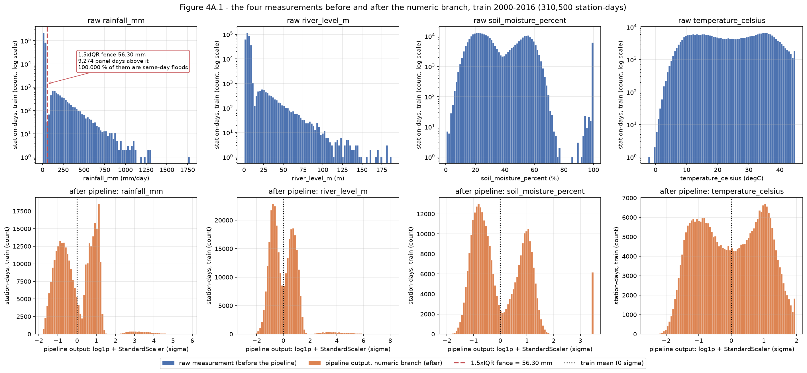

**Figure 4A.1.** The four measurements on the 310,500 training days. Top row: raw values (log count axis) with the 56.30 mm fence; bottom row: after `log1p` + `StandardScaler`, single-peaked and within roughly ±3 σ (one river reading reaches 8.10 σ). The two surviving spikes are the censoring ceilings: soil moisture at **3.4919 σ** (last bin 6,165 days against 16 below) and temperature at **1.9674 σ** (1,823 against 1,137 below, 1,074 of them the exact 45.00 °C tie).

**Conclusion (Figure 4A.1): `log1p` + `StandardScaler` put the four measurements on one comparable scale while compressing — not removing — the tails and preserving both censoring ties.**

#### All four strategies are fitted on train only — and that is measurable

Fitting the same preprocessor on the full usable frame (456,550 rows, deliberately wrong) moves the largest train mean by **0.123038** (`temperature_celsius`, **0.011734 σ**) and shifts a training row by at most **0.048422 σ** (mean 0.001442 σ). The leak is real but **small**, because the panel is stationary (`year` correlates with nothing at |r| ≤ 0.037; next-day flood rate **2.1147 %** on train → **2.3329 %** on test), so train-only fitting is a cheap correctness guarantee.

#### What this hands to 4C

Imputers, `SkewCompressor` + `ExtremeRainfallFlag` (**0 rows dropped**), the 14-column one-hot encoder and a `StandardScaler` on the 7-column numeric block, both ceiling ties preserved.

**Code:** [`pipeline.py`](https://github.com/luigilopesz/Neural-Networks-Deep-Learning/blob/main/docs/projects/eda/code/pipeline.py) *(in the repository, not embedded here)*

### B. Dimensionality reduction

All projections use the **scaled training matrix** from the 4C pipeline (**310,500 × 21**, fitted on the 2000–2016 training window only). The label only colours the points; **no model is trained**. PCA uses the whole training set (exact SVD, 0.6–0.9 s). t-SNE and UMAP use a **30,000-row stratified sample**, because they cost minutes at full size.

!!! note "The sample inflates the red"
    The sample holds **all 6,566 training positives** plus **23,434 negatives** drawn at random (`default_rng(42)`). Its positive rate is **21.8867 %**, **10.35×** the 2.1147 % training rate. Red density in Figures 4B.4–4B.7 is therefore inflated by construction: the embeddings are comparable with each other, not with the population.

#### PCA — variance and loadings

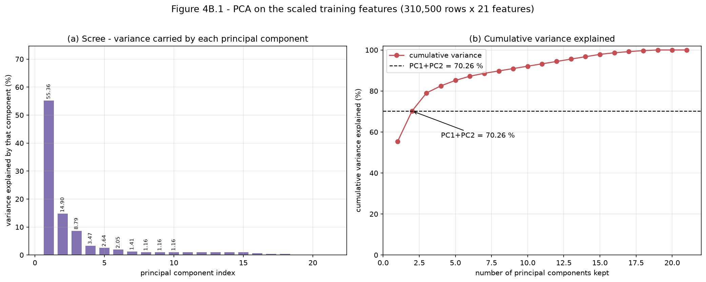

**Figure 4B.1.** Per-component and cumulative explained variance, fitted on all 310,500 training rows. PC1 + PC2 carry **70.2572 %** (PC1 **55.3581 %**, PC2 **14.8991 %**); nine components reach 90 % and 13 reach 95 %. PC21 carries 0.0000 % because each one-hot block sums to 1 and `monsoon_season` equals `Summer + Autumn`, so the 21 columns are not linearly independent.

**Conclusion (Figure 4B.1): two components carry 70.26 % of the variance and the elbow lies within the first three, so the 21 features behave like a two- or three-dimensional object dominated by the seasonal water cycle.**

**Table 4B.1 — explained variance**

| component | variance % | cumulative % |
|---|---|---|
| PC1 | 55.3581 | 55.3581 |
| PC2 | 14.8991 | 70.2572 |
| PC3 | 8.7895 | 79.0467 |
| PC4 | 3.4701 | 82.5168 |
| PC5 | 2.6435 | 85.1603 |

??? note "Table 4B.2 — PC6 to PC10"

    | component | variance % | cumulative % |
    |---|---|---|
    | PC6 | 2.0485 | 87.2088 |
    | PC7 | 1.4125 | 88.6213 |
    | PC8 | 1.1601 | 89.7814 |
    | PC9 | 1.1561 | 90.9374 |
    | PC10 | 1.1561 | 92.0935 |

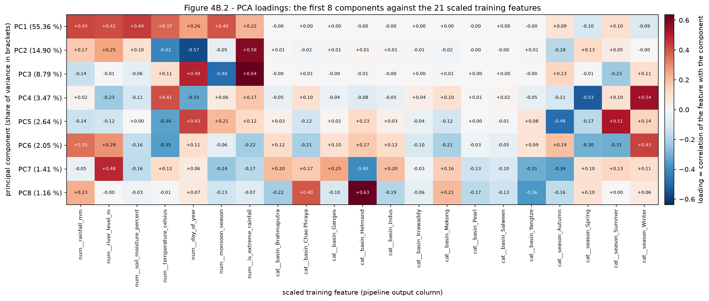

**Figure 4B.2.** Loadings of the 21 scaled features on the first eight components. PC1 is a **wet-season axis**: soil moisture (+0.4432), rainfall (+0.4273), river level (+0.4165), monsoon flag (+0.4027) and temperature (+0.3694) all load positive together. PC2 is an **event-vs-season axis**: the extreme-rainfall flag (+0.5832) opposes day of year (−0.5724) and temperature (−0.4207). Basin one-hots contribute 0.0 % of PC1's squared loading and 0.1 % of PC2's; they only become visible in PC4–PC8.

**Conclusion (Figure 4B.2): the dominant directions are numeric (96.3 % and 94.9 % of squared loading) and geography is not a direction this dataset has.**

??? note "Table 4B.3 — largest |loading| of PC1 and PC2"

    | PC1 (55.3581 %) | loading | PC2 (14.8991 %) | loading |
    |---|---|---|---|
    | `num__soil_moisture_percent` | +0.4432 | `num__is_extreme_rainfall` | +0.5832 |
    | `num__rainfall_mm` | +0.4273 | `num__day_of_year` | −0.5724 |
    | `num__river_level_m` | +0.4165 | `num__temperature_celsius` | −0.4207 |
    | `num__monsoon_season` | +0.4027 | `num__river_level_m` | +0.2533 |
    | `num__temperature_celsius` | +0.3694 | `cat__season_Autumn` | −0.1770 |
    | `num__day_of_year` | +0.2557 | `num__rainfall_mm` | +0.1687 |
    | `num__is_extreme_rainfall` | +0.2158 | `cat__season_Spring` | +0.1261 |
    | `cat__season_Summer` | +0.1025 | `num__soil_moisture_percent` | +0.0955 |

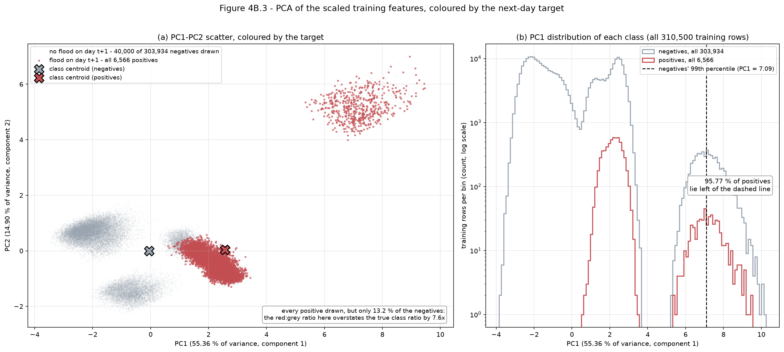

**Figure 4B.3.** (a) All 6,566 positives over a random 40,000 of the 303,934 negatives, so the visible red share overstates the true ratio by 7.6×. (b) The full PC1 distribution of each class: the positive mean is shifted by **+2.6244** (+2.5689 vs −0.0555), but **95.77 %** of positives lie inside the negatives' 99th percentile. On PC2 the class means differ by only 0.0418.

**Conclusion (Figure 4B.3): the classes do not separate in the PCA plane; only the 4.23 % of positives in the wet-season tail of PC1 are isolated, and no linear cut on PC1 or PC2 can separate the rest.**

#### t-SNE — three perplexities

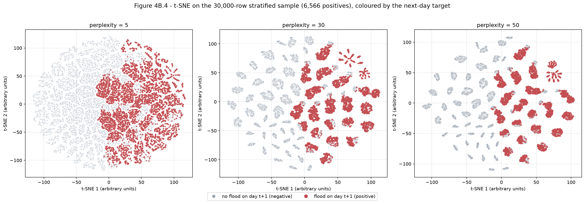

**Figure 4B.4.** The same 30,000 rows at `perplexity` 5, 30 and 50 (`learning_rate="auto"`, `init="pca"`, `max_iter=1000`, `random_state=42`). At 5 the panel is one diffuse blob with positives on its right; at 30 and 50 the positives break into dozens of compact clumps among looser negative clouds. KL divergence falls 1.9584 → 1.1470 → 0.9393, which reflects a smoother target distribution rather than better quality. Axes carry no unit.

**Conclusion (Figure 4B.4): flood days are not an evenly spread minority; they collapse into many small, tight clumps, i.e. they are near-duplicates of one another in the 21 scaled features.**

#### UMAP — three values of `n_neighbors`

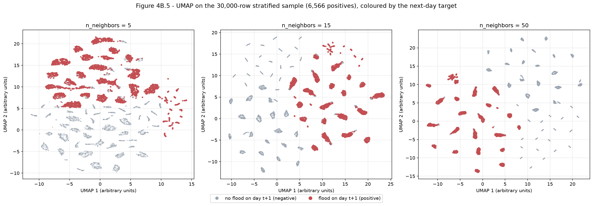

**Figure 4B.5.** The same rows under UMAP with `n_neighbors` 5, 15 and 50 (`min_dist=0.1`, `metric="euclidean"`, `random_state=42`). At 5 the positives form a dense arc above a negative field; at 15 the arc dissolves into dozens of small red blobs; at 50 the blobs are smaller and thoroughly interleaved with grey. A UMAP fit takes **28.2–46.9 s** against **257.7–406.7 s** for t-SNE.

**Conclusion (Figure 4B.5): UMAP reproduces the t-SNE finding of compact local groups at roughly a tenth of the cost, and the apparent separation at `n_neighbors=5` disappears at 15 and 50, so it comes from the layout rather than the data.**

#### Comparison — what the nonlinear projections add

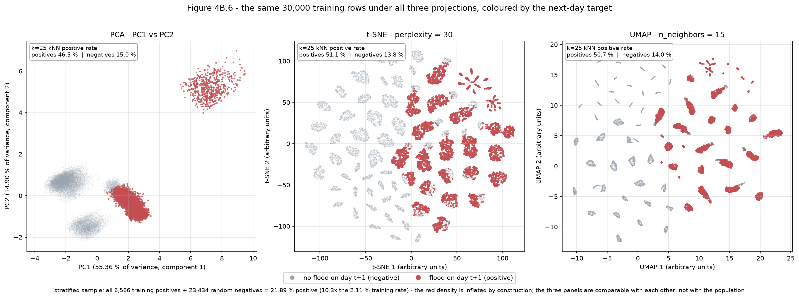

**Figure 4B.6.** PCA, t-SNE (`perplexity=30`) and UMAP (`n_neighbors=15`) on the same 30,000 rows, each annotated with its measured neighbourhood composition. The two settings are the balanced defaults; the diagnostic below shows the choice is immaterial.

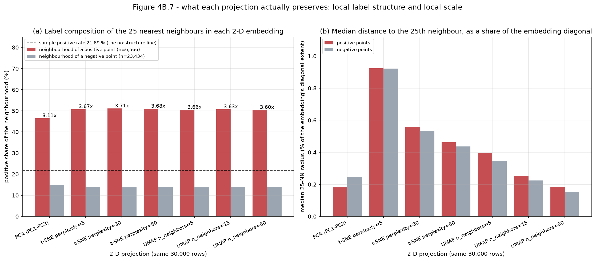

**Figure 4B.7.** (a) Mean positive share among the 25 nearest neighbours of positive and of negative points, against the sample's 21.89 % no-structure reference. (b) Median 25th-neighbour distance as a share of the embedding diagonal. This measures what a projection preserved; it predicts nothing.

**Table 4B.4 — embedding comparison (same 30,000 rows)**

| embedding | positive's 25-NN positive | negative's | ratio |
|---|---|---|---|
| PCA (PC1–PC2) | 46.49 % | 14.97 % | 3.11 |
| t-SNE `perplexity=30` | 51.13 % | 13.79 % | 3.71 |
| UMAP `n_neighbors=15` | 50.72 % | 13.97 % | 3.63 |

??? note "Table 4B.5 — all seven embeddings, with local radius"

    | embedding | positive's 25-NN positive | negative's | ratio | radius, positives | radius, negatives |
    |---|---|---|---|---|---|
    | PCA (PC1–PC2) | 46.49 % | 14.97 % | 3.11 | 0.181 | 0.246 |
    | t-SNE `perplexity=5` | 50.77 % | 13.85 % | 3.67 | 0.923 | 0.922 |
    | t-SNE `perplexity=30` | 51.13 % | 13.79 % | 3.71 | 0.559 | 0.535 |
    | t-SNE `perplexity=50` | 50.98 % | 13.86 % | 3.68 | 0.463 | 0.436 |
    | UMAP `n_neighbors=5` | 50.48 % | 13.79 % | 3.66 | 0.396 | 0.347 |
    | UMAP `n_neighbors=15` | 50.72 % | 13.97 % | 3.63 | 0.252 | 0.224 |
    | UMAP `n_neighbors=50` | 50.43 % | 14.01 % | 3.60 | 0.184 | 0.155 |

??? note "Table 4B.6 — runtime (two runs of the same script, single-threaded)"

    | step | run A | run B |
    |---|---|---|
    | PCA, full 310,500 × 21 | 0.6 s | 0.9 s |
    | t-SNE, `perplexity=5` | 257.7 s | 406.7 s |
    | t-SNE, `perplexity=30` | 278.9 s | 398.8 s |
    | t-SNE, `perplexity=50` | 350.2 s | 365.5 s |
    | UMAP, `n_neighbors=5` | 44.1 s | 46.9 s |
    | UMAP, `n_neighbors=15` | 28.2 s | 35.2 s |
    | UMAP, `n_neighbors=50` | 41.6 s | 46.4 s |
    | whole script | 1043.4 s | 1351.2 s |

    Projections are bit-identical between runs; only the clock moves, so no runtime is baked into any figure.

What each method shows, and what it is used for:

- **PCA** gives the global linear structure (one wet-season axis, one event-vs-season axis) with interpretable loadings, and is cheap enough for the full set. It is the method to use for interpretation. In its plane the positives are locally denser than the negatives (radius 0.181 vs 0.246).
- **t-SNE and UMAP** reveal the **granular** structure that PCA smears into one region: dozens of compact clumps of flood days. UMAP is the practical choice, being about ten times faster for the same finding.
- **The labels inside the clumps are still mixed.** About half of a positive's 25 nearest neighbours are not positives (51.13 % under t-SNE, 50.72 % under UMAP). Nonlinear methods buy about 19 % more local enrichment than PCA (3.71× and 3.63× against 3.11×), which is not a separation.
- **The layout is not evidence.** UMAP `n_neighbors=5` looks the most separated yet measures 3.66×, against 3.60× for the thoroughly mixed `n_neighbors=50`. Local radius also moves with the parameter (t-SNE 0.923 → 0.559 → 0.463), so it is a property of the layout.

!!! warning "What t-SNE and UMAP do not license"
    Cluster sizes and between-cluster distances have no direct reading; only neighbourhood membership is meaningful. The panels are therefore read qualitatively, and the one quantitative claim comes from the 25-neighbour composition.

**Conclusion (Figures 4B.6 and 4B.7): t-SNE and UMAP expose the shape of the positive class (granular, tightly clumped) but raise local label enrichment only from PCA's 3.11× to at most 3.71×. The classes overlap in every two-dimensional view, so a linear cut in two dimensions should not be expected to carry the task.**

**Code:** [`t6_reduction.py`](https://github.com/luigilopesz/Neural-Networks-Deep-Learning/blob/main/docs/projects/eda/code/t6_reduction.py)

### C. Pipeline

The four strategies of 4A are assembled into one importable module, `docs/projects/eda/code/pipeline.py`: a `ColumnTransformer` with a numeric `Pipeline` and a categorical `Pipeline`. It contains no plotting, no training and no global state, and it fits nothing outside `fit_preprocessor`.

| branch | steps | in → out |
|---|---|---|
| `num` | `ExtremeRainfallFlag` → `SkewCompressor` → `SimpleImputer(median)` → `StandardScaler` | 6 → **7** |
| `cat` | `SimpleImputer(most_frequent)` → `OneHotEncoder(handle_unknown="ignore", sparse_output=False)` | 2 → **14** |

`remainder="drop"` and `sparse_threshold=0.0` make the output always a dense `float64` array.

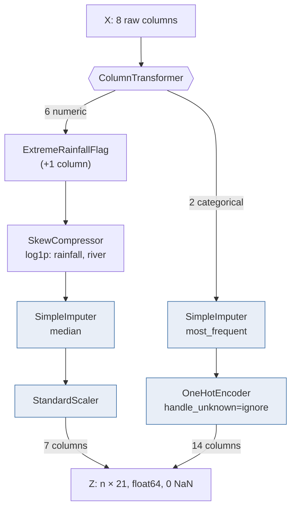
```mermaid
flowchart TB
    X["X: 8 raw columns"] --> CT{{ColumnTransformer}}
    CT -->|"6 numeric"| N1["ExtremeRainfallFlag<br/>(+1 column)"]
    N1 --> N2["SkewCompressor<br/>log1p: rainfall, river"]
    N2 --> N3["SimpleImputer<br/>median"]
    N3 --> N4["StandardScaler"]
    CT -->|"2 categorical"| C1["SimpleImputer<br/>most_frequent"]
    C1 --> C2["OneHotEncoder<br/>handle_unknown=ignore"]
    N4 -->|"7 columns"| Z["Z: n × 21, float64, 0 NaN"]
    C2 -->|"14 columns"| Z
    classDef fit fill:#e8eef7,stroke:#3b6ea5;
    class N3,N4,C1,C2 fit;
```

*The four shaded steps learn statistics (medians, means, standard deviations, category vocabularies) and only do so in `fit_preprocessor(X_train)`; the other steps are stateless.*

**Fitted on train only.** `fit_preprocessor(X_train)` is called once on the **310,500 training rows (2000–2016)**. Validation and test frames only pass through `transform`, which also raises if any output is non-finite. The 4A leak check shows that fitting outside train would have moved a training row by up to **0.048422 σ**.

**Reuse.** The module exposes `build_preprocessor()` (unfitted), `fit_preprocessor(X_train)`, `transform(preprocess, X)` and `feature_names(preprocess)`. It is imported by `t5_pipeline.py`, by `t6_reduction.py` (4B) and, unchanged, by the Classification deliverable.

**Table 4C.1 — pipeline output**

| quantity | value |
|---|---|
| `X_train` / `X_test` raw shape | `(310500, 8)` / `(73000, 8)` |
| **`X_train_t.shape`** / **`X_test_t.shape`** | **`(310500, 21)`** / **`(73000, 21)`**, `float64` |
| columns before → after | **8 → 21** (numeric 7, `basin` one-hot 10, `season` one-hot 4) |
| NaN count, train and test | **0** and **0**; all values finite |
| transformed range | **-2.9015 σ to 8.1045 σ** |

The test set has 73,000 rows rather than 73,050 because the one-day `shift(-1)` drops the last day of each of the 50 stations. Train + validation + test = 73,050 + 310,500 + 73,000 = **456,550** usable rows.

??? note "The 21 feature names (`get_feature_names_out()`)"

    1. `num__rainfall_mm`
    2. `num__river_level_m`
    3. `num__soil_moisture_percent`
    4. `num__temperature_celsius`
    5. `num__day_of_year`
    6. `num__monsoon_season`
    7. `num__is_extreme_rainfall`
    8. `cat__basin_Brahmaputra`
    9. `cat__basin_Chao Phraya`
    10. `cat__basin_Ganges`
    11. `cat__basin_Helmand`
    12. `cat__basin_Indus`
    13. `cat__basin_Irrawaddy`
    14. `cat__basin_Mekong`
    15. `cat__basin_Pearl`
    16. `cat__basin_Salween`
    17. `cat__basin_Yangtze`
    18. `cat__season_Autumn`
    19. `cat__season_Spring`
    20. `cat__season_Summer`
    21. `cat__season_Winter`

**Why the flag lives inside the pipeline.** `is_extreme_rainfall` is step 1 of the numeric branch: it appends `1.0` where raw `rainfall_mm` exceeds the constant **56.30 mm**. A flag computed outside would be present at fit time and silently absent on a new frame, shifting the feature matrix without any error. Inside the pipeline it is applied by both `fit` and `transform`, and the threshold is a module constant rather than a fitted statistic, so it is identical for train, validation and test. `SkewCompressor` applies `log1p` to `rainfall_mm` and `river_level_m` only, leaving the censored soil moisture (100.00 %), temperature (45.00 °C, partly negative) and the binary flag untouched.

**Dropped columns** (rules from stage 1B, not re-derived): `severity_level` and `flood_risk_score` (leakage), `data_quality_score` and `day` (noise), and `station_name`, `country`, `latitude`, `longitude` (redundant or constant per station).

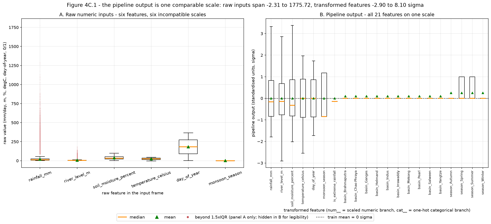

**Figure 4C.1.** Panel A: the 6 raw numeric inputs in native units on the 310,500 training rows; `rainfall_mm` runs from 2.02 to 1,775.72 mm, so the other inputs are flat lines on a shared axis. Panel B: all 21 pipeline outputs in σ, with the bulk inside ±3 σ and a maximum of **8.1045 σ** (river-level extreme). The censoring ceilings stay visible as isolated spikes at **3.4919 σ** (soil moisture) and **1.9674 σ** (temperature).

**Conclusion (Figure 4C.1): after the pipeline all 21 features share one scale (−2.9015 σ to 8.1045 σ), so no input dwarfs another at the first layer.**

**Code:** [`t5_pipeline.py`](https://github.com/luigilopesz/Neural-Networks-Deep-Learning/blob/main/docs/projects/eda/code/t5_pipeline.py)

## 5. Synthesis

### Main findings

| # | Finding | Key numbers | Decision |
|:--:|---|---|---|
| F1 | **The panel is complete; missing data is not the problem.** | 456,600 rows (50 stations × 9,132 days), **0 missing in 9,588,600 cells**, 0 duplicates, 0 date gaps ([Figure 1.1](figures/fig01_panel_completeness.png)) | Nothing to impute; 4A imputation is only a robustness guarantee |
| F2 | **Two columns are the label in disguise.** | `flood_event_occurred == (flood_risk_score > 7.0)` on all rows, ROC-AUC **1.0000**; `severity_level` is the same rebinned ([Figure 1.4](figures/fig01_leakage_audit.png)). Next-day, the risk score is merely redundant: AUC **0.8088** vs **0.8364** for soil moisture; 32 rows with `risk == 7.00` are `Extreme` yet not floods | Drop `flood_risk_score` and `severity_level` |
| F3 | **The task is rare and gated by the calendar.** | **2.166 %** positives (9,889 of 446,661), **45.2 : 1**; majority accuracy **97.83 %**. Flood rate **5.1702 %** in the monsoon vs **0.00038 %** outside (≈ 13,700×); Jul–Sep holds **94.31 %** of next-day floods ([Figure 3B.1](figures/fig33_flood_rate_month.png)) | No accuracy; PR-AUC, and all metrics inside the monsoon (base rate 5.17 %) |
| F4 | **The "outliers" are the flood days.** | The **56.30 mm** fence flags **9,274 rows (2.031 %)**, **100.000 %** same-day floods; removal would delete **93.8 %** of same-day positives ([Figure 4A.2](figures/fig40_outlier_decision.png)) | **0 rows removed, 0 winsorised**; `log1p` + `is_extreme_rainfall` |
| F5 | **Spearman is the honest correlation; one pair is redundant.** | `rainfall_mm` skew **10.513**, kurtosis **158.202**; trimming the 4.71 % of days above 100 mm drops Pearson **0.9632 → 0.6072** (Spearman **0.6110**). `rainfall_mm` ↔ `river_level_m`: Pearson **0.9604**, Spearman **0.8689** ([Figure 3A.1](figures/fig30_corr_heatmap.png)) | Use Spearman; keep both columns (next-day AUC 0.8091 / 0.7948), ablation decides |
| F6 | **Geography explains almost nothing; season almost everything.** | Basin rates **1.947 %–2.470 %** (1.27×), station rates **1.632 %–2.585 %** (1.58×); between-station rainfall variance **0.0414 %** ([Figure 3B.2](figures/fig34_flood_rate_basin.png)) | Report as a null; basin kept only as small static context |
| F7 | **For tomorrow's flood, soil moisture beats rainfall.** | Point-biserial with next-day target: soil moisture **0.1771**, temperature **0.1497**, rainfall **0.0850**; next-day flood rate peaks at **7.644 %** (8th rainfall decile) and falls to 3.948 % (10th) | Soil moisture is the precondition, rain the trigger: build accumulated-rain and rising-river window features |
| F8 | **Two measurements are censored, not merely skewed.** | **9,153 rows at exactly 100.00** soil moisture (2.0046 %); **1,788 rows at exactly 45.00 °C** (0.392 %); temperature min −2.31 °C | Keep ceilings, never clip; no `log1p` on temperature |
| F9 | **The pipeline turns 8 raw columns into 21 features.** | `X_train_t` **(310500, 21)**, `X_test_t` **(73000, 21)**, 0 NaN; a full-frame scaler would shift means by up to **0.123038** (**0.011734** train σ) ([Figure 4C.1](figures/fig40_transformed_feature_scales.png)) | Fit on train only; a correctness guarantee costing about 0.05 σ here |
| F10 | **Classes overlap, but the positive class is granular.** | PC1 + PC2 = **70.26 %**; positives sit **+2.62** on PC1 and **95.77 %** lie inside the negatives' range; 25-neighbour flood share t-SNE **51.13 %**, UMAP **50.72 %**, PCA **46.49 %**; enrichment moves only 3 % across seven settings while t-SNE radius falls **0.923 → 0.463** ([Figure 4B.3](figures/fig50_pca_scatter.png), [Figure 4B.7](figures/fig53_local_enrichment.png)) | No linear cut: nonlinear models justified; t-SNE/UMAP cluster sizes and distances not interpreted |

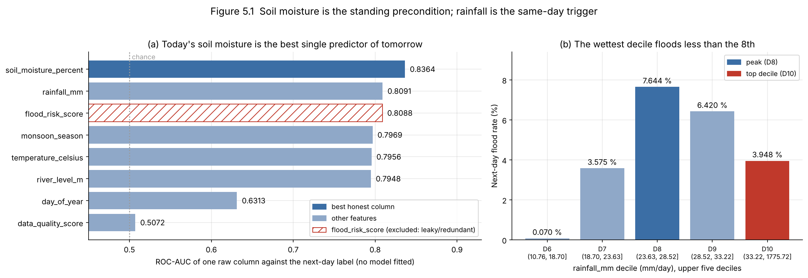

**Figure 5.1.** **(a)** ROC-AUC of each raw column against the next-day label (no model fitted; excluded risk score hatched): soil moisture **0.8364**, rainfall 0.8091, risk score 0.8088, `monsoon_season` 0.7969, temperature 0.7956, river level 0.7948, `day_of_year` 0.6313, `data_quality_score` 0.5072 (chance). **(b)** Next-day flood rate by upper rainfall decile: **7.644 %** at the 8th, **3.948 %** at the 10th.
**Conclusion:** soil moisture is the best honest single predictor of tomorrow, and the wettest day is not the most dangerous, so the modelling phase builds window features.

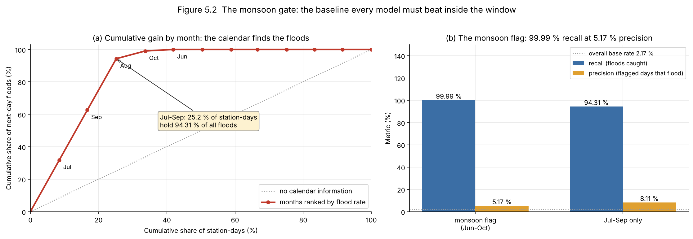

**Figure 5.2.** **(a)** Cumulative share of next-day floods vs station-days, months ranked by flood rate: Jul, Sep and Aug hold **25.2 %** of station-days and **94.31 %** of floods. **(b)** The monsoon flag (Jun–Oct) catches **99.99 %** of floods (9,888 of 9,889) at **5.17 %** precision; Jul–Sep alone catches **94.31 %** at **8.11 %**.
**Conclusion:** a free calendar rule gives near-perfect recall at about 2.4× the 2.17 % base rate, so a model earns credit only for what it adds inside the window.

**From findings to decisions.**

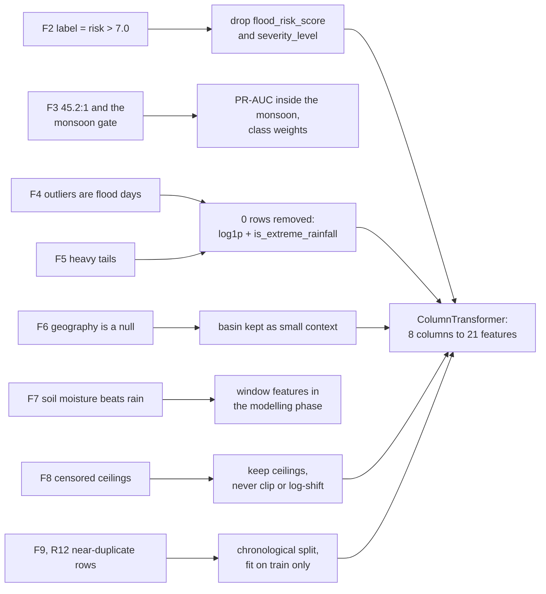
```mermaid
flowchart LR
    F2["F2 label = risk > 7.0"] --> D1["drop flood_risk_score<br/>and severity_level"]
    F3["F3 45.2:1 and the<br/>monsoon gate"] --> D2["PR-AUC inside the monsoon,<br/>class weights"]
    F4["F4 outliers are flood days"] --> D3["0 rows removed:<br/>log1p + is_extreme_rainfall"]
    F5["F5 heavy tails"] --> D3
    F6["F6 geography is a null"] --> D4["basin kept as small context"]
    F7["F7 soil moisture beats rain"] --> D5["window features in<br/>the modelling phase"]
    F8["F8 censored ceilings"] --> D6["keep ceilings,<br/>never clip or log-shift"]
    F9["F9, R12 near-duplicate rows"] --> D7["chronological split,<br/>fit on train only"]
    D1 & D3 & D4 & D6 & D7 --> P["ColumnTransformer:<br/>8 columns to 21 features"]
```

### Risks for modelling, and how each is handled

| # | Risk | Mitigation |
|---|---|---|
| R1 | **Two columns give the answer away** (`risk > 7.0` ⇒ flood on 456,600 rows) | Drop both; show the risk score once as a leaky baseline |
| R2 | **Extreme values are flood days** (100.000 % above 56.30 mm; next-day rate 8.456 %, 4.26× lift) | No filtering or winsorising; `log1p` + `is_extreme_rainfall` |
| R3 | **45.2 : 1 imbalance** (2.166 % positives) | PR-AUC headline; class weights or oversampling; threshold set on validation for a stated recall |
| R4 | **Floods exist only inside the monsoon** (1 in 265,300 off-season rows) | Report metrics inside the monsoon, never a global AUC |
| R5 | **Almost no label persistence** (8,448 of 9,135 episodes last one day; P(flood tomorrow \| flood today) = 7.6 %) | Window features, not the lagged label |
| R6 | **Daily rainfall is nearly white noise** (lag-1 autocorrelation 0.162) | Multi-day sums |
| R7 | **Geography and vulnerability are ~useless** (basin 1.27×, station 1.58×) | Small static context only; report the null |
| R8 | **Two measurements are censored** (9,153 at 100.00 %; 1,788 at 45.00 °C) | Keep ceilings; no clip, impute or log-shift |
| R9 | **`data_quality_score` is noise** (\|r\| ≤ 0.004; next-day AUC 0.5072) | Drop it |
| R10 | **The dataset is synthetic and self-inconsistent** (32 contradictory `risk == 7.00` rows; station names contradict coordinates) | Disclose in the data dictionary; never claim real flood risk |
| R11 | **Six calendar columns encode one date** (`month` ↔ `day_of_year` r = 0.9965) | Keep `monsoon_season` flag and raw `day_of_year`; defer `sin`/`cos`; drop `year`, `month`, `day` |
| R12 | **Adjacent days are near-duplicates** (random split shares 9,132 / 9,132 dates, 1,250 `(station, year)` blocks) | Chronological split by date; test touched once |

### Results summary

| # | Results summary | Value |
|:--:|---|---|
| 1 | Dataset, task and target | **ASIA-FLOOD: 25-Year Flood Risk Atlas** (Kaggle, CC BY-SA 4.0, synthetic) · **binary classification** · `flood_event_occurred` on day *t+1*, same station |
| 2 | Instances × features (numerical / categorical) | **456,600 × 21** raw → **456,550** usable after the one-day shift · raw dtypes **14 numerical / 6 categorical + 1 datetime** → **6 numerical + 2 categorical** enter the pipeline → **21 features** out |
| 3 | Column with the most missing values and its percentage | **none — 0 missing in all 21 columns (0.00 %, 0 of 9,588,600 cells)** |
| 4 | Dropped columns and the reason | `severity_level`, `flood_risk_score` (leakage: `risk > 7.0` ⇒ flood, ROC-AUC 1.0000 on 456,600/456,600 rows) · `data_quality_score` (noise, \|r\| ≤ 0.004) · `station_name` (1:1 with `station_id`) · `country` (a function of `basin`) · `day` (noise, r = 0.0007) · `latitude`, `longitude` (constant within station) |
| 5 | Minority class (%) | **2.166 %** (9,889 / 456,550) — imbalance **45.2 : 1**; majority-class accuracy 97.83 % |
| 6 | Size of the training and test sets | train **310,500** (2000–2016) · validation **73,050** (2017–2020) · test **73,000** (2021–2024) — 73,050 in the test *year window*, minus the 50 last-day rows the one-day shift removes |
| 7 | Most correlated numerical pair and its value | `rainfall_mm` ↔ `river_level_m`: **Pearson 0.9604**, **Spearman 0.8689** |
| 8 | Rows affected by the outlier strategy | **0 rows removed, 0 winsorised** (by design) · **9,274 rows (2.031 %)** flagged above the 56.30 mm rainfall fence, of which **100.000 %** are floods |
| 9 | Variance explained by PC1 + PC2 | **70.26 %** (PC1 55.36 %, PC2 14.90 %) on the 310,500 × 21 scaled training matrix |
| 10 | `shape` of train and test after the pipeline | **train `(310500, 21)`** · **test `(73000, 21)`** · `np.isnan(...).sum() = 0` on both · 8 raw columns → 21 |

**Code for Figures 1.4, 1.5, 4A.2, 5.1 and 5.2:** [`t7_extra_figures.py`](https://github.com/luigilopesz/Neural-Networks-Deep-Learning/blob/main/docs/projects/eda/code/t7_extra_figures.py) — reads no CSV; `check()` asserts that the transcribed numbers add up to the totals of this report (456,600 rows, 456,550 usable, 9,889 floods) before any figure is written.

### Closing note for the modelling phase

Almost all of the signal is **seasonal persistence plus accumulated water**, not geography. Judge everything inside the monsoon window (a global AUC of 0.87 is mostly the calendar; the honest baseline is the 5.17 % base rate), bet on window features (F7), and report PR-AUC with the threshold set for a stated recall.
**No model was trained in this deliverable.**

---

## Submission

- Report at `docs/projects/eda/index.md`, headings in the order of the statement.
- Code in `docs/projects/eda/code/` — one script per stage, run offline; figures committed
  under `docs/projects/eda/figures/`.
- Every number quoted in the prose is printed by the script named in the same section.

### Reproducing this report

From the repository root, with the dataset at `docs/projects/data/ASIA_FLOOD_25YEAR_DATASET/`:

```bash
python -m pip install -r requirements.txt          # pandas, numpy, scikit-learn, matplotlib, seaborn, umap-learn
cd docs/projects/eda/code
python data.py            # panel + target + splits
python t1_inspection.py   # stage 1
python t2_numeric.py      # stage 2A
python t3_categorical.py  # stage 2B
python t4_bivariate.py    # stage 3
python pipeline.py        # stage 4C
python t5_pipeline.py     # stage 4A + 4C
python t6_reduction.py    # stage 4B
python t7_extra_figures.py # Figures 1.4, 1.5, 4A.2, 5.1, 5.2 (needs no dataset)
```

Every script is deterministic (`random_state=42`) and writes its figures into
`../figures/`. The originals are committed, so the report renders without running anything.

---

## Rubric

| Item | Points | Where it is answered |
| --- | :---: | --- |
| **1A.** Data dictionary | 0.5 | Stage 1A |
| **1B.** Quality | 0.75 | Stage 1B |
| **1C.** Target | 0.25 | Stage 1C |
| **1D.** Train and test | 0.5 | Stage 1D |
| **2A.** Numerical | 0.75 | Stage 2A |
| **2B.** Categorical | 0.75 | Stage 2B |
| **3A.** Numerical × numerical | 0.75 | Stage 3A |
| **3B.** Categorical × target | 0.75 | Stage 3B |
| **3C.** Numerical × categorical | 0.5 | Stage 3C |
| **4A.** Strategies | 1.5 | Stage 4A |
| **4B.** Dimensionality reduction | 1.0 | Stage 4B |
| **4C.** Pipeline | 1.0 | Stage 4C |
| **5.** Synthesis | 1.0 | Stage 5 |
| | **10** | |
